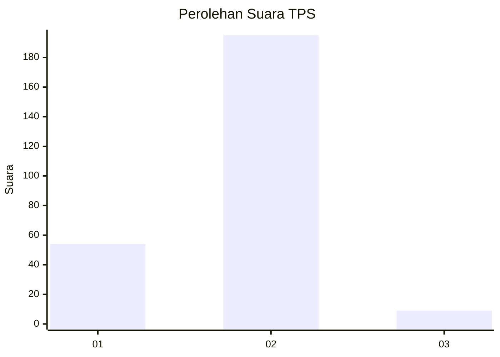

# Hasil

## Grafik

## Tabel

| No. | Nama Paslon    | Suara | Suara (raw) | Persentase |
|:--- |:-------------- | -----:| -----------:| ----------:|
| 1   | ANIES MUHAIMIN | 54    | [54][p-1]   | 20,93      |
| 2   | PRABOWO GIBRAN | 195   | [195][p-2]  | 75,58      |
| 3   | GANJAR MAHFUD  | 9     | [9][p-3]    | 3,49       |

[p-1]: https://github.com/gigit-pemilu/pemilu-2024/blob/main/pilpres/hitung-suara/sub/32-jawa-barat/sub/11-sumedang/sub/15-jatinangor/sub/2010-jatiroke/sub/013-tps/sub/paslon-1.txt
[p-2]: https://github.com/gigit-pemilu/pemilu-2024/blob/main/pilpres/hitung-suara/sub/32-jawa-barat/sub/11-sumedang/sub/15-jatinangor/sub/2010-jatiroke/sub/013-tps/sub/paslon-2.txt
[p-3]: https://github.com/gigit-pemilu/pemilu-2024/blob/main/pilpres/hitung-suara/sub/32-jawa-barat/sub/11-sumedang/sub/15-jatinangor/sub/2010-jatiroke/sub/013-tps/sub/paslon-3.txt

## Foto C Plano

https://sirekap-obj-formc.kpu.go.id/dce8/pemilu/ppwp/32/11/15/20/10/3211152010013-20240215-063332--733b63d6-411f-46ef-a28f-d66af432b5e3.jpg

https://sirekap-obj-formc.kpu.go.id/dce8/pemilu/ppwp/32/11/15/20/10/3211152010013-20240215-012748--a0610f00-89a9-4f7e-afef-b5d421509be3.jpg

https://sirekap-obj-formc.kpu.go.id/dce8/pemilu/ppwp/32/11/15/20/10/3211152010013-20240215-151300--ed0ca60b-e29f-44a5-8320-b6e0b450d781.jpg

## Metadata

| Key        | Value               |
| ---------- | ------------------- |
| Time Stamp | 2024-02-15 15:30:25 |

