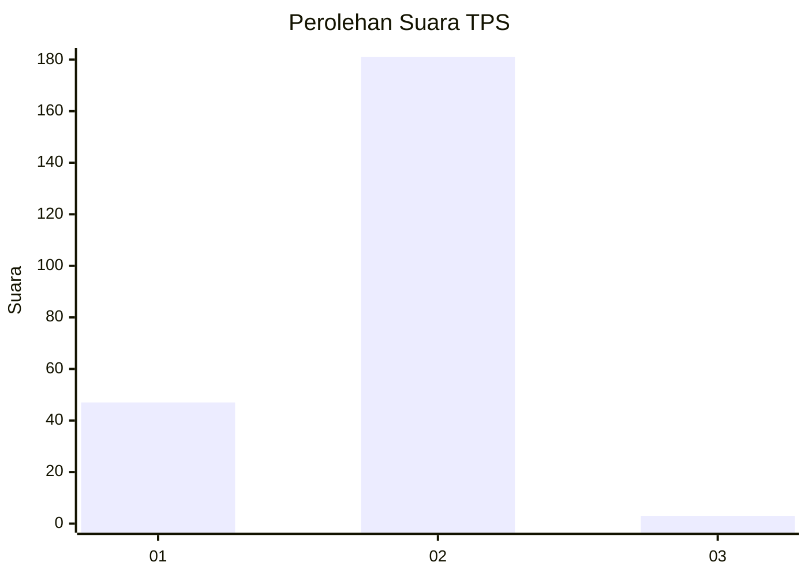
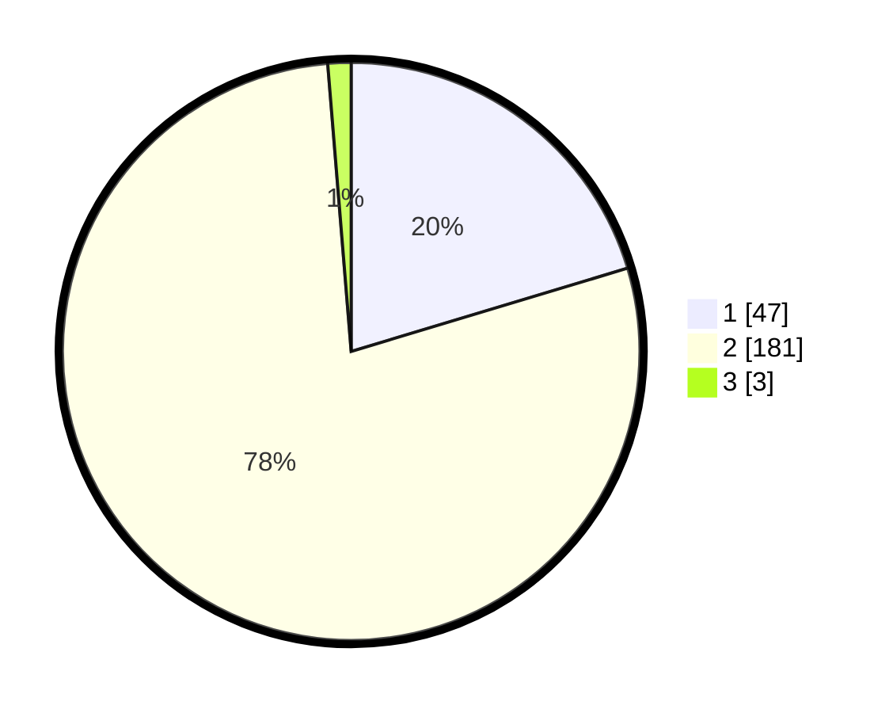

# Hasil

## Grafik

## Tabel

| No. | Nama Paslon    | Suara | Suara (raw) | Persentase |
|:--- |:-------------- | -----:| -----------:| ----------:|
| 1   | ANIES MUHAIMIN | 47    | [47][p-1]   | 20,35      |
| 2   | PRABOWO GIBRAN | 181   | [181][p-2]  | 78,35      |
| 3   | GANJAR MAHFUD  | 3     | [3][p-3]    | 1,30       |

[p-1]: https://github.com/gigit-pemilu/pemilu-2024/blob/main/pilpres/hitung-suara/sub/32-jawa-barat/sub/11-sumedang/sub/17-sumedang-selatan/sub/1001-pasanggrahan-baru/sub/002-tps/sub/paslon-1.txt
[p-2]: https://github.com/gigit-pemilu/pemilu-2024/blob/main/pilpres/hitung-suara/sub/32-jawa-barat/sub/11-sumedang/sub/17-sumedang-selatan/sub/1001-pasanggrahan-baru/sub/002-tps/sub/paslon-2.txt
[p-3]: https://github.com/gigit-pemilu/pemilu-2024/blob/main/pilpres/hitung-suara/sub/32-jawa-barat/sub/11-sumedang/sub/17-sumedang-selatan/sub/1001-pasanggrahan-baru/sub/002-tps/sub/paslon-3.txt

## Foto C Plano

https://sirekap-obj-formc.kpu.go.id/3879/pemilu/ppwp/32/11/17/10/01/3211171001002-20240215-011546--4ec29089-6cb1-4fec-bccd-ce96f339b9d6.jpg

https://sirekap-obj-formc.kpu.go.id/3879/pemilu/ppwp/32/11/17/10/01/3211171001002-20240215-011746--c9042d7b-3dee-4807-8112-a7a006f6cbbf.jpg

https://sirekap-obj-formc.kpu.go.id/3879/pemilu/ppwp/32/11/17/10/01/3211171001002-20240215-011833--3404fa29-34d8-41bb-9ceb-8fe31d5e4094.jpg

## Metadata

| Key        | Value               |
| ---------- | ------------------- |
| Time Stamp | 2024-02-24 22:31:28 |

