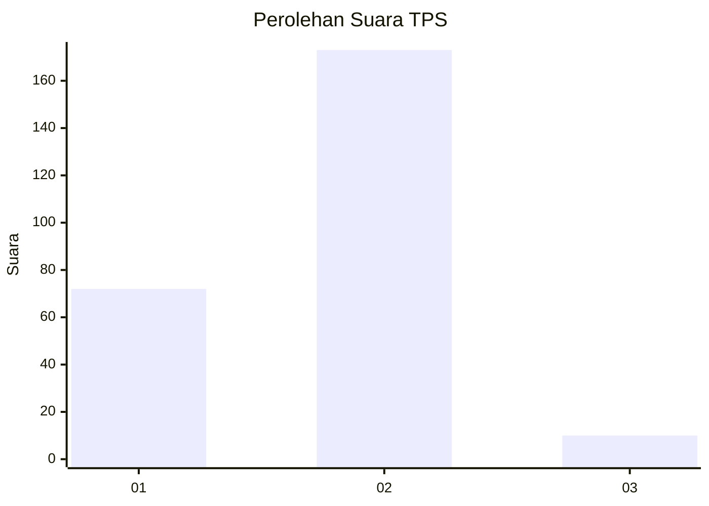
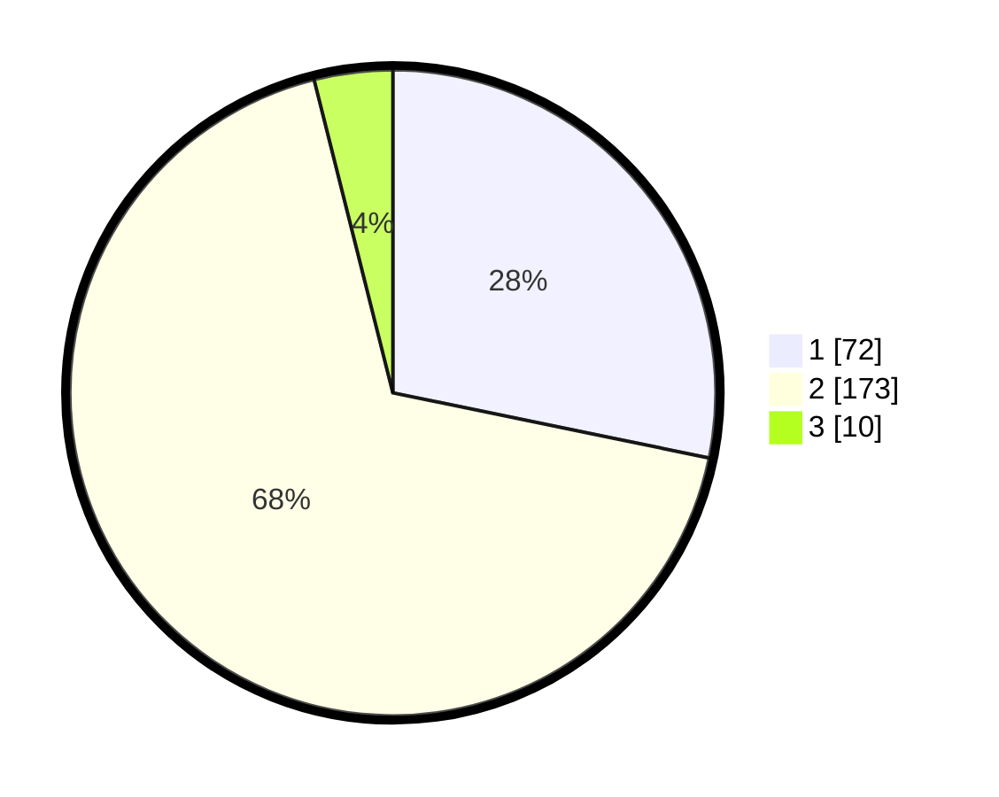

# Hasil

## Grafik

## Tabel

| No. | Nama Paslon    | Suara | Suara (raw) | Persentase |
|:--- |:-------------- | -----:| -----------:| ----------:|
| 1   | ANIES MUHAIMIN | 72    | [72][p-1]   | 28,24      |
| 2   | PRABOWO GIBRAN | 173   | [173][p-2]  | 67,84      |
| 3   | GANJAR MAHFUD  | 10    | [10][p-3]   | 3,92       |

[p-1]: https://github.com/gigit-pemilu/pemilu-2024/blob/main/pilpres/hitung-suara/sub/32-jawa-barat/sub/11-sumedang/sub/17-sumedang-selatan/sub/1001-pasanggrahan-baru/sub/005-tps/sub/paslon-1.txt
[p-2]: https://github.com/gigit-pemilu/pemilu-2024/blob/main/pilpres/hitung-suara/sub/32-jawa-barat/sub/11-sumedang/sub/17-sumedang-selatan/sub/1001-pasanggrahan-baru/sub/005-tps/sub/paslon-2.txt
[p-3]: https://github.com/gigit-pemilu/pemilu-2024/blob/main/pilpres/hitung-suara/sub/32-jawa-barat/sub/11-sumedang/sub/17-sumedang-selatan/sub/1001-pasanggrahan-baru/sub/005-tps/sub/paslon-3.txt

## Foto C Plano

https://sirekap-obj-formc.kpu.go.id/6a71/pemilu/ppwp/32/11/17/10/01/3211171001005-20240214-224510--16af581d-f12f-49e4-93f8-8bd842d34d2a.jpg

https://sirekap-obj-formc.kpu.go.id/6a71/pemilu/ppwp/32/11/17/10/01/3211171001005-20240214-224629--60fc66d8-ee7c-4e2a-bed4-1fe5b5b0a457.jpg

https://sirekap-obj-formc.kpu.go.id/6a71/pemilu/ppwp/32/11/17/10/01/3211171001005-20240214-224742--847ed825-b146-457d-823d-6427c0f2c8ba.jpg

## Metadata

| Key        | Value               |
| ---------- | ------------------- |
| Time Stamp | 2024-02-19 06:16:00 |

