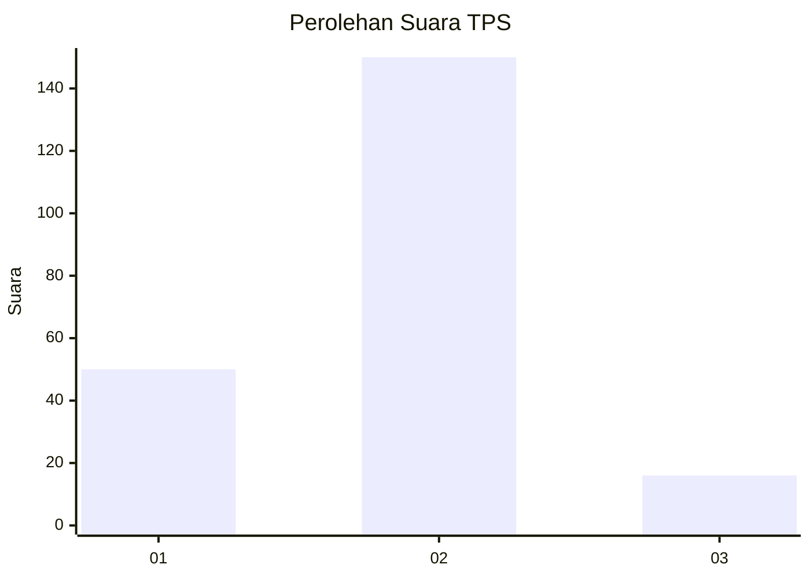
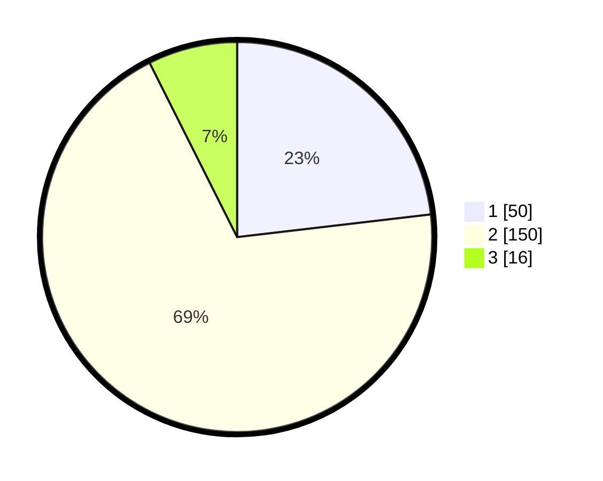

# Hasil

## Grafik

## Tabel

| No. | Nama Paslon    | Suara | Suara (raw) | Persentase |
|:--- |:-------------- | -----:| -----------:| ----------:|
| 1   | ANIES MUHAIMIN | 50    | [50][p-1]   | 23,15      |
| 2   | PRABOWO GIBRAN | 150   | [150][p-2]  | 69,44      |
| 3   | GANJAR MAHFUD  | 16    | [16][p-3]   | 7,41       |

[p-1]: https://github.com/gigit-pemilu/pemilu-2024-32-jawa-barat/blob/main/pilpres/hitung-suara/sub/32-jawa-barat/sub/11-sumedang/sub/18-sumedang-utara/sub/1001-kota-kaler/sub/003-tps/sub/paslon-1.txt
[p-2]: https://github.com/gigit-pemilu/pemilu-2024-32-jawa-barat/blob/main/pilpres/hitung-suara/sub/32-jawa-barat/sub/11-sumedang/sub/18-sumedang-utara/sub/1001-kota-kaler/sub/003-tps/sub/paslon-2.txt
[p-3]: https://github.com/gigit-pemilu/pemilu-2024-32-jawa-barat/blob/main/pilpres/hitung-suara/sub/32-jawa-barat/sub/11-sumedang/sub/18-sumedang-utara/sub/1001-kota-kaler/sub/003-tps/sub/paslon-3.txt

## Foto C Plano

https://sirekap-obj-formc.kpu.go.id/64cc/pemilu/ppwp/32/11/18/10/01/3211181001003-20240214-223154--9b8848ad-b953-43c4-9790-f3d1ee9fc8c0.jpg

https://sirekap-obj-formc.kpu.go.id/64cc/pemilu/ppwp/32/11/18/10/01/3211181001003-20240214-201359--3f95fd12-f78e-45a3-a559-4e9b625afdb9.jpg

https://sirekap-obj-formc.kpu.go.id/64cc/pemilu/ppwp/32/11/18/10/01/3211181001003-20240214-201730--902b936b-5b66-4c28-9e49-666074a8239e.jpg

## Metadata

| Key        | Value               |
| ---------- | ------------------- |
| Time Stamp | 2024-02-25 00:00:00 |

