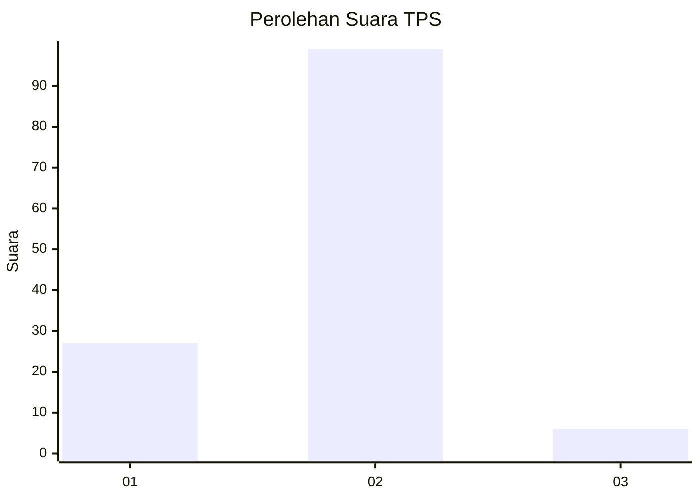
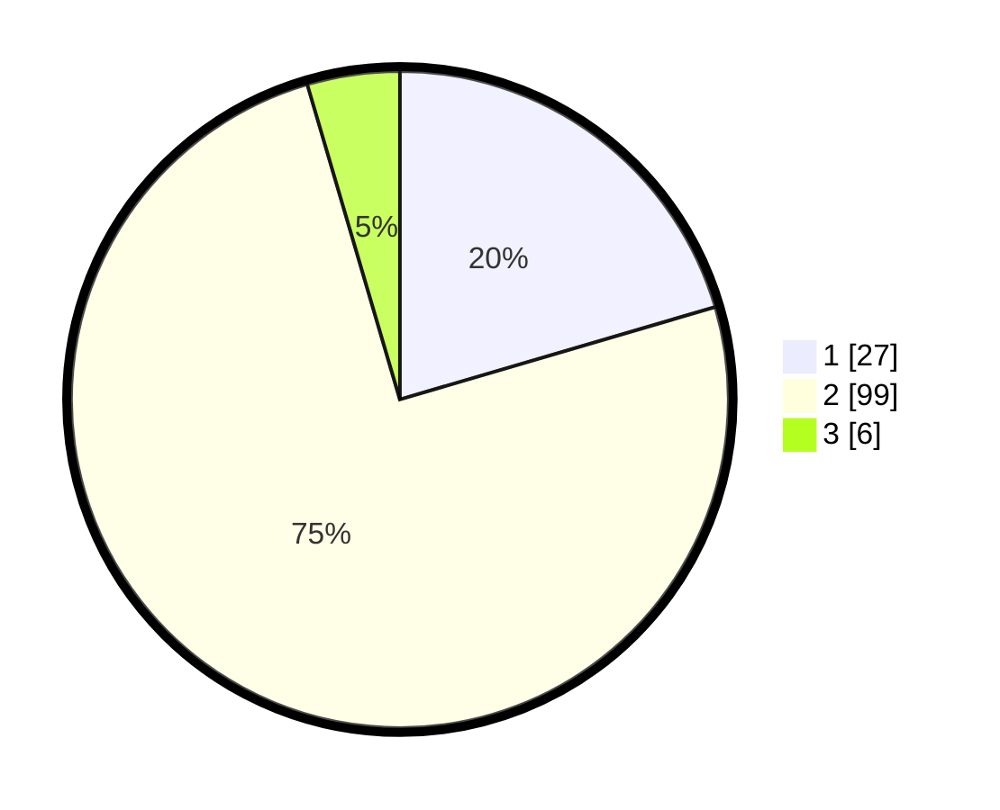

# Hasil

## Grafik

## Tabel

| No. | Nama Paslon    | Suara | Suara (raw) | Persentase |
|:--- |:-------------- | -----:| -----------:| ----------:|
| 1   | ANIES MUHAIMIN | 27    | [27][p-1]   | 20,45      |
| 2   | PRABOWO GIBRAN | 99    | [99][p-2]   | 75,00      |
| 3   | GANJAR MAHFUD  | 6     | [6][p-3]    | 4,55       |

[p-1]: https://github.com/gigit-pemilu/pemilu-2024/blob/main/pilpres/hitung-suara/sub/32-jawa-barat/sub/11-sumedang/sub/18-sumedang-utara/sub/1002-situ/sub/020-tps/sub/paslon-1.txt
[p-2]: https://github.com/gigit-pemilu/pemilu-2024/blob/main/pilpres/hitung-suara/sub/32-jawa-barat/sub/11-sumedang/sub/18-sumedang-utara/sub/1002-situ/sub/020-tps/sub/paslon-2.txt
[p-3]: https://github.com/gigit-pemilu/pemilu-2024/blob/main/pilpres/hitung-suara/sub/32-jawa-barat/sub/11-sumedang/sub/18-sumedang-utara/sub/1002-situ/sub/020-tps/sub/paslon-3.txt

## Foto C Plano

https://sirekap-obj-formc.kpu.go.id/9c4d/pemilu/ppwp/32/11/18/10/02/3211181002020-20240218-224834--9067c211-4145-45c8-99e0-386dd0ef3ae6.jpg

https://sirekap-obj-formc.kpu.go.id/9c4d/pemilu/ppwp/32/11/18/10/02/3211181002020-20240218-224638--7a724cd1-773d-49c9-bf22-1d371a986d49.jpg

https://sirekap-obj-formc.kpu.go.id/9c4d/pemilu/ppwp/32/11/18/10/02/3211181002020-20240218-224713--316b5949-cb5e-4adf-8334-3ee9ca11ac94.jpg

## Metadata

| Key        | Value               |
| ---------- | ------------------- |
| Time Stamp | 2024-02-19 06:16:00 |

## DATA PEMILIH TETAP

Jumlah pemilih dalam DPT: **100**.
 * L: **5**.
 * P: **71**.

## DATA PENGGUNA HAK PILIH

Jumlah pengguna hak pilih dalam DPT: **0**.
 * L: **71**.
 * P: **57**.

Jumlah pengguna hak pilih dalam DPTb: **225**.
 * L: **1**.
 * P: **2**.

Jumlah pengguna hak pilih dalam DPK: **50**.
 * L: **0**.
 * P: **2**.

Jumlah pengguna hak pilih: **705**.
 * L: **25**.
 * P: **507**.

## JUMLAH SUARA SAH DAN TIDAK SAH

JUMLAH SELURUH SUARA SAH: **131**.

JUMLAH SUARA TIDAK SAH: **1**.

JUMLAH SELURUH SUARA SAH DAN SUARA TIDAK SAH: **132**.

