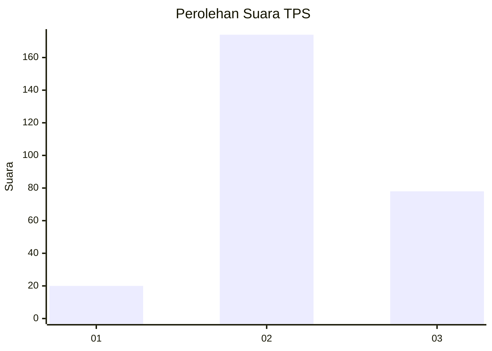
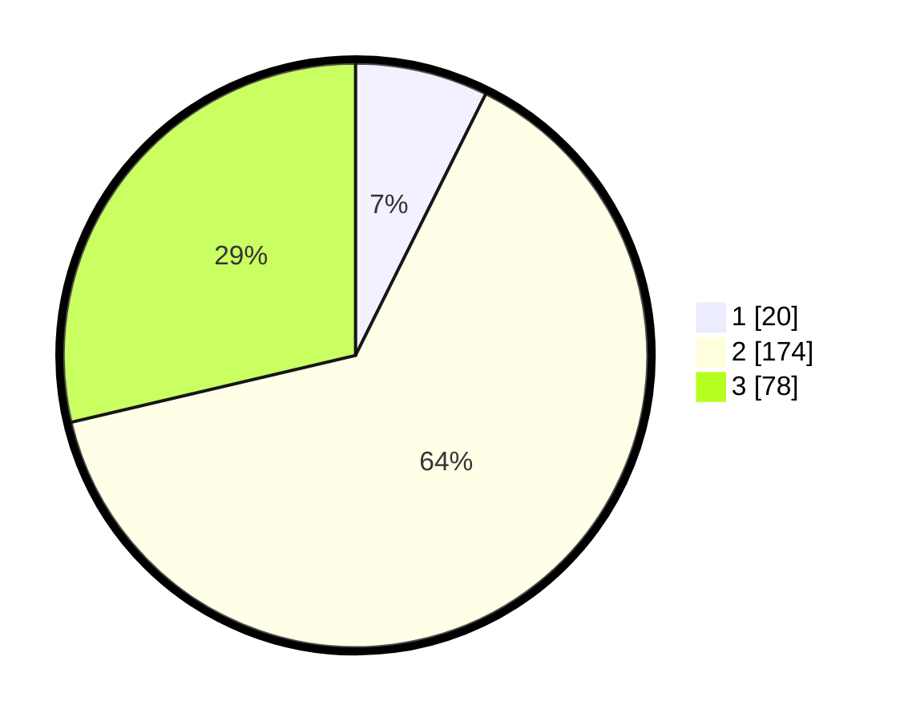

# Hasil

## Grafik

## Tabel

| No. | Nama Paslon    | Suara | Suara (raw) | Persentase |
|:--- |:-------------- | -----:| -----------:| ----------:|
| 1   | ANIES MUHAIMIN | 20    | [20][p-1]   | 7,35       |
| 2   | PRABOWO GIBRAN | 174   | [174][p-2]  | 63,97      |
| 3   | GANJAR MAHFUD  | 78    | [78][p-3]   | 28,68      |

[p-1]: https://github.com/gigit-pemilu/pemilu-2024/blob/main/pilpres/hitung-suara/sub/32-jawa-barat/sub/11-sumedang/sub/18-sumedang-utara/sub/2011-jatihurip/sub/006-tps/sub/paslon-1.txt
[p-2]: https://github.com/gigit-pemilu/pemilu-2024/blob/main/pilpres/hitung-suara/sub/32-jawa-barat/sub/11-sumedang/sub/18-sumedang-utara/sub/2011-jatihurip/sub/006-tps/sub/paslon-2.txt
[p-3]: https://github.com/gigit-pemilu/pemilu-2024/blob/main/pilpres/hitung-suara/sub/32-jawa-barat/sub/11-sumedang/sub/18-sumedang-utara/sub/2011-jatihurip/sub/006-tps/sub/paslon-3.txt

## Foto C Plano

https://sirekap-obj-formc.kpu.go.id/a15a/pemilu/ppwp/32/11/18/20/11/3211182011006-20240222-204404--9f35ba3a-2009-4a3b-8232-796dd3f0cd40.jpg

https://sirekap-obj-formc.kpu.go.id/a15a/pemilu/ppwp/32/11/18/20/11/3211182011006-20240218-194501--aea823f3-dbb1-422e-9bbd-0051c8913c95.jpg

https://sirekap-obj-formc.kpu.go.id/a15a/pemilu/ppwp/32/11/18/20/11/3211182011006-20240218-194542--c8370dee-870a-425f-a6c6-4c8088304fe3.jpg

## Metadata

| Key        | Value               |
| ---------- | ------------------- |
| Time Stamp | 2024-02-22 21:00:00 |

