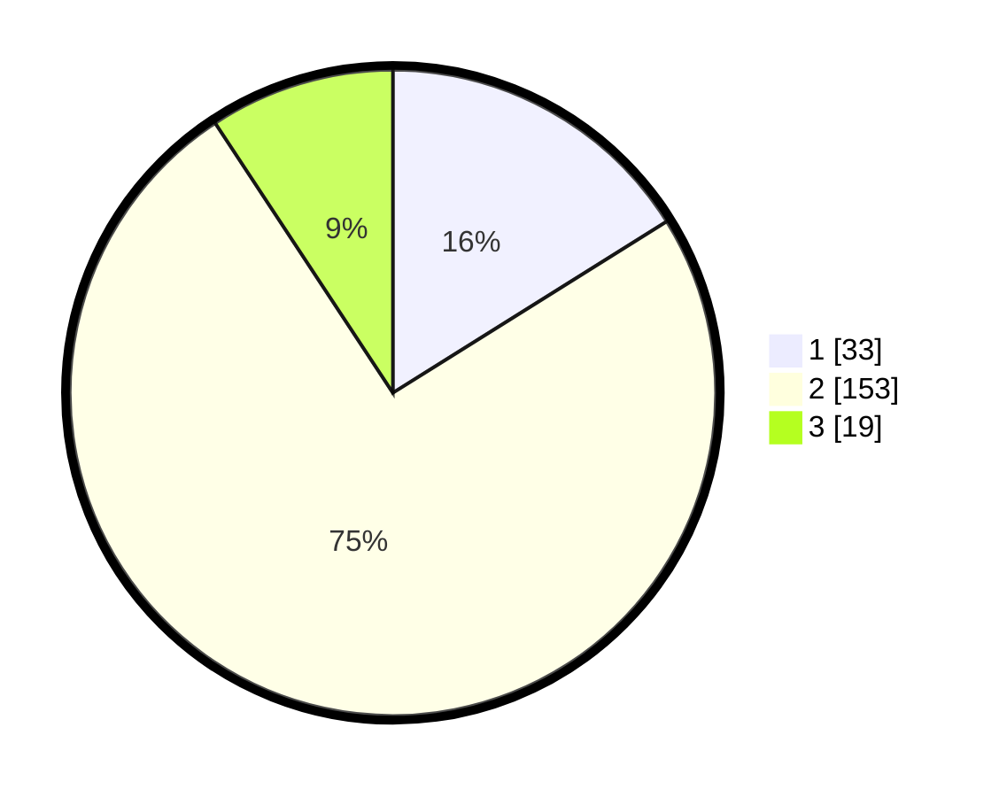

# Hasil

## Grafik

## Tabel

| No. | Nama Paslon    | Suara | Suara (raw) | Persentase |
|:--- |:-------------- | -----:| -----------:| ----------:|
| 1   | ANIES MUHAIMIN | 33    | [33][p-1]   | 16,10      |
| 2   | PRABOWO GIBRAN | 153   | [153][p-2]  | 74,63      |
| 3   | GANJAR MAHFUD  | 19    | [19][p-3]   | 9,27       |

[p-1]: https://github.com/gigit-pemilu/pemilu-2024/blob/main/pilpres/hitung-suara/sub/32-jawa-barat/sub/11-sumedang/sub/22-cimalaka/sub/2005-nyalindung/sub/005-tps/sub/paslon-1.txt
[p-2]: https://github.com/gigit-pemilu/pemilu-2024/blob/main/pilpres/hitung-suara/sub/32-jawa-barat/sub/11-sumedang/sub/22-cimalaka/sub/2005-nyalindung/sub/005-tps/sub/paslon-2.txt
[p-3]: https://github.com/gigit-pemilu/pemilu-2024/blob/main/pilpres/hitung-suara/sub/32-jawa-barat/sub/11-sumedang/sub/22-cimalaka/sub/2005-nyalindung/sub/005-tps/sub/paslon-3.txt

## Foto C Plano

https://sirekap-obj-formc.kpu.go.id/1681/pemilu/ppwp/32/11/22/20/05/3211222005005-20240214-234309--13a760d3-15f0-46b8-8210-6d9641daa60b.jpg

https://sirekap-obj-formc.kpu.go.id/1681/pemilu/ppwp/32/11/22/20/05/3211222005005-20240214-233543--af75d4bd-5c3e-4abd-a6bc-e28cd9f03387.jpg

https://sirekap-obj-formc.kpu.go.id/1681/pemilu/ppwp/32/11/22/20/05/3211222005005-20240214-233625--5b9d3c2d-852c-443d-a1b3-f4312c1fdf66.jpg

## Metadata

| Key        | Value               |
| ---------- | ------------------- |
| Time Stamp | 2024-02-20 00:00:00 |

