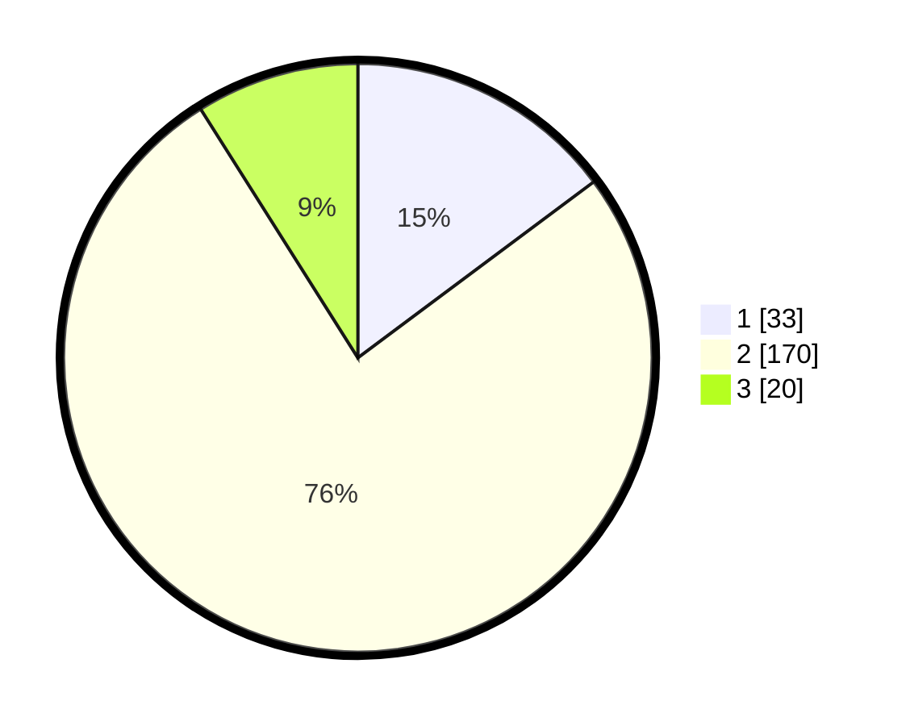

# Hasil

## Grafik

## Tabel

| No. | Nama Paslon    | Suara | Suara (raw) | Persentase |
|:--- |:-------------- | -----:| -----------:| ----------:|
| 1   | ANIES MUHAIMIN | 33    | [33][p-1]   | 14,80      |
| 2   | PRABOWO GIBRAN | 170   | [170][p-2]  | 76,23      |
| 3   | GANJAR MAHFUD  | 20    | [20][p-3]   | 8,97       |

[p-1]: https://github.com/gigit-pemilu/pemilu-2024/blob/main/pilpres/hitung-suara/sub/32-jawa-barat/sub/11-sumedang/sub/24-tomo/sub/2001-tomo/sub/001-tps/sub/paslon-1.txt
[p-2]: https://github.com/gigit-pemilu/pemilu-2024/blob/main/pilpres/hitung-suara/sub/32-jawa-barat/sub/11-sumedang/sub/24-tomo/sub/2001-tomo/sub/001-tps/sub/paslon-2.txt
[p-3]: https://github.com/gigit-pemilu/pemilu-2024/blob/main/pilpres/hitung-suara/sub/32-jawa-barat/sub/11-sumedang/sub/24-tomo/sub/2001-tomo/sub/001-tps/sub/paslon-3.txt

## Foto C Plano

https://sirekap-obj-formc.kpu.go.id/1163/pemilu/ppwp/32/11/24/20/01/3211242001001-20240215-030853--0315de4c-4ee5-41dd-94ec-767b49c70e3c.jpg

https://sirekap-obj-formc.kpu.go.id/1163/pemilu/ppwp/32/11/24/20/01/3211242001001-20240214-214344--f5d05e25-6efd-42b6-b8d5-9890dc04f3c8.jpg

https://sirekap-obj-formc.kpu.go.id/1163/pemilu/ppwp/32/11/24/20/01/3211242001001-20240214-214421--a7d7f422-06f0-486d-878c-92fb70527a66.jpg

## Metadata

| Key        | Value               |
| ---------- | ------------------- |
| Time Stamp | 2024-02-15 15:00:29 |

