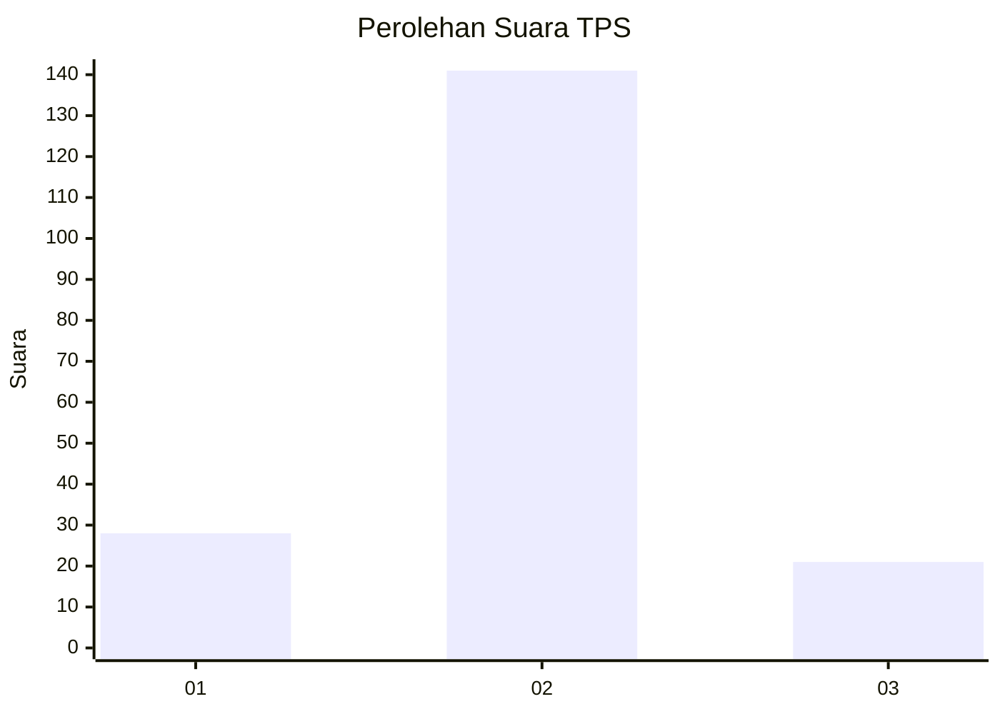
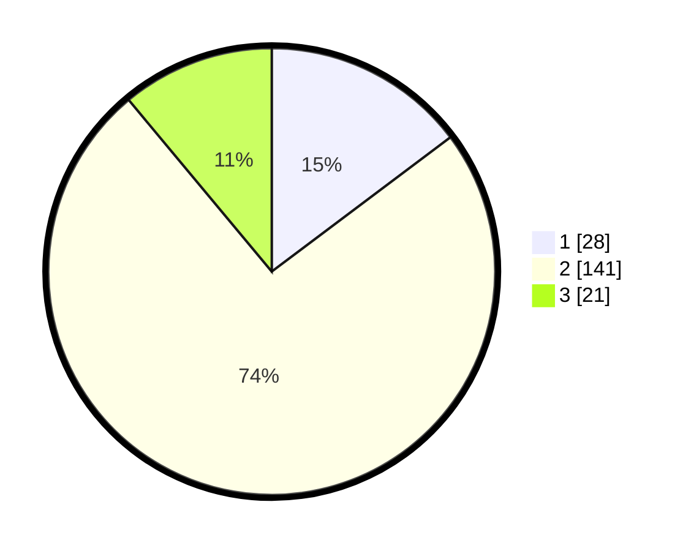

# Hasil

## Grafik

## Tabel

| No. | Nama Paslon    | Suara | Suara (raw) | Persentase |
|:--- |:-------------- | -----:| -----------:| ----------:|
| 1   | ANIES MUHAIMIN | 28    | [28][p-1]   | 14,74      |
| 2   | PRABOWO GIBRAN | 141   | [141][p-2]  | 74,21      |
| 3   | GANJAR MAHFUD  | 21    | [21][p-3]   | 11,05      |

[p-1]: https://github.com/gigit-pemilu/pemilu-2024-32-jawa-barat/blob/main/pilpres/hitung-suara/sub/32-jawa-barat/sub/11-sumedang/sub/24-tomo/sub/2001-tomo/sub/005-tps/sub/paslon-1.txt
[p-2]: https://github.com/gigit-pemilu/pemilu-2024-32-jawa-barat/blob/main/pilpres/hitung-suara/sub/32-jawa-barat/sub/11-sumedang/sub/24-tomo/sub/2001-tomo/sub/005-tps/sub/paslon-2.txt
[p-3]: https://github.com/gigit-pemilu/pemilu-2024-32-jawa-barat/blob/main/pilpres/hitung-suara/sub/32-jawa-barat/sub/11-sumedang/sub/24-tomo/sub/2001-tomo/sub/005-tps/sub/paslon-3.txt

## Foto C Plano

https://sirekap-obj-formc.kpu.go.id/6cca/pemilu/ppwp/32/11/24/20/01/3211242001005-20240214-231155--f530afdf-bdb1-427c-a666-8b58f83690cd.jpg

https://sirekap-obj-formc.kpu.go.id/6cca/pemilu/ppwp/32/11/24/20/01/3211242001005-20240215-002404--c6c106db-abc3-42a8-ac67-3d845bf97800.jpg

https://sirekap-obj-formc.kpu.go.id/6cca/pemilu/ppwp/32/11/24/20/01/3211242001005-20240215-123102--c295ea63-dbfe-4c22-aa1b-194033a51140.jpg

## Metadata

| Key        | Value               |
| ---------- | ------------------- |
| Time Stamp | 2024-02-16 03:00:26 |

