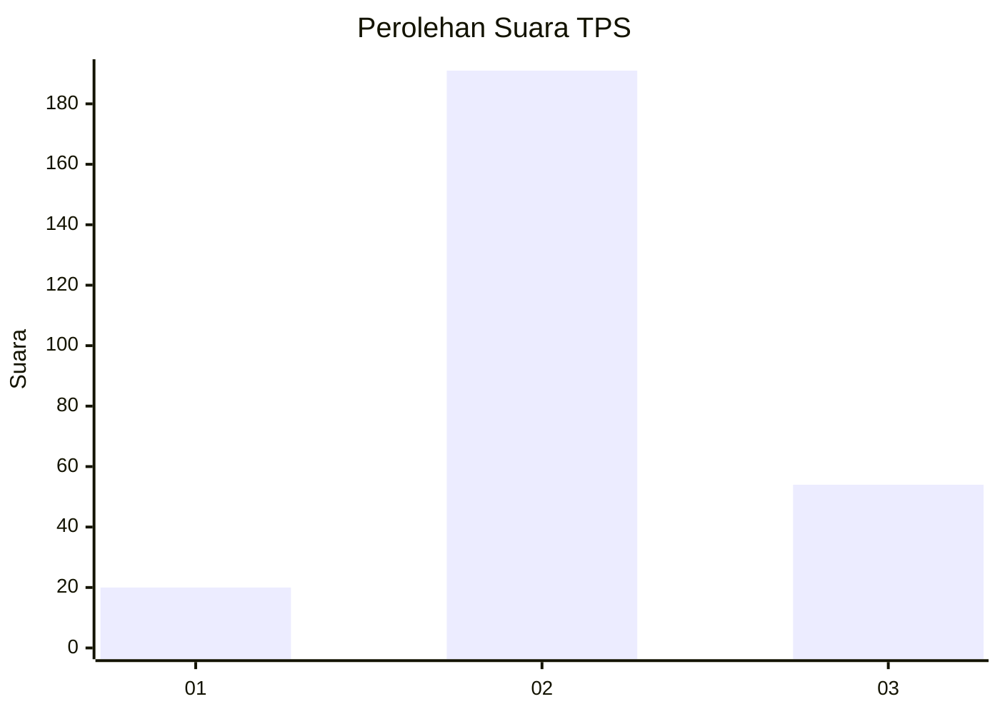

# Hasil

## Grafik

## Tabel

| No. | Nama Paslon    | Suara | Suara (raw) | Persentase |
|:--- |:-------------- | -----:| -----------:| ----------:|
| 1   | ANIES MUHAIMIN | 20    | [20][p-1]   | 7,55       |
| 2   | PRABOWO GIBRAN | 191   | [191][p-2]  | 72,08      |
| 3   | GANJAR MAHFUD  | 54    | [54][p-3]   | 20,38      |

[p-1]: https://github.com/gigit-pemilu/pemilu-2024/blob/main/pilpres/hitung-suara/sub/32-jawa-barat/sub/11-sumedang/sub/24-tomo/sub/2004-marongge/sub/005-tps/sub/paslon-1.txt
[p-2]: https://github.com/gigit-pemilu/pemilu-2024/blob/main/pilpres/hitung-suara/sub/32-jawa-barat/sub/11-sumedang/sub/24-tomo/sub/2004-marongge/sub/005-tps/sub/paslon-2.txt
[p-3]: https://github.com/gigit-pemilu/pemilu-2024/blob/main/pilpres/hitung-suara/sub/32-jawa-barat/sub/11-sumedang/sub/24-tomo/sub/2004-marongge/sub/005-tps/sub/paslon-3.txt

## Foto C Plano

https://sirekap-obj-formc.kpu.go.id/a82c/pemilu/ppwp/32/11/24/20/04/3211242004005-20240214-214650--890d50ae-8f83-4e3f-b82b-224b0825cfec.jpg

https://sirekap-obj-formc.kpu.go.id/a82c/pemilu/ppwp/32/11/24/20/04/3211242004005-20240214-234159--56fcfa28-b182-4ece-a428-0b333904a979.jpg

https://sirekap-obj-formc.kpu.go.id/a82c/pemilu/ppwp/32/11/24/20/04/3211242004005-20240214-202826--cea66c31-ffe5-4c0b-9f65-d821af059c31.jpg

## Metadata

| Key        | Value               |
| ---------- | ------------------- |
| Time Stamp | 2024-02-19 23:00:00 |

