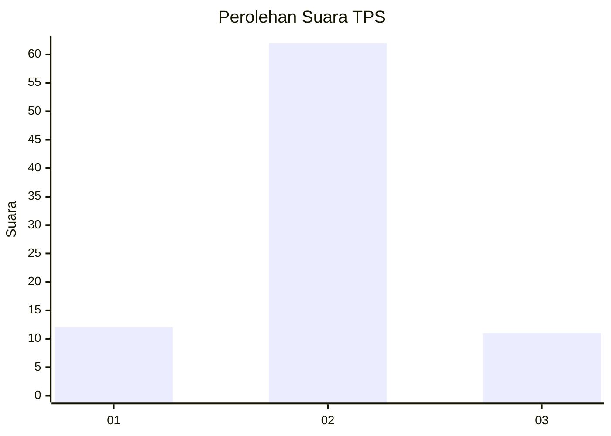
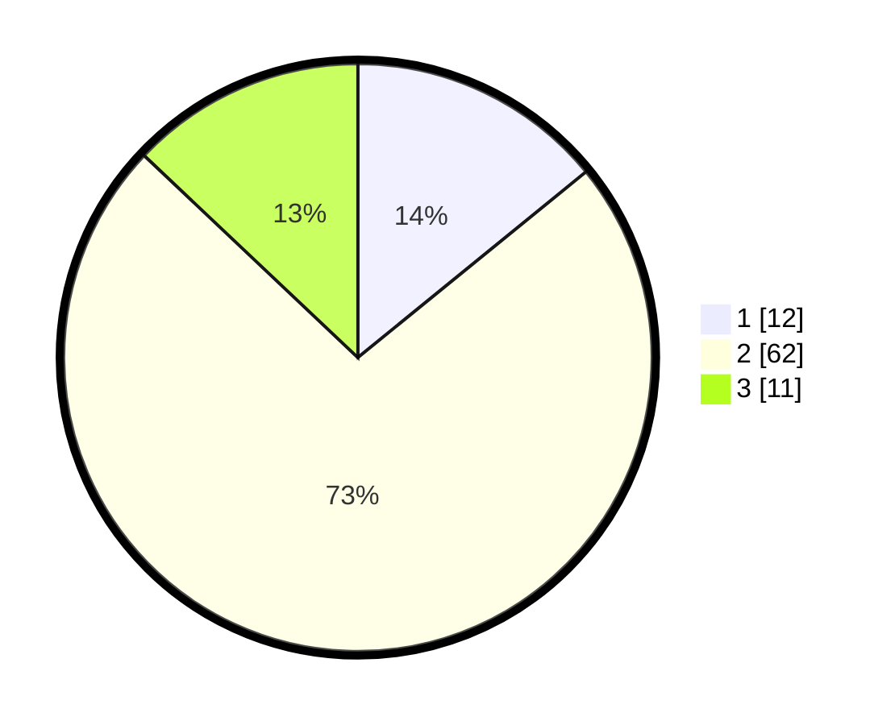

# Hasil

## Grafik

## Tabel

| No. | Nama Paslon    | Suara | Suara (raw) | Persentase |
|:--- |:-------------- | -----:| -----------:| ----------:|
| 1   | ANIES MUHAIMIN | 12    | [12][p-1]   | 14,12      |
| 2   | PRABOWO GIBRAN | 62    | [62][p-2]   | 72,94      |
| 3   | GANJAR MAHFUD  | 11    | [11][p-3]   | 12,94      |

[p-1]: https://github.com/gigit-pemilu/pemilu-2024-32-jawa-barat/blob/main/pilpres/hitung-suara/sub/32-jawa-barat/sub/11-sumedang/sub/26-jatigede/sub/2010-jemah/sub/002-tps/sub/paslon-1.txt
[p-2]: https://github.com/gigit-pemilu/pemilu-2024-32-jawa-barat/blob/main/pilpres/hitung-suara/sub/32-jawa-barat/sub/11-sumedang/sub/26-jatigede/sub/2010-jemah/sub/002-tps/sub/paslon-2.txt
[p-3]: https://github.com/gigit-pemilu/pemilu-2024-32-jawa-barat/blob/main/pilpres/hitung-suara/sub/32-jawa-barat/sub/11-sumedang/sub/26-jatigede/sub/2010-jemah/sub/002-tps/sub/paslon-3.txt

## Foto C Plano

https://sirekap-obj-formc.kpu.go.id/7255/pemilu/ppwp/32/11/26/20/10/3211262010002-20240224-200929--65c98903-45a5-444a-87f4-529923756067.jpg

https://sirekap-obj-formc.kpu.go.id/7255/pemilu/ppwp/32/11/26/20/10/3211262010002-20240224-201801--e22465e0-dbce-49f0-a527-d67e2c2e54b1.jpg

https://sirekap-obj-formc.kpu.go.id/7255/pemilu/ppwp/32/11/26/20/10/3211262010002-20240224-202121--3f1489d1-1261-4b8c-977d-123666be83ac.jpg

## Metadata

| Key        | Value               |
| ---------- | ------------------- |
| Time Stamp | 2024-02-24 22:31:28 |

