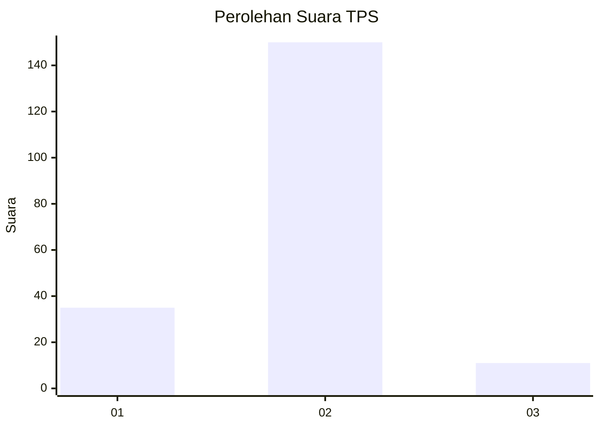
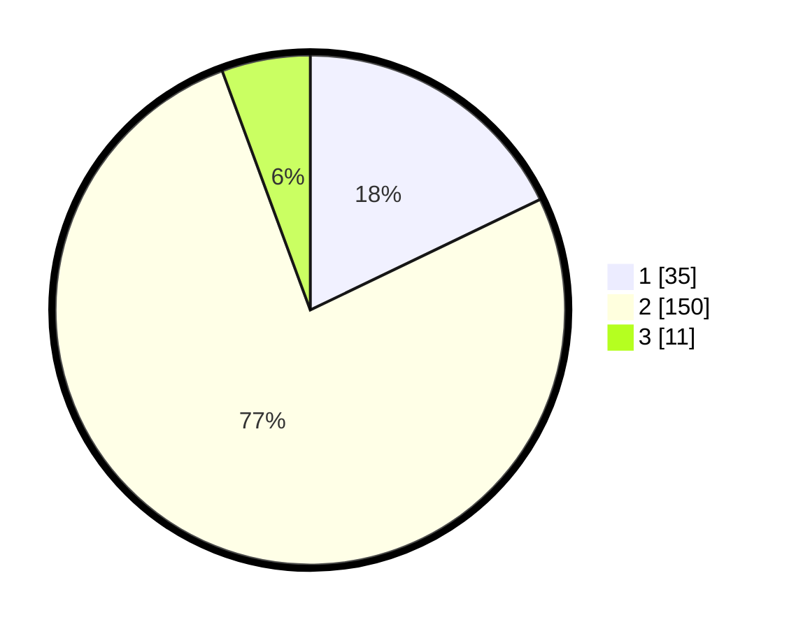

# Hasil

## Grafik

## Tabel

| No. | Nama Paslon    | Suara | Suara (raw) | Persentase |
|:--- |:-------------- | -----:| -----------:| ----------:|
| 1   | ANIES MUHAIMIN | 35    | [35][p-1]   | 17,86      |
| 2   | PRABOWO GIBRAN | 150   | [150][p-2]  | 76,53      |
| 3   | GANJAR MAHFUD  | 11    | [11][p-3]   | 5,61       |

[p-1]: https://github.com/gigit-pemilu/pemilu-2024/blob/main/pilpres/hitung-suara/sub/32-jawa-barat/sub/12-indramayu/sub/01-haurgeulis/sub/2007-haurkolot/sub/006-tps/sub/paslon-1.txt
[p-2]: https://github.com/gigit-pemilu/pemilu-2024/blob/main/pilpres/hitung-suara/sub/32-jawa-barat/sub/12-indramayu/sub/01-haurgeulis/sub/2007-haurkolot/sub/006-tps/sub/paslon-2.txt
[p-3]: https://github.com/gigit-pemilu/pemilu-2024/blob/main/pilpres/hitung-suara/sub/32-jawa-barat/sub/12-indramayu/sub/01-haurgeulis/sub/2007-haurkolot/sub/006-tps/sub/paslon-3.txt

## Foto C Plano

https://sirekap-obj-formc.kpu.go.id/68e1/pemilu/ppwp/32/12/01/20/07/3212012007006-20240223-171616--c76f2c79-6760-4f2d-88fd-19a33f2cc32c.jpg

https://sirekap-obj-formc.kpu.go.id/68e1/pemilu/ppwp/32/12/01/20/07/3212012007006-20240223-170951--5fd1ca7a-d129-4f76-a4f4-23aaabd7ea07.jpg

https://sirekap-obj-formc.kpu.go.id/68e1/pemilu/ppwp/32/12/01/20/07/3212012007006-20240223-171044--cd4de8d9-0c9f-4ddd-9921-8be2043988d2.jpg

## Metadata

| Key        | Value               |
| ---------- | ------------------- |
| Time Stamp | 2024-02-24 22:31:28 |

