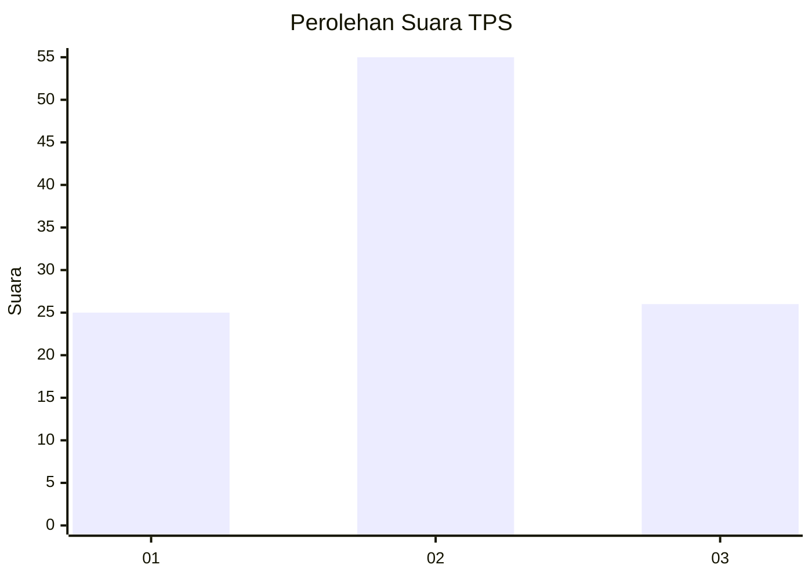
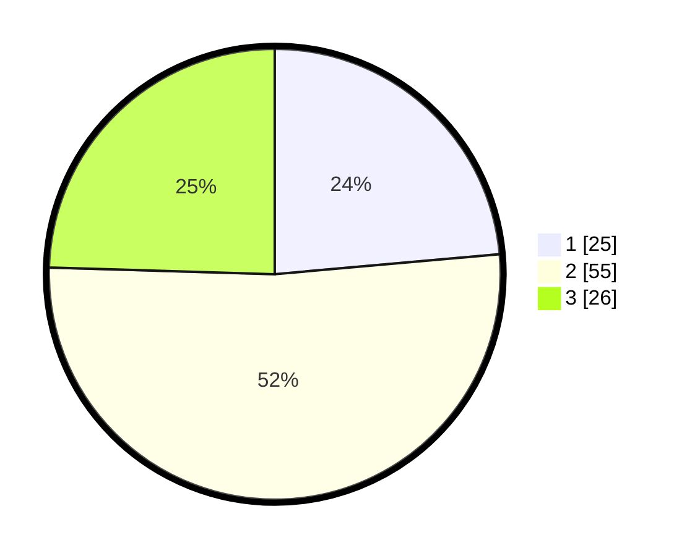

# Hasil

## Grafik

## Tabel

| No. | Nama Paslon    | Suara | Suara (raw) | Persentase |
|:--- |:-------------- | -----:| -----------:| ----------:|
| 1   | ANIES MUHAIMIN | 25    | [25][p-1]   | 23,58      |
| 2   | PRABOWO GIBRAN | 55    | [55][p-2]   | 51,89      |
| 3   | GANJAR MAHFUD  | 26    | [26][p-3]   | 24,53      |

[p-1]: https://github.com/gigit-pemilu/pemilu-2024/blob/main/pilpres/hitung-suara/sub/32-jawa-barat/sub/12-indramayu/sub/01-haurgeulis/sub/2013-cipancuh/sub/012-tps/sub/paslon-1.txt
[p-2]: https://github.com/gigit-pemilu/pemilu-2024/blob/main/pilpres/hitung-suara/sub/32-jawa-barat/sub/12-indramayu/sub/01-haurgeulis/sub/2013-cipancuh/sub/012-tps/sub/paslon-2.txt
[p-3]: https://github.com/gigit-pemilu/pemilu-2024/blob/main/pilpres/hitung-suara/sub/32-jawa-barat/sub/12-indramayu/sub/01-haurgeulis/sub/2013-cipancuh/sub/012-tps/sub/paslon-3.txt

## Foto C Plano

https://sirekap-obj-formc.kpu.go.id/e13b/pemilu/ppwp/32/12/01/20/13/3212012013012-20240221-222926--c054d1df-d871-4cea-8daa-640fe36693e2.jpg

https://sirekap-obj-formc.kpu.go.id/e13b/pemilu/ppwp/32/12/01/20/13/3212012013012-20240221-223238--a086d51c-c4e3-4470-944c-50ebae124e91.jpg

https://sirekap-obj-formc.kpu.go.id/e13b/pemilu/ppwp/32/12/01/20/13/3212012013012-20240221-223722--0ac28000-2dad-46a9-8d1b-4f43b37d9881.jpg

## Metadata

| Key        | Value               |
| ---------- | ------------------- |
| Time Stamp | 2024-02-21 23:00:00 |

## DATA PEMILIH TETAP

Jumlah pemilih dalam DPT: **572**.
 * L: **0**.
 * P: **575**.

## DATA PENGGUNA HAK PILIH

Jumlah pengguna hak pilih dalam DPT: **709**.
 * L: **575**.
 * P: **277**.

Jumlah pengguna hak pilih dalam DPTb: **0**.
 * L: **0**.
 * P: **0**.

Jumlah pengguna hak pilih dalam DPK: **2**.
 * L: **1**.
 * P: **1**.

Jumlah pengguna hak pilih: **190**.
 * L: **99**.
 * P: **91**.

## JUMLAH SUARA SAH DAN TIDAK SAH

JUMLAH SELURUH SUARA SAH: **185**.

JUMLAH SUARA TIDAK SAH: **5**.

JUMLAH SELURUH SUARA SAH DAN SUARA TIDAK SAH: **190**.

