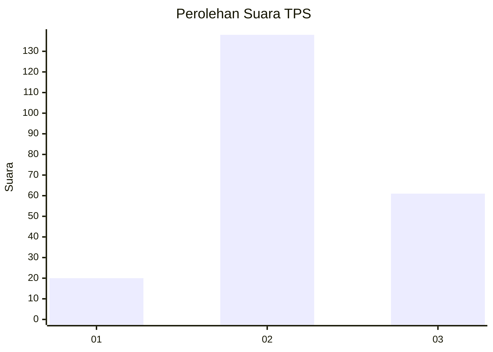
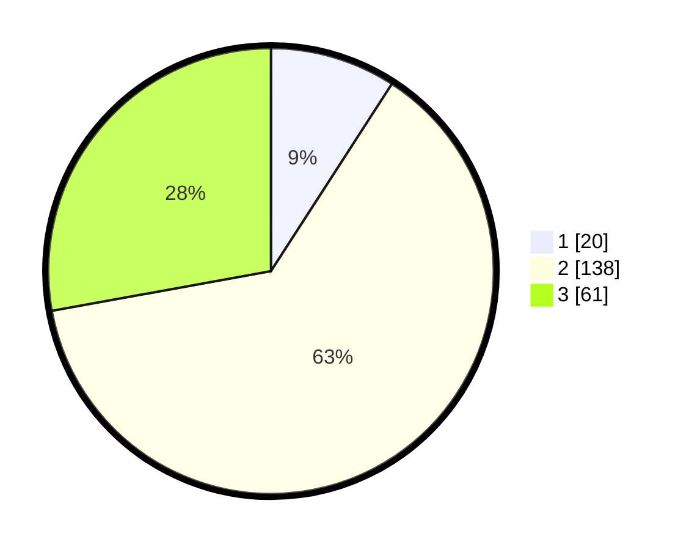

# Hasil

## Grafik

## Tabel

| No. | Nama Paslon    | Suara | Suara (raw) | Persentase |
|:--- |:-------------- | -----:| -----------:| ----------:|
| 1   | ANIES MUHAIMIN | 20    | [20][p-1]   | 9,13       |
| 2   | PRABOWO GIBRAN | 138   | [138][p-2]  | 63,01      |
| 3   | GANJAR MAHFUD  | 61    | [61][p-3]   | 27,85      |

[p-1]: https://github.com/gigit-pemilu/pemilu-2024/blob/main/pilpres/hitung-suara/sub/32-jawa-barat/sub/12-indramayu/sub/01-haurgeulis/sub/2016-sumbermulya/sub/014-tps/sub/paslon-1.txt
[p-2]: https://github.com/gigit-pemilu/pemilu-2024/blob/main/pilpres/hitung-suara/sub/32-jawa-barat/sub/12-indramayu/sub/01-haurgeulis/sub/2016-sumbermulya/sub/014-tps/sub/paslon-2.txt
[p-3]: https://github.com/gigit-pemilu/pemilu-2024/blob/main/pilpres/hitung-suara/sub/32-jawa-barat/sub/12-indramayu/sub/01-haurgeulis/sub/2016-sumbermulya/sub/014-tps/sub/paslon-3.txt

## Foto C Plano

https://sirekap-obj-formc.kpu.go.id/d6d5/pemilu/ppwp/32/12/01/20/16/3212012016014-20240222-105530--365318cc-7ffc-43a6-aae4-1c336a374f14.jpg

https://sirekap-obj-formc.kpu.go.id/d6d5/pemilu/ppwp/32/12/01/20/16/3212012016014-20240222-110305--a2d6d82c-896e-4d7f-9428-a5f636af7b13.jpg

https://sirekap-obj-formc.kpu.go.id/d6d5/pemilu/ppwp/32/12/01/20/16/3212012016014-20240222-110559--84f8eb2e-b7ff-4b4d-8cf6-5d78757d9d5a.jpg

## Metadata

| Key        | Value               |
| ---------- | ------------------- |
| Time Stamp | 2024-02-24 22:31:28 |

## DATA PEMILIH TETAP

Jumlah pemilih dalam DPT: **233**.
 * L: **838**.
 * P: **245**.

## DATA PENGGUNA HAK PILIH

Jumlah pengguna hak pilih dalam DPT: **228**.
 * L: **121**.
 * P: **117**.

Jumlah pengguna hak pilih dalam DPTb: **882**.
 * L: **888**.
 * P: **81**.

Jumlah pengguna hak pilih dalam DPK: **8**.
 * L: **80**.
 * P: **0**.

Jumlah pengguna hak pilih: **230**.
 * L: **822**.
 * P: **188**.

## JUMLAH SUARA SAH DAN TIDAK SAH

JUMLAH SELURUH SUARA SAH: **219**.

JUMLAH SUARA TIDAK SAH: **11**.

JUMLAH SELURUH SUARA SAH DAN SUARA TIDAK SAH: **230**.

