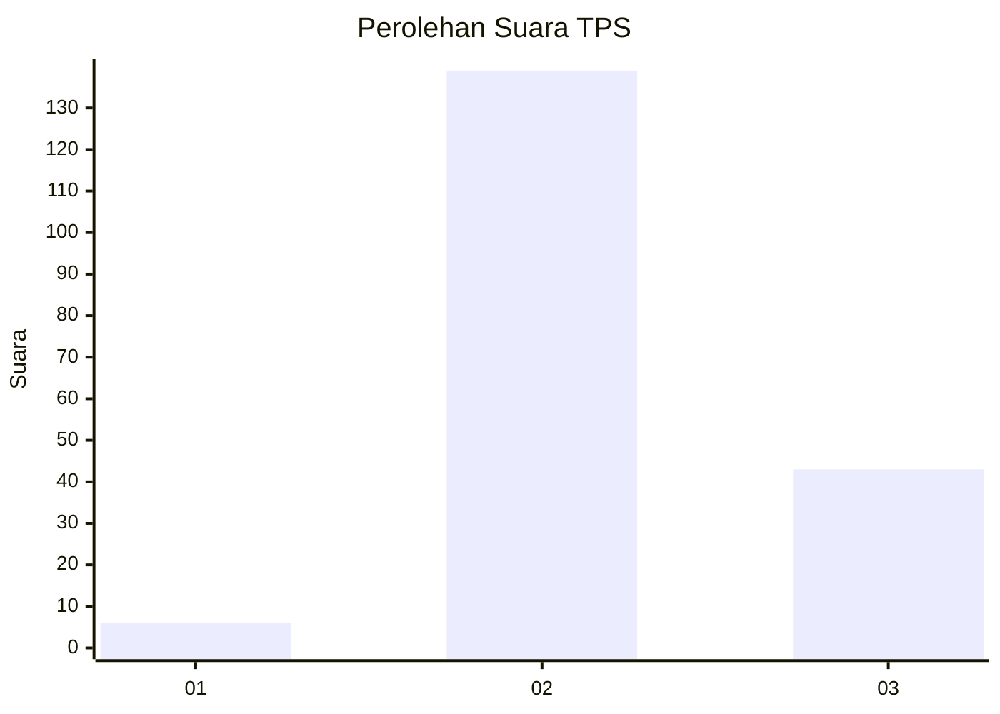
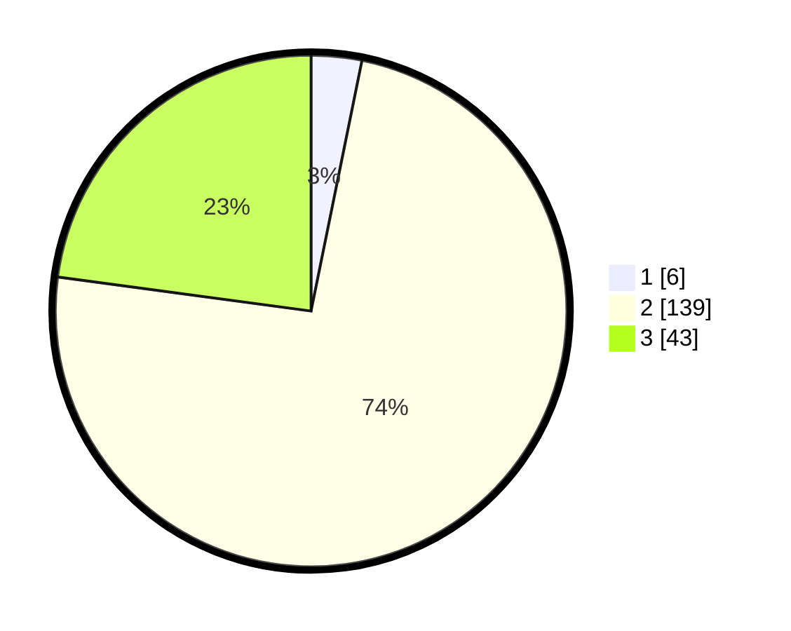

# Hasil

## Grafik

## Tabel

| No. | Nama Paslon    | Suara | Suara (raw) | Persentase |
|:--- |:-------------- | -----:| -----------:| ----------:|
| 1   | ANIES MUHAIMIN | 6     | [6][p-1]    | 3,19       |
| 2   | PRABOWO GIBRAN | 139   | [139][p-2]  | 73,94      |
| 3   | GANJAR MAHFUD  | 43    | [43][p-3]   | 22,87      |

[p-1]: https://github.com/gigit-pemilu/pemilu-2024/blob/main/pilpres/hitung-suara/sub/32-jawa-barat/sub/12-indramayu/sub/03-gabuswetan/sub/2001-kedungdawa/sub/001-tps/sub/paslon-1.txt
[p-2]: https://github.com/gigit-pemilu/pemilu-2024/blob/main/pilpres/hitung-suara/sub/32-jawa-barat/sub/12-indramayu/sub/03-gabuswetan/sub/2001-kedungdawa/sub/001-tps/sub/paslon-2.txt
[p-3]: https://github.com/gigit-pemilu/pemilu-2024/blob/main/pilpres/hitung-suara/sub/32-jawa-barat/sub/12-indramayu/sub/03-gabuswetan/sub/2001-kedungdawa/sub/001-tps/sub/paslon-3.txt

## Foto C Plano

https://sirekap-obj-formc.kpu.go.id/8503/pemilu/ppwp/32/12/03/20/01/3212032001001-20240214-224734--3f24b244-1de1-4b6c-bfd3-61b17d357c38.jpg

https://sirekap-obj-formc.kpu.go.id/8503/pemilu/ppwp/32/12/03/20/01/3212032001001-20240214-224903--62ea7e0c-5819-4a7f-aa62-91d5d99eab0d.jpg

https://sirekap-obj-formc.kpu.go.id/8503/pemilu/ppwp/32/12/03/20/01/3212032001001-20240214-225022--fc6eb8fc-19f8-4e8a-88f2-f2de8276ae6e.jpg

## Metadata

| Key        | Value               |
| ---------- | ------------------- |
| Time Stamp | 2024-02-15 12:00:28 |

