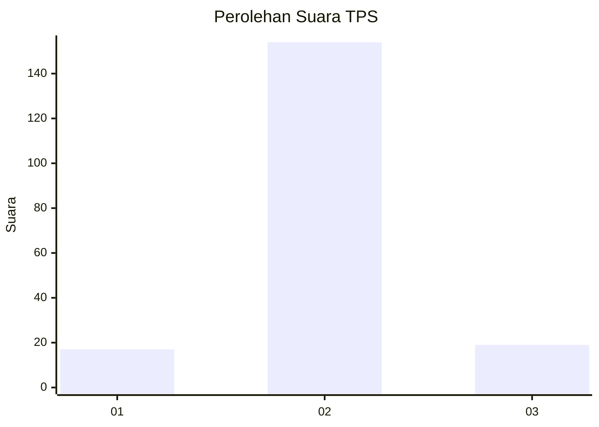
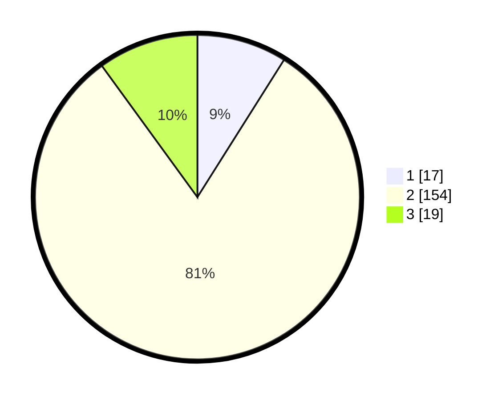

# Hasil

## Grafik

## Tabel

| No. | Nama Paslon    | Suara | Suara (raw) | Persentase |
|:--- |:-------------- | -----:| -----------:| ----------:|
| 1   | ANIES MUHAIMIN | 17    | [17][p-1]   | 8,95       |
| 2   | PRABOWO GIBRAN | 154   | [154][p-2]  | 81,05      |
| 3   | GANJAR MAHFUD  | 19    | [19][p-3]   | 10,00      |

[p-1]: https://github.com/gigit-pemilu/pemilu-2024-32-jawa-barat/blob/main/pilpres/hitung-suara/sub/32-jawa-barat/sub/12-indramayu/sub/03-gabuswetan/sub/2001-kedungdawa/sub/004-tps/sub/paslon-1.txt
[p-2]: https://github.com/gigit-pemilu/pemilu-2024-32-jawa-barat/blob/main/pilpres/hitung-suara/sub/32-jawa-barat/sub/12-indramayu/sub/03-gabuswetan/sub/2001-kedungdawa/sub/004-tps/sub/paslon-2.txt
[p-3]: https://github.com/gigit-pemilu/pemilu-2024-32-jawa-barat/blob/main/pilpres/hitung-suara/sub/32-jawa-barat/sub/12-indramayu/sub/03-gabuswetan/sub/2001-kedungdawa/sub/004-tps/sub/paslon-3.txt

## Foto C Plano

https://sirekap-obj-formc.kpu.go.id/111a/pemilu/ppwp/32/12/03/20/01/3212032001004-20240215-034224--3ec050bf-0f3f-4470-b266-ac7afd7baf8c.jpg

https://sirekap-obj-formc.kpu.go.id/111a/pemilu/ppwp/32/12/03/20/01/3212032001004-20240215-034302--aa27ebfa-9ea6-4255-84a8-6ce918c48797.jpg

https://sirekap-obj-formc.kpu.go.id/111a/pemilu/ppwp/32/12/03/20/01/3212032001004-20240215-034337--29ff5679-eef8-4218-bf11-ed627c769637.jpg

## Metadata

| Key        | Value               |
| ---------- | ------------------- |
| Time Stamp | 2024-02-15 15:00:29 |

