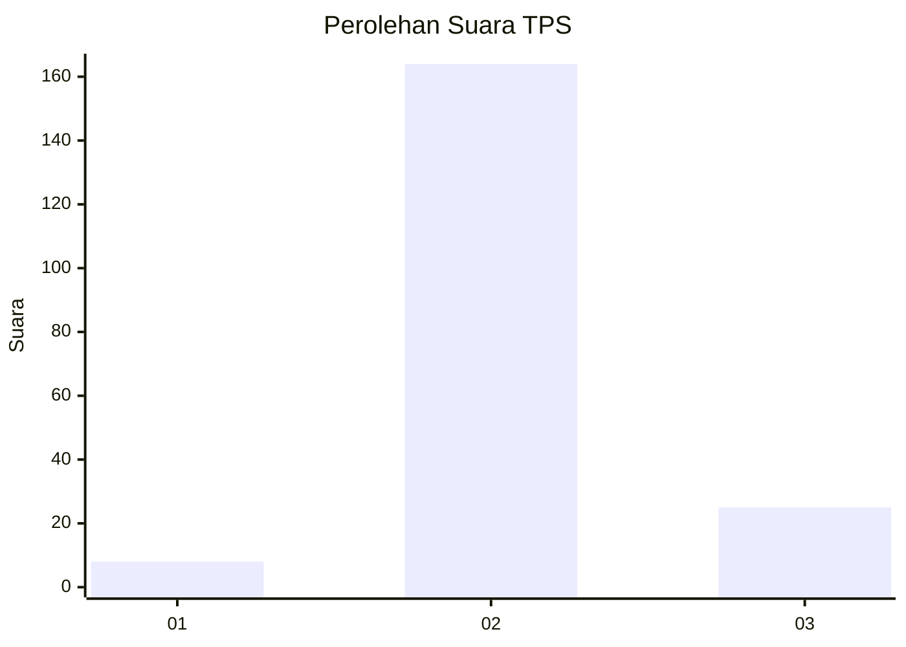
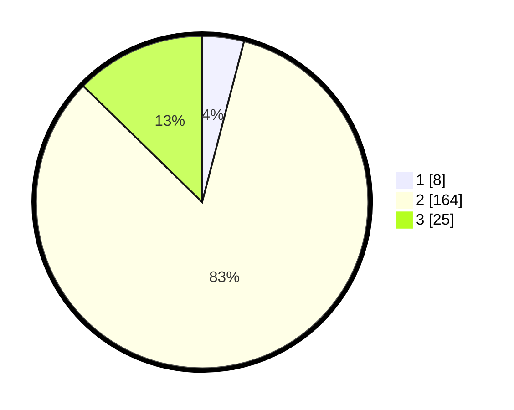

# Hasil

## Grafik

## Tabel

| No. | Nama Paslon    | Suara | Suara (raw) | Persentase |
|:--- |:-------------- | -----:| -----------:| ----------:|
| 1   | ANIES MUHAIMIN | 8     | [8][p-1]    | 4,06       |
| 2   | PRABOWO GIBRAN | 164   | [164][p-2]  | 83,25      |
| 3   | GANJAR MAHFUD  | 25    | [25][p-3]   | 12,69      |

[p-1]: https://github.com/gigit-pemilu/pemilu-2024-32-jawa-barat/blob/main/pilpres/hitung-suara/sub/32-jawa-barat/sub/12-indramayu/sub/03-gabuswetan/sub/2001-kedungdawa/sub/005-tps/sub/paslon-1.txt
[p-2]: https://github.com/gigit-pemilu/pemilu-2024-32-jawa-barat/blob/main/pilpres/hitung-suara/sub/32-jawa-barat/sub/12-indramayu/sub/03-gabuswetan/sub/2001-kedungdawa/sub/005-tps/sub/paslon-2.txt
[p-3]: https://github.com/gigit-pemilu/pemilu-2024-32-jawa-barat/blob/main/pilpres/hitung-suara/sub/32-jawa-barat/sub/12-indramayu/sub/03-gabuswetan/sub/2001-kedungdawa/sub/005-tps/sub/paslon-3.txt

## Foto C Plano

https://sirekap-obj-formc.kpu.go.id/91ea/pemilu/ppwp/32/12/03/20/01/3212032001005-20240214-232451--20b9cf09-fe6a-4b1e-85c0-c28a1cac1d5e.jpg

https://sirekap-obj-formc.kpu.go.id/91ea/pemilu/ppwp/32/12/03/20/01/3212032001005-20240214-232000--26984671-1991-408b-afaf-5a26a04b2dad.jpg

https://sirekap-obj-formc.kpu.go.id/91ea/pemilu/ppwp/32/12/03/20/01/3212032001005-20240214-232208--740ea701-609b-4e9f-b89f-a0efbf4e7b1e.jpg

## Metadata

| Key        | Value               |
| ---------- | ------------------- |
| Time Stamp | 2024-02-15 09:00:24 |

