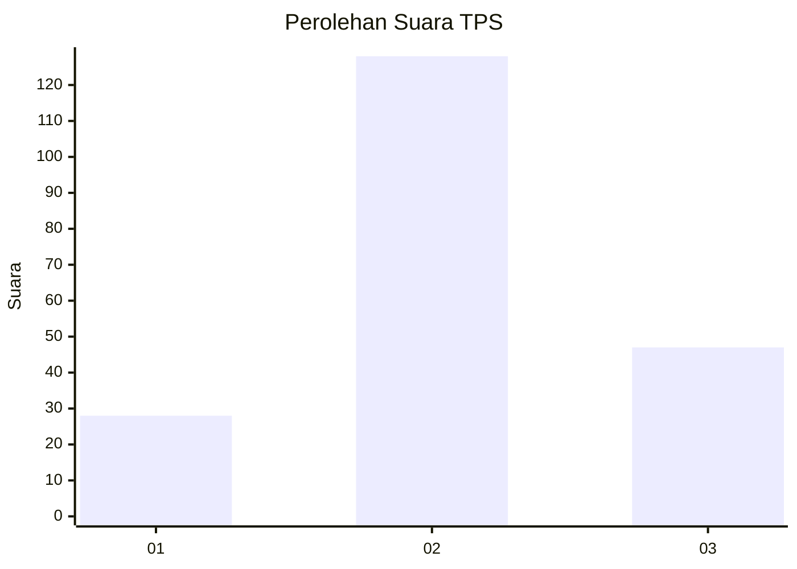
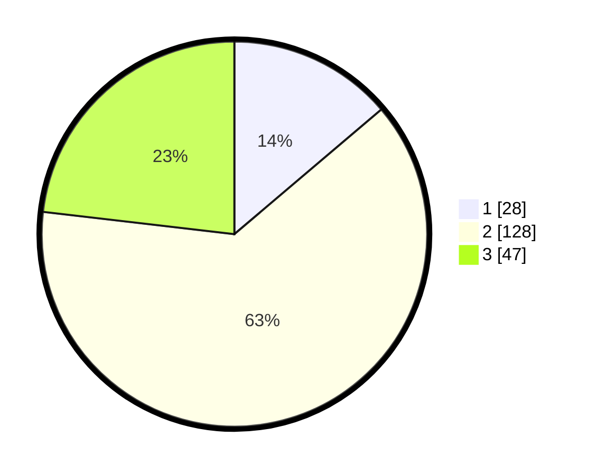

# Hasil

## Grafik

## Tabel

| No. | Nama Paslon    | Suara | Suara (raw) | Persentase |
|:--- |:-------------- | -----:| -----------:| ----------:|
| 1   | ANIES MUHAIMIN | 28    | [28][p-1]   | 13,79      |
| 2   | PRABOWO GIBRAN | 128   | [128][p-2]  | 63,05      |
| 3   | GANJAR MAHFUD  | 47    | [47][p-3]   | 23,15      |

[p-1]: https://github.com/gigit-pemilu/pemilu-2024/blob/main/pilpres/hitung-suara/sub/32-jawa-barat/sub/12-indramayu/sub/03-gabuswetan/sub/2008-gabuswetan/sub/009-tps/sub/paslon-1.txt
[p-2]: https://github.com/gigit-pemilu/pemilu-2024/blob/main/pilpres/hitung-suara/sub/32-jawa-barat/sub/12-indramayu/sub/03-gabuswetan/sub/2008-gabuswetan/sub/009-tps/sub/paslon-2.txt
[p-3]: https://github.com/gigit-pemilu/pemilu-2024/blob/main/pilpres/hitung-suara/sub/32-jawa-barat/sub/12-indramayu/sub/03-gabuswetan/sub/2008-gabuswetan/sub/009-tps/sub/paslon-3.txt

## Foto C Plano

https://sirekap-obj-formc.kpu.go.id/a392/pemilu/ppwp/32/12/03/20/08/3212032008009-20240214-204506--eac40c47-0e9e-407a-9d1a-2c2ece5c8fa6.jpg

https://sirekap-obj-formc.kpu.go.id/a392/pemilu/ppwp/32/12/03/20/08/3212032008009-20240214-204836--a912d5c0-8b22-42c2-a235-d6600ac7c55f.jpg

https://sirekap-obj-formc.kpu.go.id/a392/pemilu/ppwp/32/12/03/20/08/3212032008009-20240214-232620--c0f37c8e-6b57-40b7-a12d-656fc7024638.jpg

## Metadata

| Key        | Value               |
| ---------- | ------------------- |
| Time Stamp | 2024-02-16 00:00:26 |

