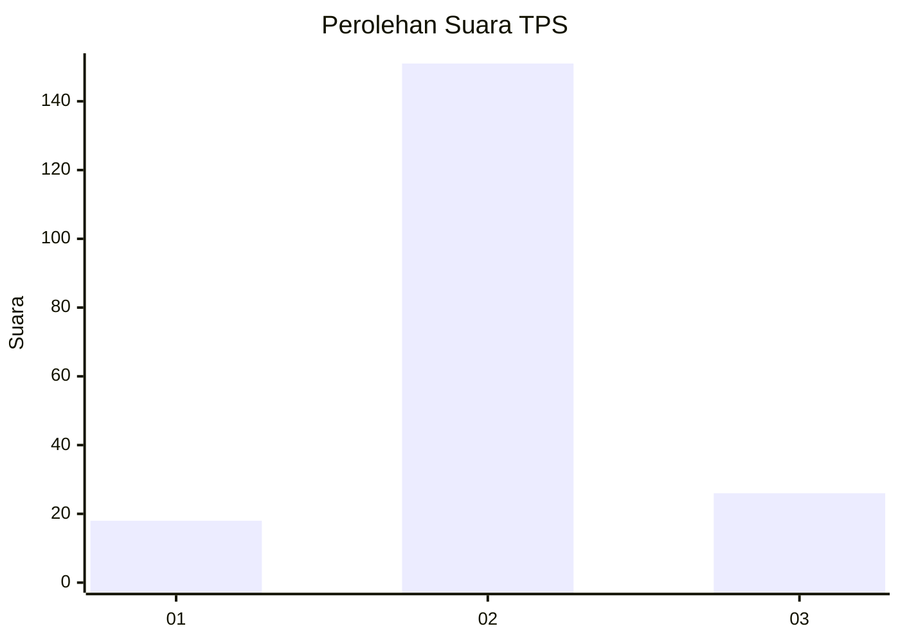
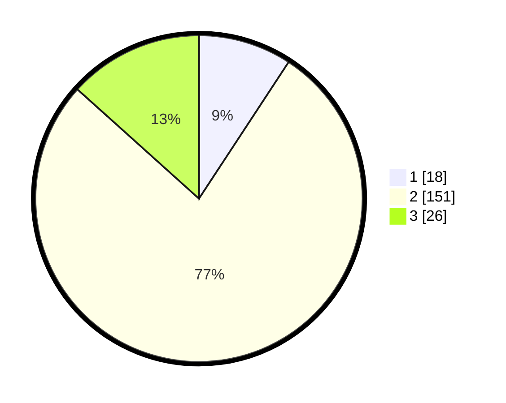

# Hasil

## Grafik

## Tabel

| No. | Nama Paslon    | Suara | Suara (raw) | Persentase |
|:--- |:-------------- | -----:| -----------:| ----------:|
| 1   | ANIES MUHAIMIN | 18    | [18][p-1]   | 9,23       |
| 2   | PRABOWO GIBRAN | 151   | [151][p-2]  | 77,44      |
| 3   | GANJAR MAHFUD  | 26    | [26][p-3]   | 13,33      |

[p-1]: https://github.com/gigit-pemilu/pemilu-2024-32-jawa-barat/blob/main/pilpres/hitung-suara/sub/32-jawa-barat/sub/12-indramayu/sub/04-cikedung/sub/2003-loyang/sub/001-tps/sub/paslon-1.txt
[p-2]: https://github.com/gigit-pemilu/pemilu-2024-32-jawa-barat/blob/main/pilpres/hitung-suara/sub/32-jawa-barat/sub/12-indramayu/sub/04-cikedung/sub/2003-loyang/sub/001-tps/sub/paslon-2.txt
[p-3]: https://github.com/gigit-pemilu/pemilu-2024-32-jawa-barat/blob/main/pilpres/hitung-suara/sub/32-jawa-barat/sub/12-indramayu/sub/04-cikedung/sub/2003-loyang/sub/001-tps/sub/paslon-3.txt

## Foto C Plano

https://sirekap-obj-formc.kpu.go.id/0dba/pemilu/ppwp/32/12/04/20/03/3212042003001-20240215-043633--5525374d-fe90-490b-a504-9a90ee4dead1.jpg

https://sirekap-obj-formc.kpu.go.id/0dba/pemilu/ppwp/32/12/04/20/03/3212042003001-20240215-044500--3bf49c33-2aa7-47d5-86ed-d949db9b37d5.jpg

https://sirekap-obj-formc.kpu.go.id/0dba/pemilu/ppwp/32/12/04/20/03/3212042003001-20240215-042129--d9988044-6c1f-4ab2-afe0-dd7adfd1de93.jpg

## Metadata

| Key        | Value               |
| ---------- | ------------------- |
| Time Stamp | 2024-02-15 22:00:27 |

