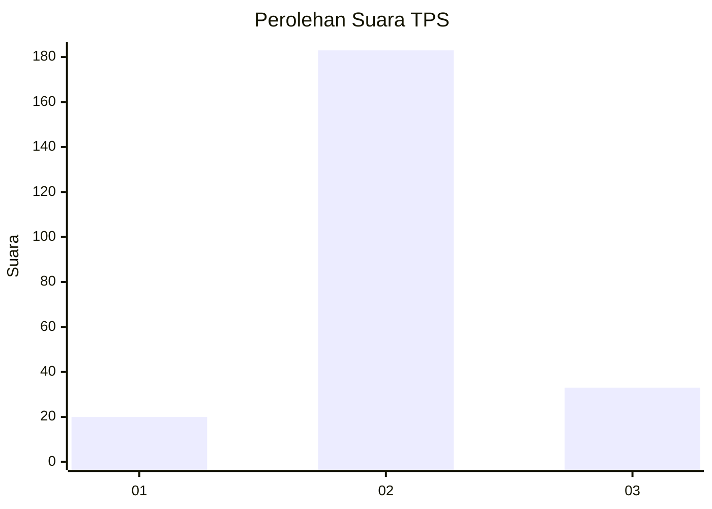
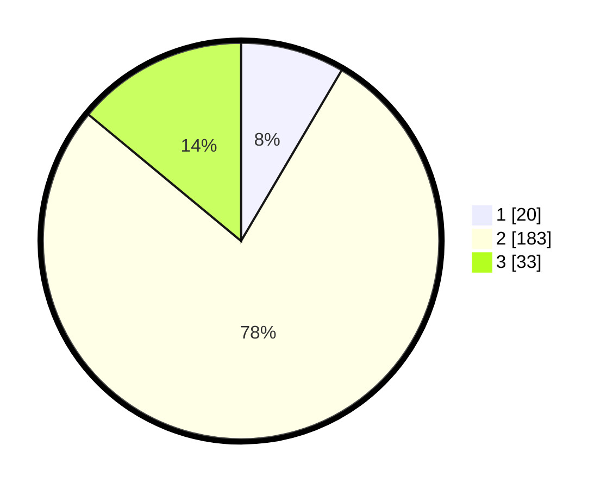

# Hasil

## Grafik

## Tabel

| No. | Nama Paslon    | Suara | Suara (raw) | Persentase |
|:--- |:-------------- | -----:| -----------:| ----------:|
| 1   | ANIES MUHAIMIN | 20    | [20][p-1]   | 8,47       |
| 2   | PRABOWO GIBRAN | 183   | [183][p-2]  | 77,54      |
| 3   | GANJAR MAHFUD  | 33    | [33][p-3]   | 13,98      |

[p-1]: https://github.com/gigit-pemilu/pemilu-2024/blob/main/pilpres/hitung-suara/sub/32-jawa-barat/sub/12-indramayu/sub/04-cikedung/sub/2003-loyang/sub/006-tps/sub/paslon-1.txt
[p-2]: https://github.com/gigit-pemilu/pemilu-2024/blob/main/pilpres/hitung-suara/sub/32-jawa-barat/sub/12-indramayu/sub/04-cikedung/sub/2003-loyang/sub/006-tps/sub/paslon-2.txt
[p-3]: https://github.com/gigit-pemilu/pemilu-2024/blob/main/pilpres/hitung-suara/sub/32-jawa-barat/sub/12-indramayu/sub/04-cikedung/sub/2003-loyang/sub/006-tps/sub/paslon-3.txt

## Foto C Plano

https://sirekap-obj-formc.kpu.go.id/7ecf/pemilu/ppwp/32/12/04/20/03/3212042003006-20240215-070747--fb70e030-70bf-44fd-9953-bdc4f5e3adee.jpg

https://sirekap-obj-formc.kpu.go.id/7ecf/pemilu/ppwp/32/12/04/20/03/3212042003006-20240215-070911--ccd68cda-e90a-4e6d-9dab-7d8f4f6eea68.jpg

https://sirekap-obj-formc.kpu.go.id/7ecf/pemilu/ppwp/32/12/04/20/03/3212042003006-20240215-071104--9fa00fd5-b9fd-4acc-82e2-0a873ee2b1d9.jpg

## Metadata

| Key        | Value               |
| ---------- | ------------------- |
| Time Stamp | 2024-02-15 17:30:25 |

