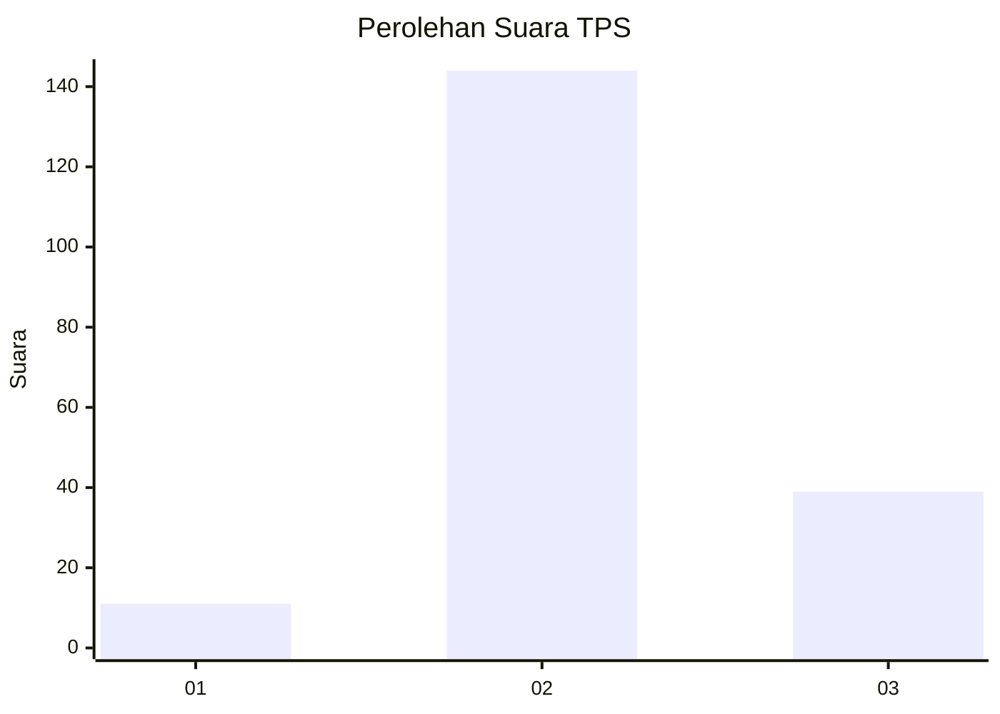

# Hasil

## Grafik

## Tabel

| No. | Nama Paslon    | Suara | Suara (raw) | Persentase |
|:--- |:-------------- | -----:| -----------:| ----------:|
| 1   | ANIES MUHAIMIN | 11    | [11][p-1]   | 5,67       |
| 2   | PRABOWO GIBRAN | 144   | [144][p-2]  | 74,23      |
| 3   | GANJAR MAHFUD  | 39    | [39][p-3]   | 20,10      |

[p-1]: https://github.com/gigit-pemilu/pemilu-2024/blob/main/pilpres/hitung-suara/sub/32-jawa-barat/sub/12-indramayu/sub/04-cikedung/sub/2005-jatisura/sub/003-tps/sub/paslon-1.txt
[p-2]: https://github.com/gigit-pemilu/pemilu-2024/blob/main/pilpres/hitung-suara/sub/32-jawa-barat/sub/12-indramayu/sub/04-cikedung/sub/2005-jatisura/sub/003-tps/sub/paslon-2.txt
[p-3]: https://github.com/gigit-pemilu/pemilu-2024/blob/main/pilpres/hitung-suara/sub/32-jawa-barat/sub/12-indramayu/sub/04-cikedung/sub/2005-jatisura/sub/003-tps/sub/paslon-3.txt

## Foto C Plano

https://sirekap-obj-formc.kpu.go.id/eee5/pemilu/ppwp/32/12/04/20/05/3212042005003-20240217-132957--42cd36ed-0de4-497c-bbae-be22b2c97d79.jpg

https://sirekap-obj-formc.kpu.go.id/eee5/pemilu/ppwp/32/12/04/20/05/3212042005003-20240217-132701--2ae3c093-7ce3-48dc-8ce0-8980cd0740df.jpg

https://sirekap-obj-formc.kpu.go.id/eee5/pemilu/ppwp/32/12/04/20/05/3212042005003-20240217-132836--f0243d5e-43e1-4fc8-917a-8d39ffd8963f.jpg

## Metadata

| Key        | Value               |
| ---------- | ------------------- |
| Time Stamp | 2024-02-19 06:16:00 |

