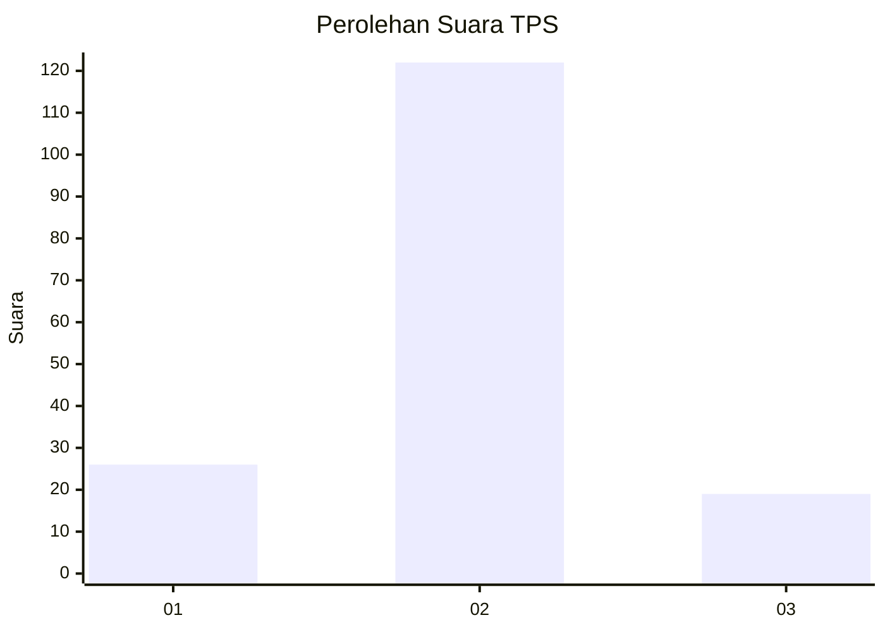
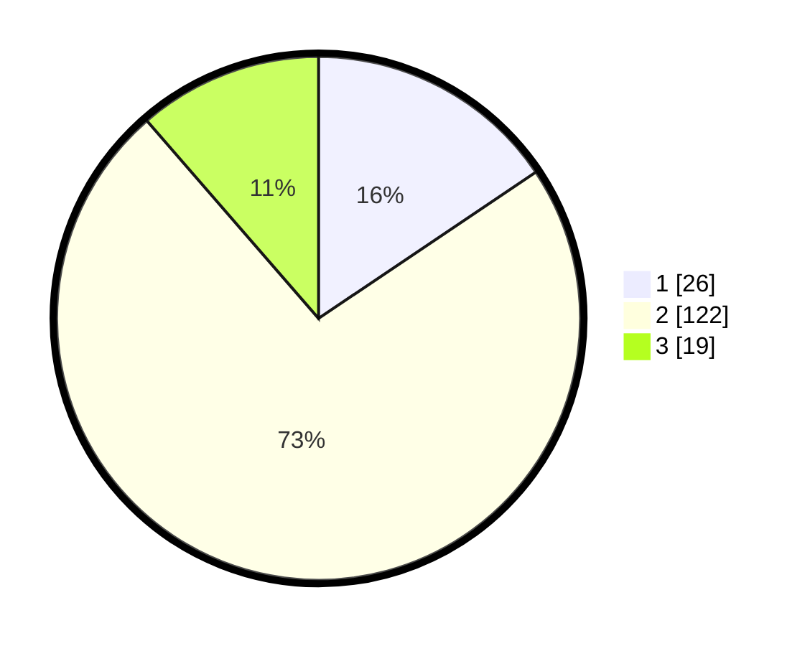

# Hasil

## Grafik

## Tabel

| No. | Nama Paslon    | Suara | Suara (raw) | Persentase |
|:--- |:-------------- | -----:| -----------:| ----------:|
| 1   | ANIES MUHAIMIN | 26    | [26][p-1]   | 15,57      |
| 2   | PRABOWO GIBRAN | 122   | [122][p-2]  | 73,05      |
| 3   | GANJAR MAHFUD  | 19    | [19][p-3]   | 11,38      |

[p-1]: https://github.com/gigit-pemilu/pemilu-2024-32-jawa-barat/blob/main/pilpres/hitung-suara/sub/32-jawa-barat/sub/12-indramayu/sub/05-lelea/sub/2001-tunggulpayung/sub/001-tps/sub/paslon-1.txt
[p-2]: https://github.com/gigit-pemilu/pemilu-2024-32-jawa-barat/blob/main/pilpres/hitung-suara/sub/32-jawa-barat/sub/12-indramayu/sub/05-lelea/sub/2001-tunggulpayung/sub/001-tps/sub/paslon-2.txt
[p-3]: https://github.com/gigit-pemilu/pemilu-2024-32-jawa-barat/blob/main/pilpres/hitung-suara/sub/32-jawa-barat/sub/12-indramayu/sub/05-lelea/sub/2001-tunggulpayung/sub/001-tps/sub/paslon-3.txt

## Foto C Plano

https://sirekap-obj-formc.kpu.go.id/ee6a/pemilu/ppwp/32/12/05/20/01/3212052001001-20240215-011736--54d04313-1b77-442c-aaae-ab8b361a6f2f.jpg

https://sirekap-obj-formc.kpu.go.id/ee6a/pemilu/ppwp/32/12/05/20/01/3212052001001-20240215-010815--8133530e-5c7a-47be-aa9f-4aae24426641.jpg

https://sirekap-obj-formc.kpu.go.id/ee6a/pemilu/ppwp/32/12/05/20/01/3212052001001-20240215-011417--65b624a0-2240-4fa2-8175-c78f340a41fb.jpg

## Metadata

| Key        | Value               |
| ---------- | ------------------- |
| Time Stamp | 2024-02-15 17:00:25 |

