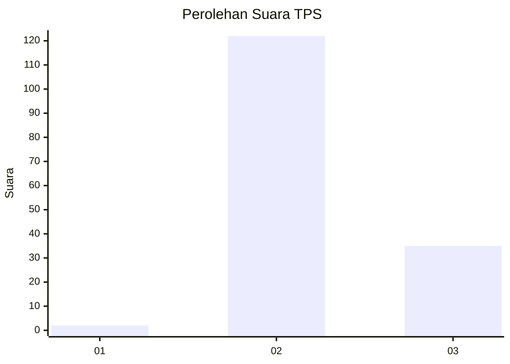
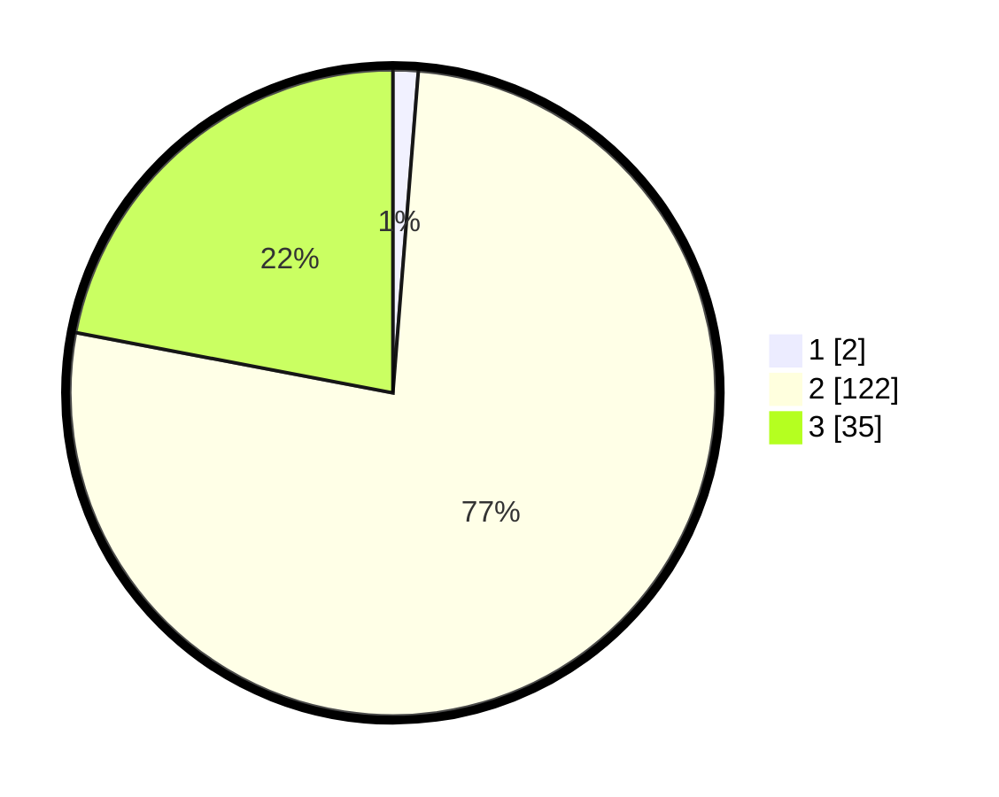

# Hasil

## Grafik

## Tabel

| No. | Nama Paslon    | Suara | Suara (raw) | Persentase |
|:--- |:-------------- | -----:| -----------:| ----------:|
| 1   | ANIES MUHAIMIN | 2     | [2][p-1]    | 1,26       |
| 2   | PRABOWO GIBRAN | 122   | [122][p-2]  | 76,73      |
| 3   | GANJAR MAHFUD  | 35    | [35][p-3]   | 22,01      |

[p-1]: https://github.com/gigit-pemilu/pemilu-2024-32-jawa-barat/blob/main/pilpres/hitung-suara/sub/32-jawa-barat/sub/12-indramayu/sub/05-lelea/sub/2001-tunggulpayung/sub/005-tps/sub/paslon-1.txt
[p-2]: https://github.com/gigit-pemilu/pemilu-2024-32-jawa-barat/blob/main/pilpres/hitung-suara/sub/32-jawa-barat/sub/12-indramayu/sub/05-lelea/sub/2001-tunggulpayung/sub/005-tps/sub/paslon-2.txt
[p-3]: https://github.com/gigit-pemilu/pemilu-2024-32-jawa-barat/blob/main/pilpres/hitung-suara/sub/32-jawa-barat/sub/12-indramayu/sub/05-lelea/sub/2001-tunggulpayung/sub/005-tps/sub/paslon-3.txt

## Foto C Plano

https://sirekap-obj-formc.kpu.go.id/1c77/pemilu/ppwp/32/12/05/20/01/3212052001005-20240214-221926--f4bdacd9-6637-461f-835b-1d986a96fa15.jpg

https://sirekap-obj-formc.kpu.go.id/1c77/pemilu/ppwp/32/12/05/20/01/3212052001005-20240214-222614--57b914f3-13f8-47e9-a7e7-162756b399af.jpg

https://sirekap-obj-formc.kpu.go.id/1c77/pemilu/ppwp/32/12/05/20/01/3212052001005-20240214-222827--c4e1aa32-2ce2-4e16-ba68-c1370b3bef9d.jpg

## Metadata

| Key        | Value               |
| ---------- | ------------------- |
| Time Stamp | 2024-02-15 17:00:25 |

