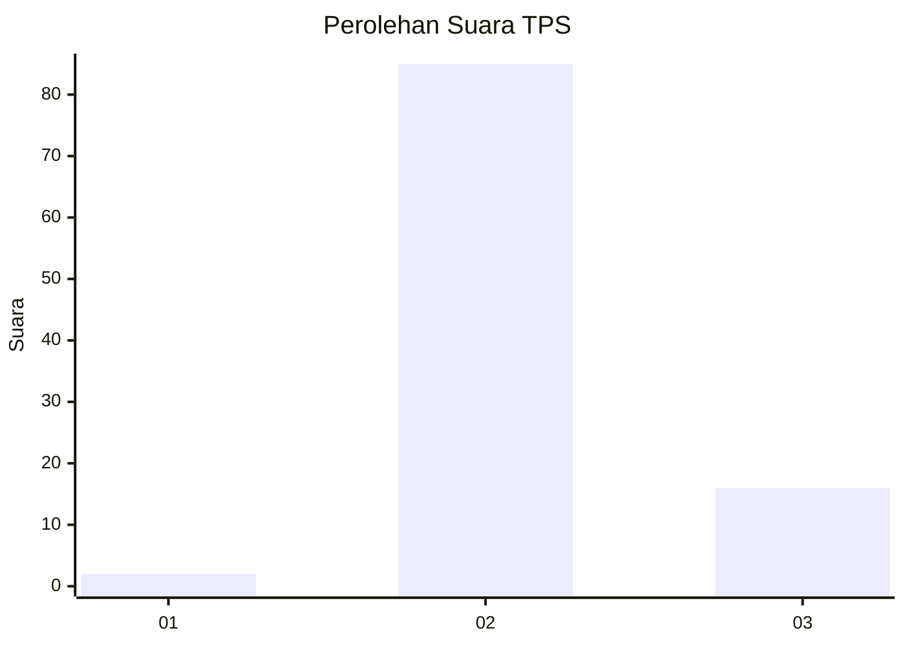
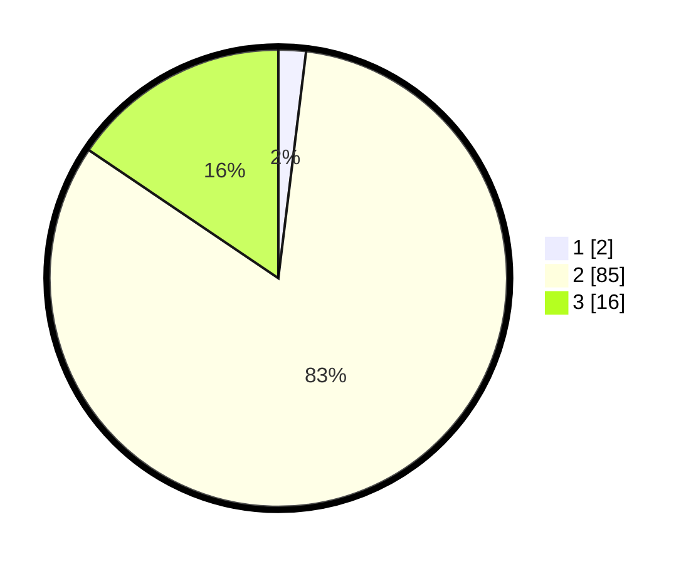

# Hasil

## Grafik

## Tabel

| No. | Nama Paslon    | Suara | Suara (raw) | Persentase |
|:--- |:-------------- | -----:| -----------:| ----------:|
| 1   | ANIES MUHAIMIN | 2     | [2][p-1]    | 1,94       |
| 2   | PRABOWO GIBRAN | 85    | [85][p-2]   | 82,52      |
| 3   | GANJAR MAHFUD  | 16    | [16][p-3]   | 15,53      |

[p-1]: https://github.com/gigit-pemilu/pemilu-2024/blob/main/pilpres/hitung-suara/sub/32-jawa-barat/sub/12-indramayu/sub/05-lelea/sub/2004-tempel/sub/010-tps/sub/paslon-1.txt
[p-2]: https://github.com/gigit-pemilu/pemilu-2024/blob/main/pilpres/hitung-suara/sub/32-jawa-barat/sub/12-indramayu/sub/05-lelea/sub/2004-tempel/sub/010-tps/sub/paslon-2.txt
[p-3]: https://github.com/gigit-pemilu/pemilu-2024/blob/main/pilpres/hitung-suara/sub/32-jawa-barat/sub/12-indramayu/sub/05-lelea/sub/2004-tempel/sub/010-tps/sub/paslon-3.txt

## Foto C Plano

https://sirekap-obj-formc.kpu.go.id/7fa7/pemilu/ppwp/32/12/05/20/04/3212052004010-20240214-215938--ce62069f-78c9-409a-ada5-a0313c35b2d9.jpg

https://sirekap-obj-formc.kpu.go.id/7fa7/pemilu/ppwp/32/12/05/20/04/3212052004010-20240214-234654--87baaebd-5715-4da8-bbb5-fd0d59ab1837.jpg

https://sirekap-obj-formc.kpu.go.id/7fa7/pemilu/ppwp/32/12/05/20/04/3212052004010-20240214-234805--5096e3a9-06ad-43b0-b0f0-0476ae5f6fb3.jpg

## Metadata

| Key        | Value               |
| ---------- | ------------------- |
| Time Stamp | 2024-02-15 15:00:29 |

