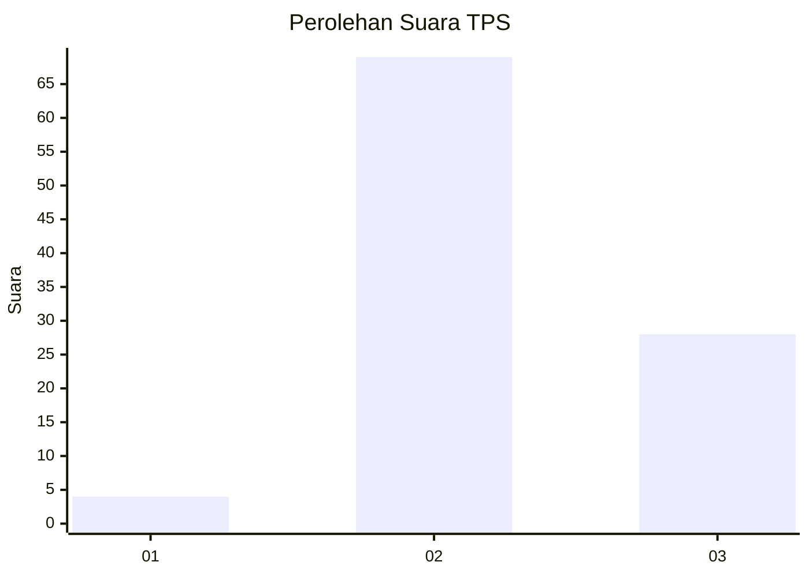
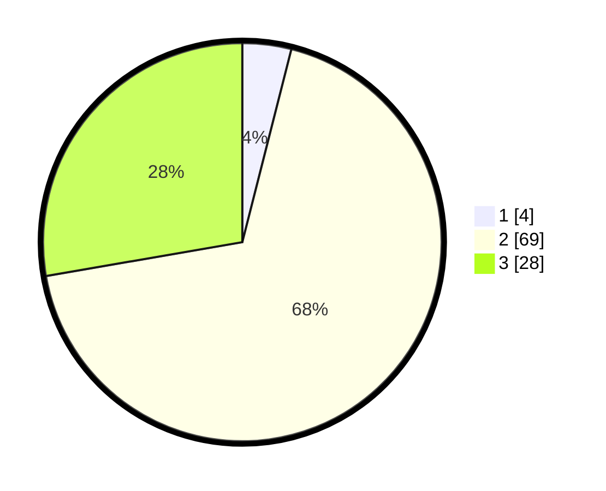

# Hasil

## Grafik

## Tabel

| No. | Nama Paslon    | Suara | Suara (raw) | Persentase |
|:--- |:-------------- | -----:| -----------:| ----------:|
| 1   | ANIES MUHAIMIN | 4     | [4][p-1]    | 3,96       |
| 2   | PRABOWO GIBRAN | 69    | [69][p-2]   | 68,32      |
| 3   | GANJAR MAHFUD  | 28    | [28][p-3]   | 27,72      |

[p-1]: https://github.com/gigit-pemilu/pemilu-2024-32-jawa-barat/blob/main/pilpres/hitung-suara/sub/32-jawa-barat/sub/12-indramayu/sub/05-lelea/sub/2004-tempel/sub/011-tps/sub/paslon-1.txt
[p-2]: https://github.com/gigit-pemilu/pemilu-2024-32-jawa-barat/blob/main/pilpres/hitung-suara/sub/32-jawa-barat/sub/12-indramayu/sub/05-lelea/sub/2004-tempel/sub/011-tps/sub/paslon-2.txt
[p-3]: https://github.com/gigit-pemilu/pemilu-2024-32-jawa-barat/blob/main/pilpres/hitung-suara/sub/32-jawa-barat/sub/12-indramayu/sub/05-lelea/sub/2004-tempel/sub/011-tps/sub/paslon-3.txt

## Foto C Plano

https://sirekap-obj-formc.kpu.go.id/bbf0/pemilu/ppwp/32/12/05/20/04/3212052004011-20240214-224208--c34b5b3d-5306-4d9c-8ea1-6f55584d4069.jpg

https://sirekap-obj-formc.kpu.go.id/bbf0/pemilu/ppwp/32/12/05/20/04/3212052004011-20240214-141402--740c0dfa-effc-431d-9c2f-3451c0c0683e.jpg

https://sirekap-obj-formc.kpu.go.id/bbf0/pemilu/ppwp/32/12/05/20/04/3212052004011-20240214-220310--a7459efb-98b2-47aa-a1c0-432516c3becd.jpg

## Metadata

| Key        | Value               |
| ---------- | ------------------- |
| Time Stamp | 2024-02-15 15:30:25 |

