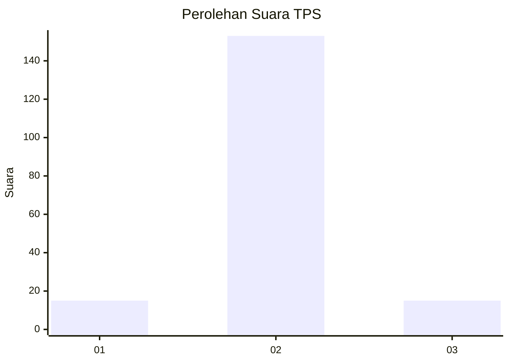
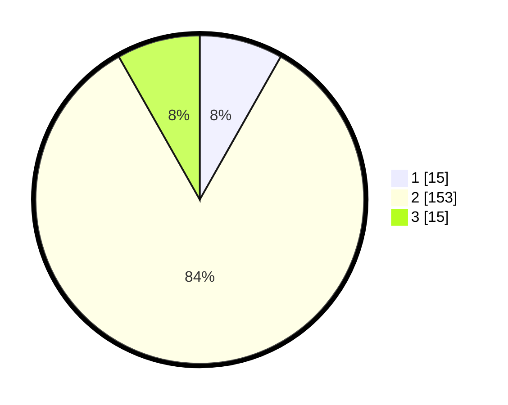

# Hasil

## Grafik

## Tabel

| No. | Nama Paslon    | Suara | Suara (raw) | Persentase |
|:--- |:-------------- | -----:| -----------:| ----------:|
| 1   | ANIES MUHAIMIN | 15    | [15][p-1]   | 8,20       |
| 2   | PRABOWO GIBRAN | 153   | [153][p-2]  | 83,61      |
| 3   | GANJAR MAHFUD  | 15    | [15][p-3]   | 8,20       |

[p-1]: https://github.com/gigit-pemilu/pemilu-2024/blob/main/pilpres/hitung-suara/sub/32-jawa-barat/sub/12-indramayu/sub/07-widasari/sub/2006-bangkaloa-ilir/sub/001-tps/sub/paslon-1.txt
[p-2]: https://github.com/gigit-pemilu/pemilu-2024/blob/main/pilpres/hitung-suara/sub/32-jawa-barat/sub/12-indramayu/sub/07-widasari/sub/2006-bangkaloa-ilir/sub/001-tps/sub/paslon-2.txt
[p-3]: https://github.com/gigit-pemilu/pemilu-2024/blob/main/pilpres/hitung-suara/sub/32-jawa-barat/sub/12-indramayu/sub/07-widasari/sub/2006-bangkaloa-ilir/sub/001-tps/sub/paslon-3.txt

## Foto C Plano

https://sirekap-obj-formc.kpu.go.id/9445/pemilu/ppwp/32/12/07/20/06/3212072006001-20240217-153512--ccb3fb1f-d8c1-461c-a85c-b5b68b5ab11c.jpg

https://sirekap-obj-formc.kpu.go.id/9445/pemilu/ppwp/32/12/07/20/06/3212072006001-20240217-154822--175335be-f993-42d6-aed3-cb80a4ccf57d.jpg

https://sirekap-obj-formc.kpu.go.id/9445/pemilu/ppwp/32/12/07/20/06/3212072006001-20240217-154913--8f58b8d8-6f02-4255-802c-36a33971acbf.jpg

## Metadata

| Key        | Value               |
| ---------- | ------------------- |
| Time Stamp | 2024-02-19 06:16:00 |

