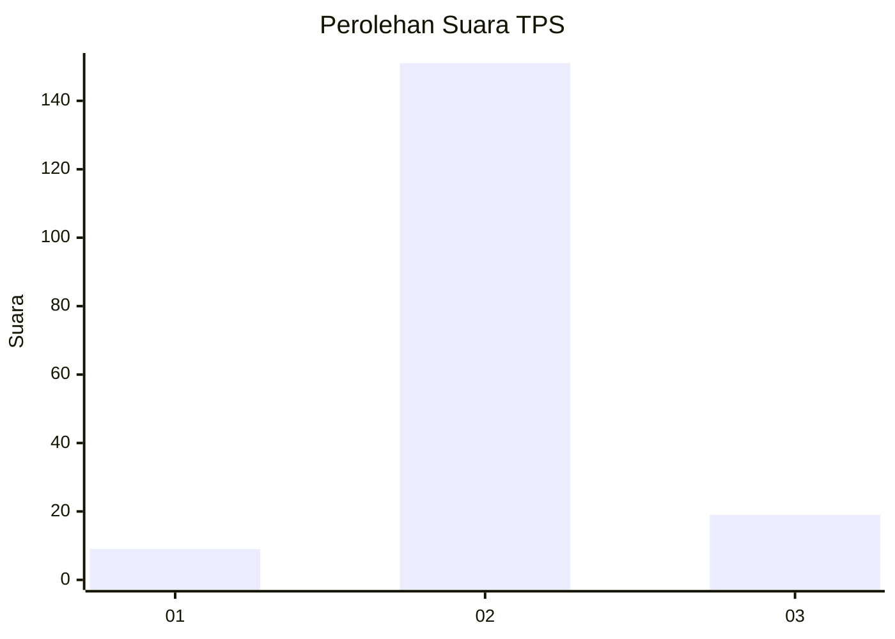
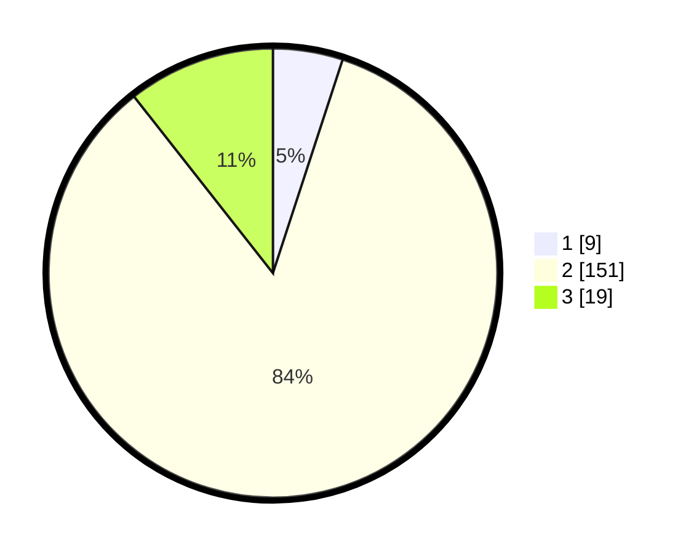

# Hasil

## Grafik

## Tabel

| No. | Nama Paslon    | Suara | Suara (raw) | Persentase |
|:--- |:-------------- | -----:| -----------:| ----------:|
| 1   | ANIES MUHAIMIN | 9     | [9][p-1]    | 5,03       |
| 2   | PRABOWO GIBRAN | 151   | [151][p-2]  | 84,36      |
| 3   | GANJAR MAHFUD  | 19    | [19][p-3]   | 10,61      |

[p-1]: https://github.com/gigit-pemilu/pemilu-2024-32-jawa-barat/blob/main/pilpres/hitung-suara/sub/32-jawa-barat/sub/12-indramayu/sub/07-widasari/sub/2006-bangkaloa-ilir/sub/002-tps/sub/paslon-1.txt
[p-2]: https://github.com/gigit-pemilu/pemilu-2024-32-jawa-barat/blob/main/pilpres/hitung-suara/sub/32-jawa-barat/sub/12-indramayu/sub/07-widasari/sub/2006-bangkaloa-ilir/sub/002-tps/sub/paslon-2.txt
[p-3]: https://github.com/gigit-pemilu/pemilu-2024-32-jawa-barat/blob/main/pilpres/hitung-suara/sub/32-jawa-barat/sub/12-indramayu/sub/07-widasari/sub/2006-bangkaloa-ilir/sub/002-tps/sub/paslon-3.txt

## Foto C Plano

https://sirekap-obj-formc.kpu.go.id/943e/pemilu/ppwp/32/12/07/20/06/3212072006002-20240214-213747--52a1fb27-f766-47fd-9779-130e6590c758.jpg

https://sirekap-obj-formc.kpu.go.id/943e/pemilu/ppwp/32/12/07/20/06/3212072006002-20240214-194754--498d4d83-4fc4-46cc-a159-1ed2430d0689.jpg

https://sirekap-obj-formc.kpu.go.id/943e/pemilu/ppwp/32/12/07/20/06/3212072006002-20240214-213902--d9b84ea7-427d-4a51-94e2-5d7c092906f6.jpg

## Metadata

| Key        | Value               |
| ---------- | ------------------- |
| Time Stamp | 2024-02-15 15:00:29 |

