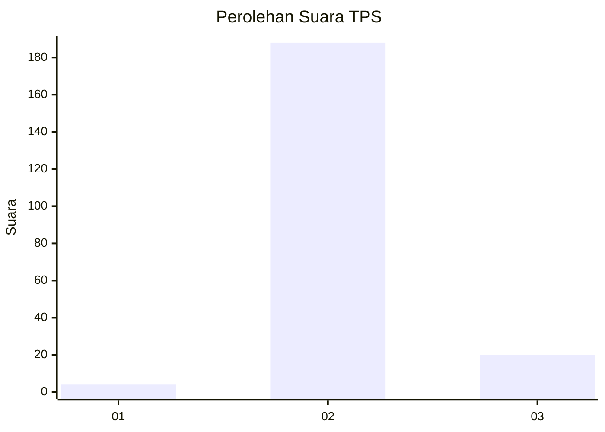
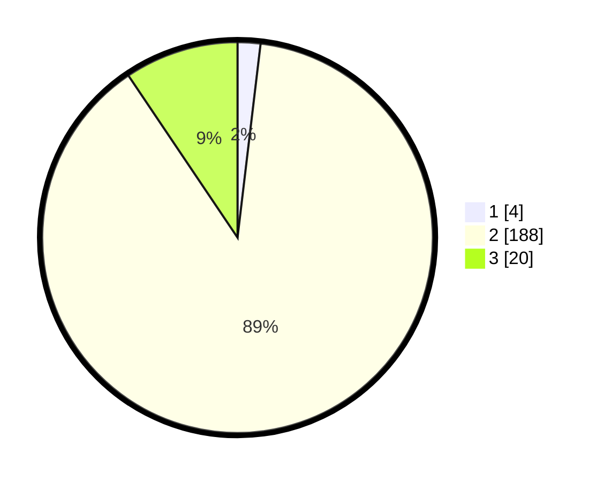

# Hasil

## Grafik

## Tabel

| No. | Nama Paslon    | Suara | Suara (raw) | Persentase |
|:--- |:-------------- | -----:| -----------:| ----------:|
| 1   | ANIES MUHAIMIN | 4     | [4][p-1]    | 1,89       |
| 2   | PRABOWO GIBRAN | 188   | [188][p-2]  | 88,68      |
| 3   | GANJAR MAHFUD  | 20    | [20][p-3]   | 9,43       |

[p-1]: https://github.com/gigit-pemilu/pemilu-2024-32-jawa-barat/blob/main/pilpres/hitung-suara/sub/32-jawa-barat/sub/12-indramayu/sub/07-widasari/sub/2006-bangkaloa-ilir/sub/003-tps/sub/paslon-1.txt
[p-2]: https://github.com/gigit-pemilu/pemilu-2024-32-jawa-barat/blob/main/pilpres/hitung-suara/sub/32-jawa-barat/sub/12-indramayu/sub/07-widasari/sub/2006-bangkaloa-ilir/sub/003-tps/sub/paslon-2.txt
[p-3]: https://github.com/gigit-pemilu/pemilu-2024-32-jawa-barat/blob/main/pilpres/hitung-suara/sub/32-jawa-barat/sub/12-indramayu/sub/07-widasari/sub/2006-bangkaloa-ilir/sub/003-tps/sub/paslon-3.txt

## Foto C Plano

https://sirekap-obj-formc.kpu.go.id/0586/pemilu/ppwp/32/12/07/20/06/3212072006003-20240214-225645--ca6bc842-1cf7-4f34-a4ea-e9b830befa6b.jpg

https://sirekap-obj-formc.kpu.go.id/0586/pemilu/ppwp/32/12/07/20/06/3212072006003-20240214-225752--9cf22a61-1820-4925-b62b-844569a8f3ce.jpg

https://sirekap-obj-formc.kpu.go.id/0586/pemilu/ppwp/32/12/07/20/06/3212072006003-20240214-230006--edc8c31e-ccf4-401c-a2cc-c9d35bf088d7.jpg

## Metadata

| Key        | Value               |
| ---------- | ------------------- |
| Time Stamp | 2024-02-15 12:00:28 |

