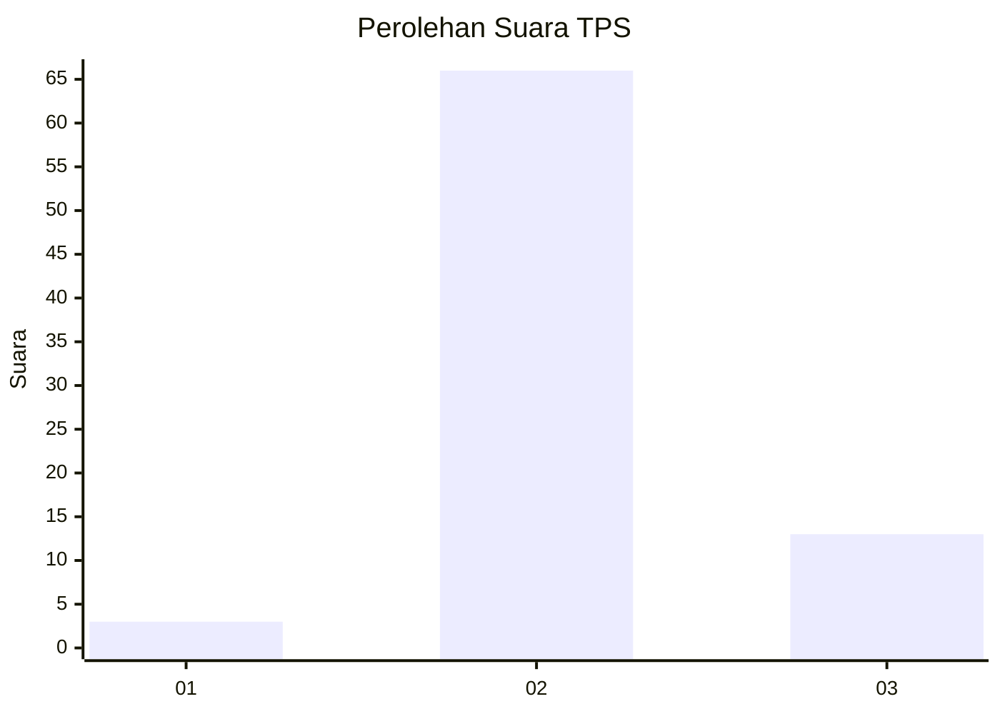
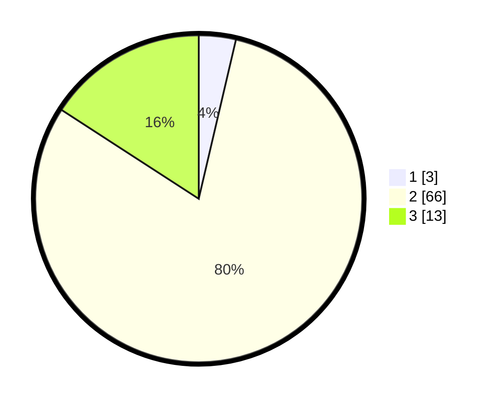

# Hasil

## Grafik

## Tabel

| No. | Nama Paslon    | Suara | Suara (raw) | Persentase |
|:--- |:-------------- | -----:| -----------:| ----------:|
| 1   | ANIES MUHAIMIN | 3     | [3][p-1]    | 3,66       |
| 2   | PRABOWO GIBRAN | 66    | [66][p-2]   | 80,49      |
| 3   | GANJAR MAHFUD  | 13    | [13][p-3]   | 15,85      |

[p-1]: https://github.com/gigit-pemilu/pemilu-2024-32-jawa-barat/blob/main/pilpres/hitung-suara/sub/32-jawa-barat/sub/12-indramayu/sub/08-kertasemaya/sub/2011-jambe/sub/017-tps/sub/paslon-1.txt
[p-2]: https://github.com/gigit-pemilu/pemilu-2024-32-jawa-barat/blob/main/pilpres/hitung-suara/sub/32-jawa-barat/sub/12-indramayu/sub/08-kertasemaya/sub/2011-jambe/sub/017-tps/sub/paslon-2.txt
[p-3]: https://github.com/gigit-pemilu/pemilu-2024-32-jawa-barat/blob/main/pilpres/hitung-suara/sub/32-jawa-barat/sub/12-indramayu/sub/08-kertasemaya/sub/2011-jambe/sub/017-tps/sub/paslon-3.txt

## Foto C Plano

https://sirekap-obj-formc.kpu.go.id/2c0c/pemilu/ppwp/32/12/08/20/11/3212082011017-20240214-222009--085de123-267f-4482-8f5e-907a25560022.jpg

https://sirekap-obj-formc.kpu.go.id/2c0c/pemilu/ppwp/32/12/08/20/11/3212082011017-20240216-190241--7dc90379-c792-4ec8-b26d-fee2c5639a98.jpg

https://sirekap-obj-formc.kpu.go.id/2c0c/pemilu/ppwp/32/12/08/20/11/3212082011017-20240216-190209--f105b8df-7b17-49bd-b4b9-6335f4480617.jpg

## Metadata

| Key        | Value               |
| ---------- | ------------------- |
| Time Stamp | 2024-02-19 06:16:00 |

