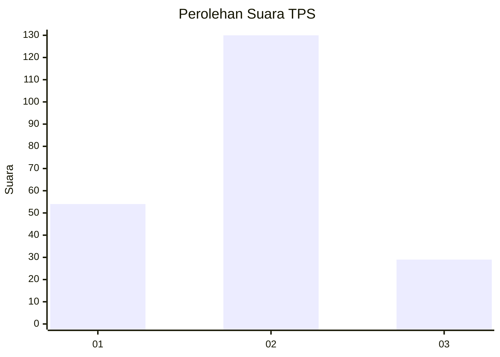
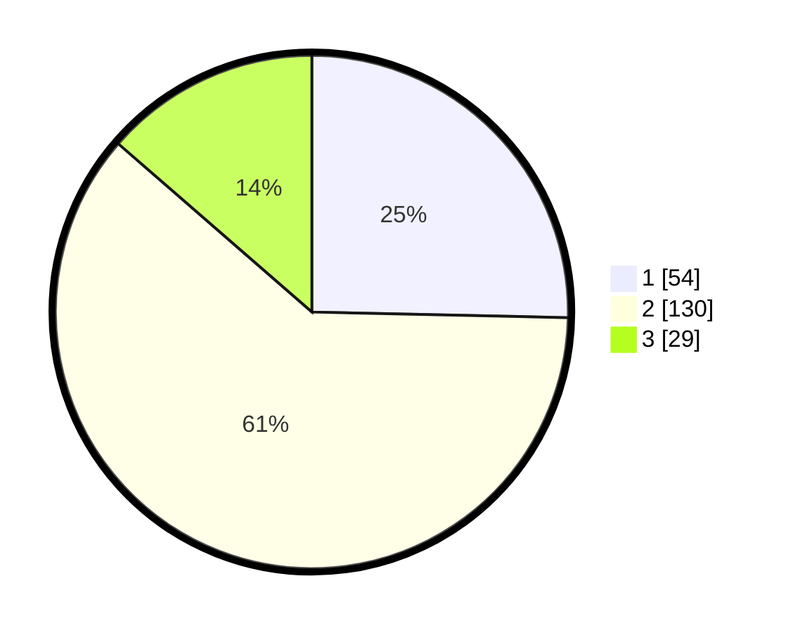

# Hasil

## Grafik

## Tabel

| No. | Nama Paslon    | Suara | Suara (raw) | Persentase |
|:--- |:-------------- | -----:| -----------:| ----------:|
| 1   | ANIES MUHAIMIN | 54    | [54][p-1]   | 25,35      |
| 2   | PRABOWO GIBRAN | 130   | [130][p-2]  | 61,03      |
| 3   | GANJAR MAHFUD  | 29    | [29][p-3]   | 13,62      |

[p-1]: https://github.com/gigit-pemilu/pemilu-2024/blob/main/pilpres/hitung-suara/sub/32-jawa-barat/sub/12-indramayu/sub/10-karangampel/sub/2008-tanjungpura/sub/003-tps/sub/paslon-1.txt
[p-2]: https://github.com/gigit-pemilu/pemilu-2024/blob/main/pilpres/hitung-suara/sub/32-jawa-barat/sub/12-indramayu/sub/10-karangampel/sub/2008-tanjungpura/sub/003-tps/sub/paslon-2.txt
[p-3]: https://github.com/gigit-pemilu/pemilu-2024/blob/main/pilpres/hitung-suara/sub/32-jawa-barat/sub/12-indramayu/sub/10-karangampel/sub/2008-tanjungpura/sub/003-tps/sub/paslon-3.txt

## Foto C Plano

https://sirekap-obj-formc.kpu.go.id/875f/pemilu/ppwp/32/12/10/20/08/3212102008003-20240215-002050--88c9175e-f8eb-4d56-b282-d60267a8cf3c.jpg

https://sirekap-obj-formc.kpu.go.id/875f/pemilu/ppwp/32/12/10/20/08/3212102008003-20240215-002249--4cc7f86e-0051-49a4-a238-07a77ca7e6d4.jpg

https://sirekap-obj-formc.kpu.go.id/875f/pemilu/ppwp/32/12/10/20/08/3212102008003-20240215-002448--763e44ef-0388-45d2-9166-89906c2534c5.jpg

## Metadata

| Key        | Value               |
| ---------- | ------------------- |
| Time Stamp | 2024-02-15 15:00:29 |

