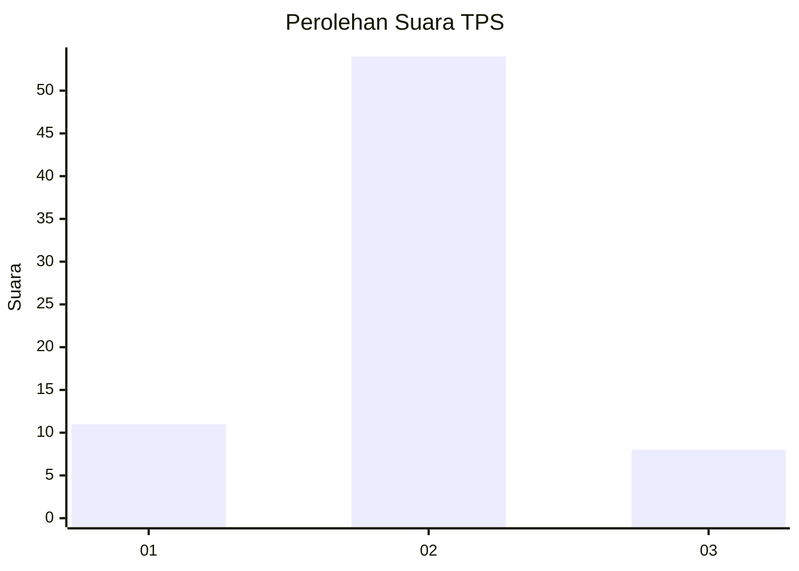
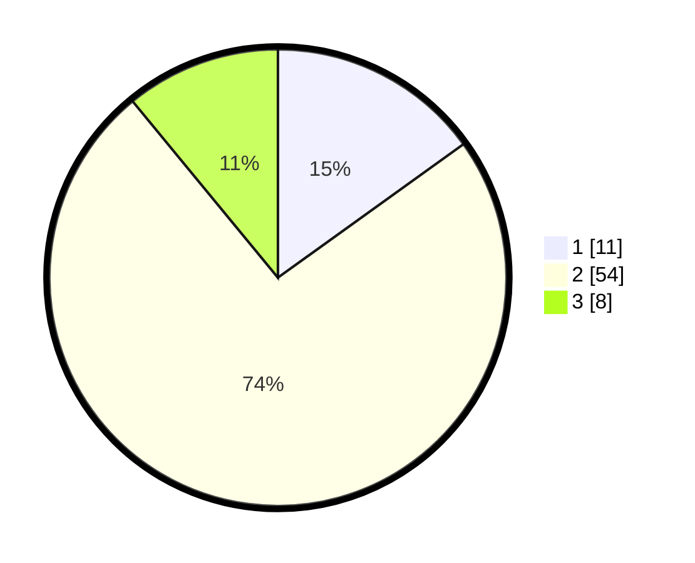

# Hasil

## Grafik

## Tabel

| No. | Nama Paslon    | Suara | Suara (raw) | Persentase |
|:--- |:-------------- | -----:| -----------:| ----------:|
| 1   | ANIES MUHAIMIN | 11    | [11][p-1]   | 15,07      |
| 2   | PRABOWO GIBRAN | 54    | [54][p-2]   | 73,97      |
| 3   | GANJAR MAHFUD  | 8     | [8][p-3]    | 10,96      |

[p-1]: https://github.com/gigit-pemilu/pemilu-2024/blob/main/pilpres/hitung-suara/sub/32-jawa-barat/sub/12-indramayu/sub/11-juntinyuat/sub/2001-segeran-kidul/sub/005-tps/sub/paslon-1.txt
[p-2]: https://github.com/gigit-pemilu/pemilu-2024/blob/main/pilpres/hitung-suara/sub/32-jawa-barat/sub/12-indramayu/sub/11-juntinyuat/sub/2001-segeran-kidul/sub/005-tps/sub/paslon-2.txt
[p-3]: https://github.com/gigit-pemilu/pemilu-2024/blob/main/pilpres/hitung-suara/sub/32-jawa-barat/sub/12-indramayu/sub/11-juntinyuat/sub/2001-segeran-kidul/sub/005-tps/sub/paslon-3.txt

## Foto C Plano

https://sirekap-obj-formc.kpu.go.id/fded/pemilu/ppwp/32/12/11/20/01/3212112001005-20240214-213734--0d3de83a-eb8e-4909-9aaf-d569f99a37f8.jpg

https://sirekap-obj-formc.kpu.go.id/fded/pemilu/ppwp/32/12/11/20/01/3212112001005-20240214-213843--e9adf6e4-2c58-4c53-95c4-1d5592c71a07.jpg

https://sirekap-obj-formc.kpu.go.id/fded/pemilu/ppwp/32/12/11/20/01/3212112001005-20240214-213940--84775004-d4db-4914-9073-3188999d8987.jpg

## Metadata

| Key        | Value               |
| ---------- | ------------------- |
| Time Stamp | 2024-02-15 18:00:26 |

## DATA PEMILIH TETAP

Jumlah pemilih dalam DPT: **90**.
 * L: **43**.
 * P: **47**.

## DATA PENGGUNA HAK PILIH

Jumlah pengguna hak pilih dalam DPT: **59**.
 * L: **26**.
 * P: **33**.

Jumlah pengguna hak pilih dalam DPTb: **0**.
 * L: **0**.
 * P: **0**.

Jumlah pengguna hak pilih dalam DPK: **14**.
 * L: **5**.
 * P: **9**.

Jumlah pengguna hak pilih: **73**.
 * L: **31**.
 * P: **42**.

## JUMLAH SUARA SAH DAN TIDAK SAH

JUMLAH SELURUH SUARA SAH: **73**.

JUMLAH SUARA TIDAK SAH: **0**.

JUMLAH SELURUH SUARA SAH DAN SUARA TIDAK SAH: **73**.

