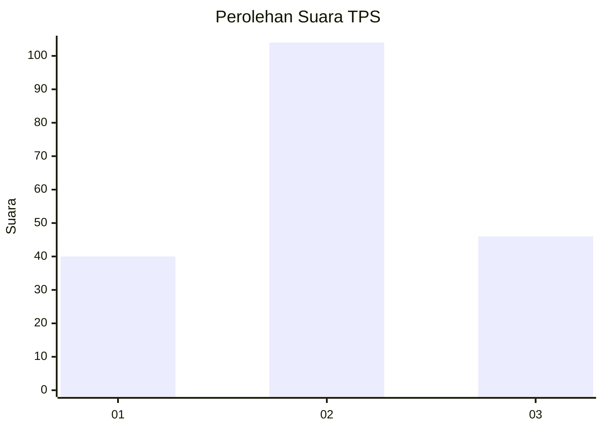
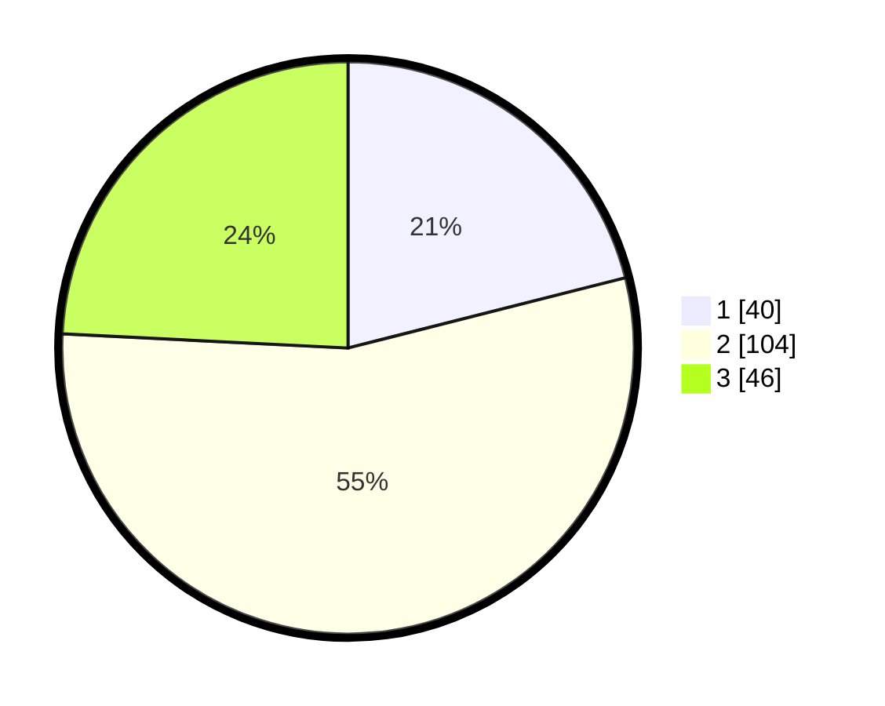

# Hasil

## Grafik

## Tabel

| No. | Nama Paslon    | Suara | Suara (raw) | Persentase |
|:--- |:-------------- | -----:| -----------:| ----------:|
| 1   | ANIES MUHAIMIN | 40    | [40][p-1]   | 21,05      |
| 2   | PRABOWO GIBRAN | 104   | [104][p-2]  | 54,74      |
| 3   | GANJAR MAHFUD  | 46    | [46][p-3]   | 24,21      |

[p-1]: https://github.com/gigit-pemilu/pemilu-2024-32-jawa-barat/blob/main/pilpres/hitung-suara/sub/32-jawa-barat/sub/12-indramayu/sub/13-jatibarang/sub/2001-sukalila/sub/003-tps/sub/paslon-1.txt
[p-2]: https://github.com/gigit-pemilu/pemilu-2024-32-jawa-barat/blob/main/pilpres/hitung-suara/sub/32-jawa-barat/sub/12-indramayu/sub/13-jatibarang/sub/2001-sukalila/sub/003-tps/sub/paslon-2.txt
[p-3]: https://github.com/gigit-pemilu/pemilu-2024-32-jawa-barat/blob/main/pilpres/hitung-suara/sub/32-jawa-barat/sub/12-indramayu/sub/13-jatibarang/sub/2001-sukalila/sub/003-tps/sub/paslon-3.txt

## Foto C Plano

https://sirekap-obj-formc.kpu.go.id/bfa9/pemilu/ppwp/32/12/13/20/01/3212132001003-20240215-031630--38f98510-7434-43b5-852e-42070129509a.jpg

https://sirekap-obj-formc.kpu.go.id/bfa9/pemilu/ppwp/32/12/13/20/01/3212132001003-20240215-031845--5baeb35b-bc63-4eb2-8e4a-28ef015b311b.jpg

https://sirekap-obj-formc.kpu.go.id/bfa9/pemilu/ppwp/32/12/13/20/01/3212132001003-20240215-032108--7186272a-e7da-4a14-b611-0fc63ee33deb.jpg

## Metadata

| Key        | Value               |
| ---------- | ------------------- |
| Time Stamp | 2024-02-15 17:30:25 |

