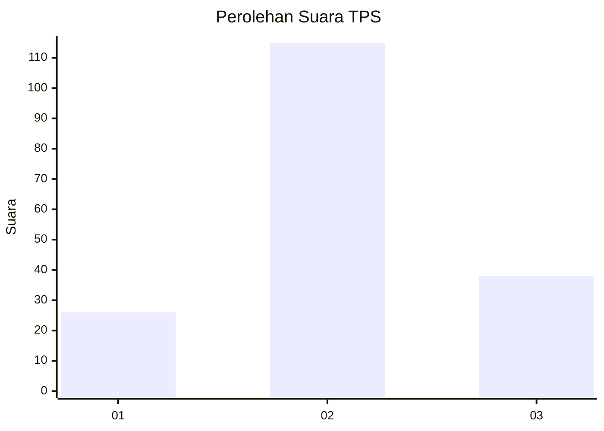
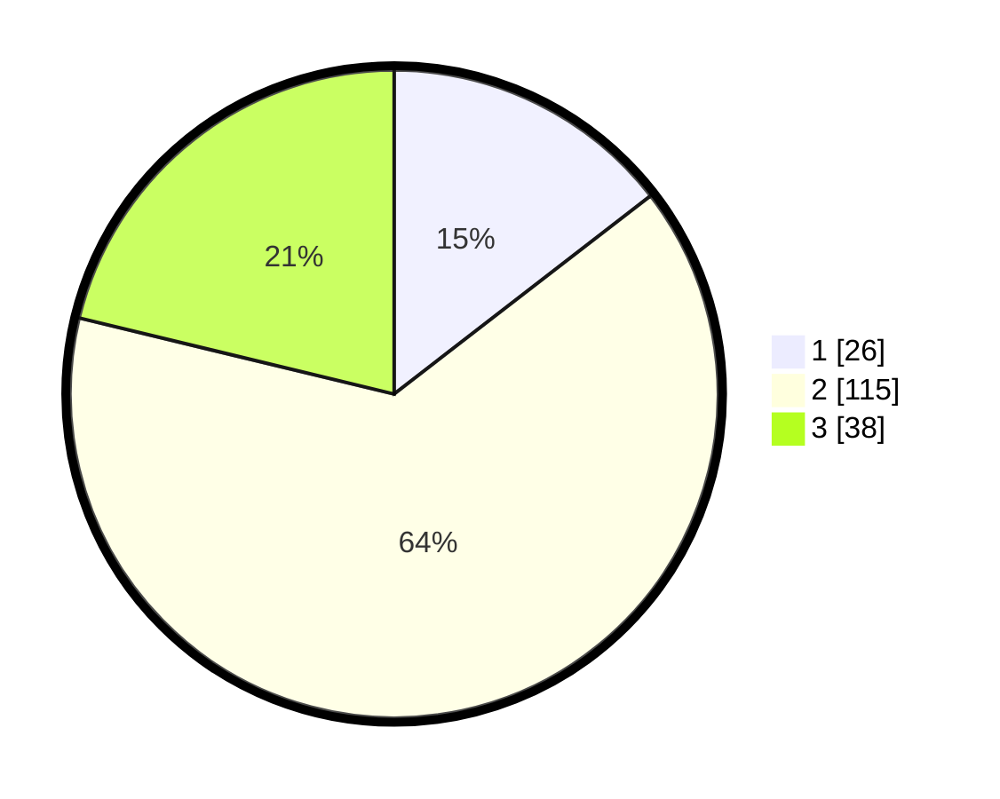

# Hasil

## Grafik

## Tabel

| No. | Nama Paslon    | Suara | Suara (raw) | Persentase |
|:--- |:-------------- | -----:| -----------:| ----------:|
| 1   | ANIES MUHAIMIN | 26    | [26][p-1]   | 14,53      |
| 2   | PRABOWO GIBRAN | 115   | [115][p-2]  | 64,25      |
| 3   | GANJAR MAHFUD  | 38    | [38][p-3]   | 21,23      |

[p-1]: https://github.com/gigit-pemilu/pemilu-2024/blob/main/pilpres/hitung-suara/sub/32-jawa-barat/sub/12-indramayu/sub/13-jatibarang/sub/2001-sukalila/sub/004-tps/sub/paslon-1.txt
[p-2]: https://github.com/gigit-pemilu/pemilu-2024/blob/main/pilpres/hitung-suara/sub/32-jawa-barat/sub/12-indramayu/sub/13-jatibarang/sub/2001-sukalila/sub/004-tps/sub/paslon-2.txt
[p-3]: https://github.com/gigit-pemilu/pemilu-2024/blob/main/pilpres/hitung-suara/sub/32-jawa-barat/sub/12-indramayu/sub/13-jatibarang/sub/2001-sukalila/sub/004-tps/sub/paslon-3.txt

## Foto C Plano

https://sirekap-obj-formc.kpu.go.id/df76/pemilu/ppwp/32/12/13/20/01/3212132001004-20240214-234535--38d8fa1e-e893-4cce-9e93-ba44c623bb1f.jpg

https://sirekap-obj-formc.kpu.go.id/df76/pemilu/ppwp/32/12/13/20/01/3212132001004-20240214-234639--0594f7f1-515d-4798-918b-11bc9124b1b0.jpg

https://sirekap-obj-formc.kpu.go.id/df76/pemilu/ppwp/32/12/13/20/01/3212132001004-20240214-234823--9b161804-6443-4fc9-be75-c2068886553d.jpg

## Metadata

| Key        | Value               |
| ---------- | ------------------- |
| Time Stamp | 2024-02-17 17:30:00 |

