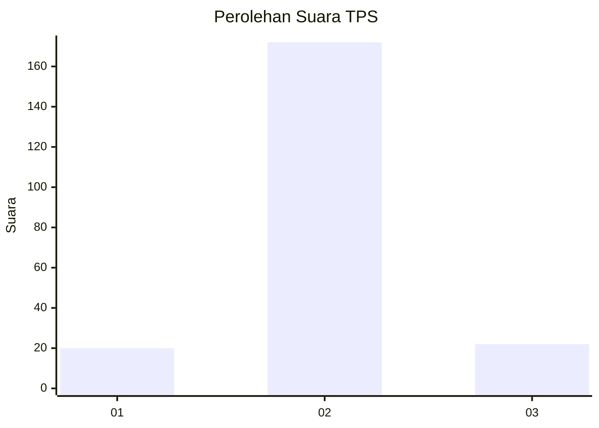
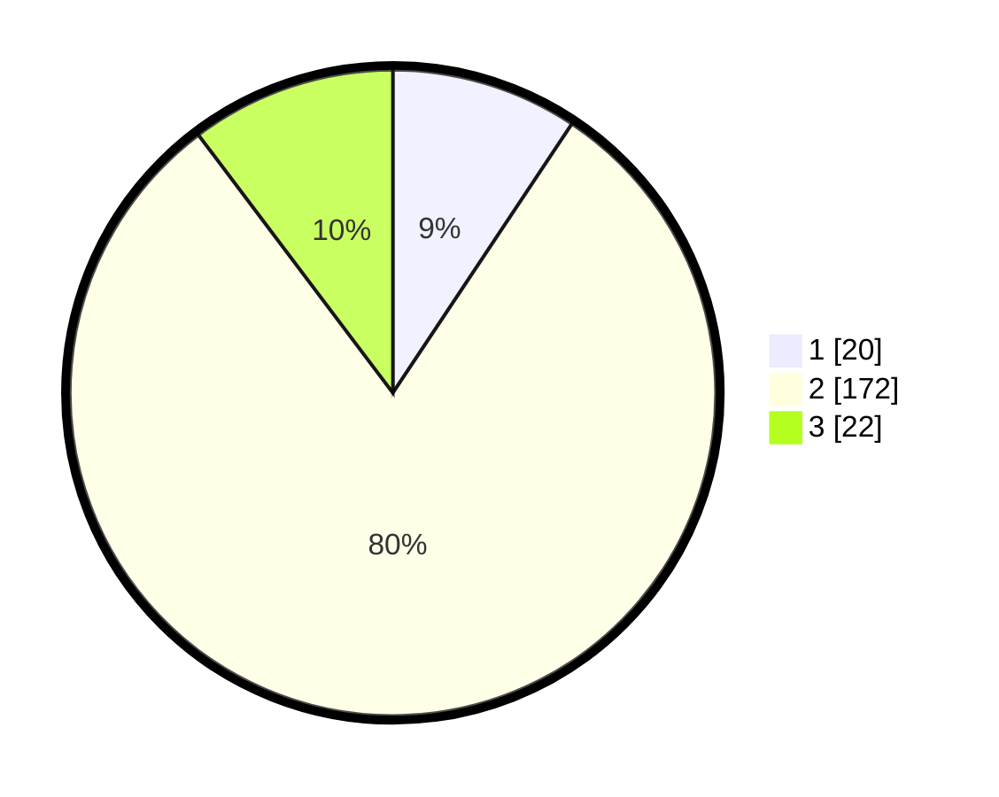

# Hasil

## Grafik

## Tabel

| No. | Nama Paslon    | Suara | Suara (raw) | Persentase |
|:--- |:-------------- | -----:| -----------:| ----------:|
| 1   | ANIES MUHAIMIN | 20    | [20][p-1]   | 9,35       |
| 2   | PRABOWO GIBRAN | 172   | [172][p-2]  | 80,37      |
| 3   | GANJAR MAHFUD  | 22    | [22][p-3]   | 10,28      |

[p-1]: https://github.com/gigit-pemilu/pemilu-2024/blob/main/pilpres/hitung-suara/sub/32-jawa-barat/sub/12-indramayu/sub/13-jatibarang/sub/2004-bulak/sub/001-tps/sub/paslon-1.txt
[p-2]: https://github.com/gigit-pemilu/pemilu-2024/blob/main/pilpres/hitung-suara/sub/32-jawa-barat/sub/12-indramayu/sub/13-jatibarang/sub/2004-bulak/sub/001-tps/sub/paslon-2.txt
[p-3]: https://github.com/gigit-pemilu/pemilu-2024/blob/main/pilpres/hitung-suara/sub/32-jawa-barat/sub/12-indramayu/sub/13-jatibarang/sub/2004-bulak/sub/001-tps/sub/paslon-3.txt

## Foto C Plano

https://sirekap-obj-formc.kpu.go.id/3f31/pemilu/ppwp/32/12/13/20/04/3212132004001-20240216-181414--c53e28a5-404c-491f-a791-544288729280.jpg

https://sirekap-obj-formc.kpu.go.id/3f31/pemilu/ppwp/32/12/13/20/04/3212132004001-20240216-181620--1ae06d53-c198-4ac6-ac2a-638ef02755a4.jpg

https://sirekap-obj-formc.kpu.go.id/3f31/pemilu/ppwp/32/12/13/20/04/3212132004001-20240216-104655--429aa9be-93c0-4e23-8580-da144e6eb468.jpg

## Metadata

| Key        | Value               |
| ---------- | ------------------- |
| Time Stamp | 2024-02-16 21:01:00 |

## DATA PEMILIH TETAP

Jumlah pemilih dalam DPT: **273**.
 * L: **133**.
 * P: **740**.

## DATA PENGGUNA HAK PILIH

Jumlah pengguna hak pilih dalam DPT: **229**.
 * L: **934**.
 * P: **175**.

Jumlah pengguna hak pilih dalam DPTb: **656**.
 * L: **408**.
 * P: **3**.

Jumlah pengguna hak pilih dalam DPK: **844**.
 * L: **828**.
 * P: **269**.

Jumlah pengguna hak pilih: **464**.
 * L: **114**.
 * P: **887**.

## JUMLAH SUARA SAH DAN TIDAK SAH

JUMLAH SELURUH SUARA SAH: **225**.

JUMLAH SUARA TIDAK SAH: **6**.

JUMLAH SELURUH SUARA SAH DAN SUARA TIDAK SAH: **231**.

