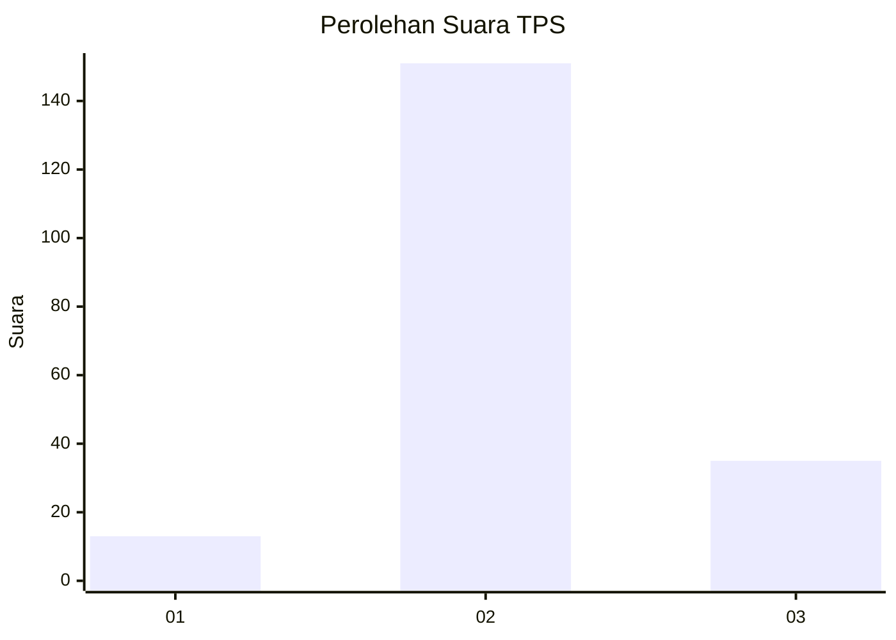

# Hasil

## Grafik

## Tabel

| No. | Nama Paslon    | Suara | Suara (raw) | Persentase |
|:--- |:-------------- | -----:| -----------:| ----------:|
| 1   | ANIES MUHAIMIN | 13    | [13][p-1]   | 6,53       |
| 2   | PRABOWO GIBRAN | 151   | [151][p-2]  | 75,88      |
| 3   | GANJAR MAHFUD  | 35    | [35][p-3]   | 17,59      |

[p-1]: https://github.com/gigit-pemilu/pemilu-2024/blob/main/pilpres/hitung-suara/sub/32-jawa-barat/sub/12-indramayu/sub/14-balongan/sub/2001-tegalsembadra/sub/005-tps/sub/paslon-1.txt
[p-2]: https://github.com/gigit-pemilu/pemilu-2024/blob/main/pilpres/hitung-suara/sub/32-jawa-barat/sub/12-indramayu/sub/14-balongan/sub/2001-tegalsembadra/sub/005-tps/sub/paslon-2.txt
[p-3]: https://github.com/gigit-pemilu/pemilu-2024/blob/main/pilpres/hitung-suara/sub/32-jawa-barat/sub/12-indramayu/sub/14-balongan/sub/2001-tegalsembadra/sub/005-tps/sub/paslon-3.txt

## Foto C Plano

https://sirekap-obj-formc.kpu.go.id/0cb8/pemilu/ppwp/32/12/14/20/01/3212142001005-20240215-025541--74bb0906-d2c2-4463-a2d7-d529b54ccca2.jpg

https://sirekap-obj-formc.kpu.go.id/0cb8/pemilu/ppwp/32/12/14/20/01/3212142001005-20240215-025856--77f8092e-cc82-481a-aa43-49e7d996ff67.jpg

https://sirekap-obj-formc.kpu.go.id/0cb8/pemilu/ppwp/32/12/14/20/01/3212142001005-20240215-030023--95c8e3a6-437d-4ca5-a175-65b16dd3e984.jpg

## Metadata

| Key        | Value               |
| ---------- | ------------------- |
| Time Stamp | 2024-02-15 21:01:18 |

