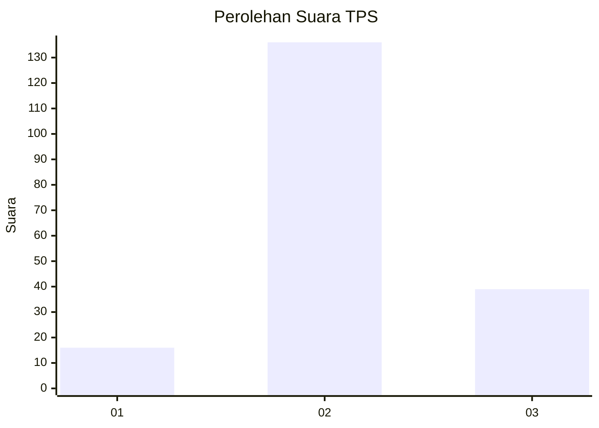
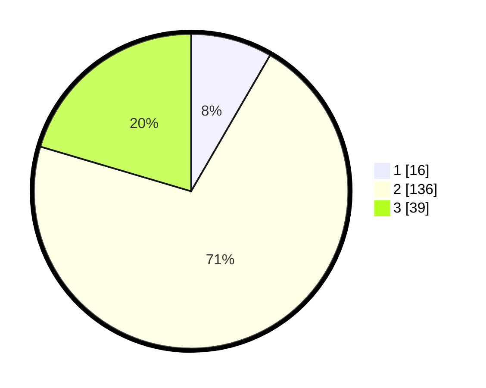

# Hasil

## Grafik

## Tabel

| No. | Nama Paslon    | Suara | Suara (raw) | Persentase |
|:--- |:-------------- | -----:| -----------:| ----------:|
| 1   | ANIES MUHAIMIN | 16    | [16][p-1]   | 8,38       |
| 2   | PRABOWO GIBRAN | 136   | [136][p-2]  | 71,20      |
| 3   | GANJAR MAHFUD  | 39    | [39][p-3]   | 20,42      |

[p-1]: https://github.com/gigit-pemilu/pemilu-2024-32-jawa-barat/blob/main/pilpres/hitung-suara/sub/32-jawa-barat/sub/12-indramayu/sub/14-balongan/sub/2001-tegalsembadra/sub/006-tps/sub/paslon-1.txt
[p-2]: https://github.com/gigit-pemilu/pemilu-2024-32-jawa-barat/blob/main/pilpres/hitung-suara/sub/32-jawa-barat/sub/12-indramayu/sub/14-balongan/sub/2001-tegalsembadra/sub/006-tps/sub/paslon-2.txt
[p-3]: https://github.com/gigit-pemilu/pemilu-2024-32-jawa-barat/blob/main/pilpres/hitung-suara/sub/32-jawa-barat/sub/12-indramayu/sub/14-balongan/sub/2001-tegalsembadra/sub/006-tps/sub/paslon-3.txt

## Foto C Plano

https://sirekap-obj-formc.kpu.go.id/0eb7/pemilu/ppwp/32/12/14/20/01/3212142001006-20240215-035553--fcf9b2a4-acae-45ed-bec9-dfb732b87ea3.jpg

https://sirekap-obj-formc.kpu.go.id/0eb7/pemilu/ppwp/32/12/14/20/01/3212142001006-20240215-022337--20ef6390-d0e7-4df2-94f7-8acd7c7cb661.jpg

https://sirekap-obj-formc.kpu.go.id/0eb7/pemilu/ppwp/32/12/14/20/01/3212142001006-20240214-213500--8fbed1bc-9a20-494d-b284-e6fc21bc0926.jpg

## Metadata

| Key        | Value               |
| ---------- | ------------------- |
| Time Stamp | 2024-02-15 12:00:28 |

