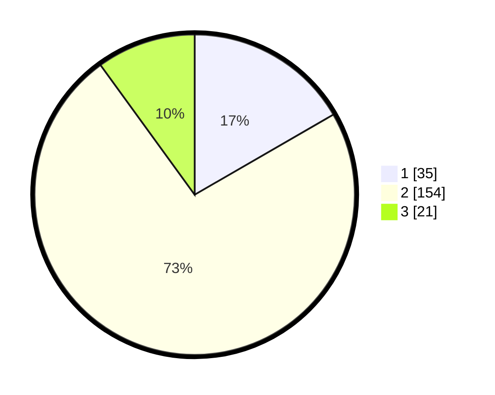

# Hasil

## Grafik

## Tabel

| No. | Nama Paslon    | Suara | Suara (raw) | Persentase |
|:--- |:-------------- | -----:| -----------:| ----------:|
| 1   | ANIES MUHAIMIN | 35    | [35][p-1]   | 16,67      |
| 2   | PRABOWO GIBRAN | 154   | [154][p-2]  | 73,33      |
| 3   | GANJAR MAHFUD  | 21    | [21][p-3]   | 10,00      |

[p-1]: https://github.com/gigit-pemilu/pemilu-2024/blob/main/pilpres/hitung-suara/sub/32-jawa-barat/sub/12-indramayu/sub/15-indramayu/sub/1005-lemahmekar/sub/013-tps/sub/paslon-1.txt
[p-2]: https://github.com/gigit-pemilu/pemilu-2024/blob/main/pilpres/hitung-suara/sub/32-jawa-barat/sub/12-indramayu/sub/15-indramayu/sub/1005-lemahmekar/sub/013-tps/sub/paslon-2.txt
[p-3]: https://github.com/gigit-pemilu/pemilu-2024/blob/main/pilpres/hitung-suara/sub/32-jawa-barat/sub/12-indramayu/sub/15-indramayu/sub/1005-lemahmekar/sub/013-tps/sub/paslon-3.txt

## Foto C Plano

https://sirekap-obj-formc.kpu.go.id/ee7b/pemilu/ppwp/32/12/15/10/05/3212151005013-20240218-032529--53808ae5-aca2-4e91-a1ee-73871195bd0a.jpg

https://sirekap-obj-formc.kpu.go.id/ee7b/pemilu/ppwp/32/12/15/10/05/3212151005013-20240215-011653--c906ead6-3111-4dc7-a704-f4347f419633.jpg

https://sirekap-obj-formc.kpu.go.id/ee7b/pemilu/ppwp/32/12/15/10/05/3212151005013-20240215-011734--dffc6fbe-e4b7-44fc-bf03-aa51f486645a.jpg

## Metadata

| Key        | Value               |
| ---------- | ------------------- |
| Time Stamp | 2024-02-19 06:16:00 |

## DATA PEMILIH TETAP

Jumlah pemilih dalam DPT: **229**.
 * L: **682**.
 * P: **433**.

## DATA PENGGUNA HAK PILIH

Jumlah pengguna hak pilih dalam DPT: **242**.
 * L: **404**.
 * P: **844**.

Jumlah pengguna hak pilih dalam DPTb: **82**.
 * L: **2**.
 * P: **8**.

Jumlah pengguna hak pilih dalam DPK: **882**.
 * L: **0**.
 * P: **4**.

Jumlah pengguna hak pilih: **265**.
 * L: **403**.
 * P: **442**.

## JUMLAH SUARA SAH DAN TIDAK SAH

JUMLAH SELURUH SUARA SAH: **210**.

JUMLAH SUARA TIDAK SAH: **5**.

JUMLAH SELURUH SUARA SAH DAN SUARA TIDAK SAH: **215**.

