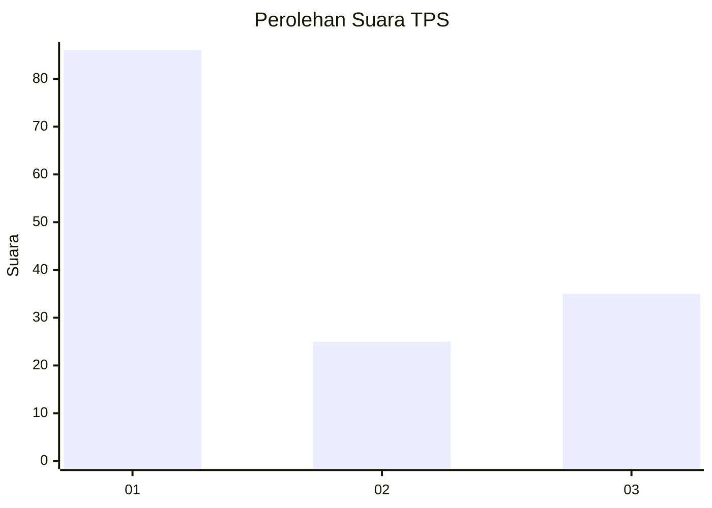
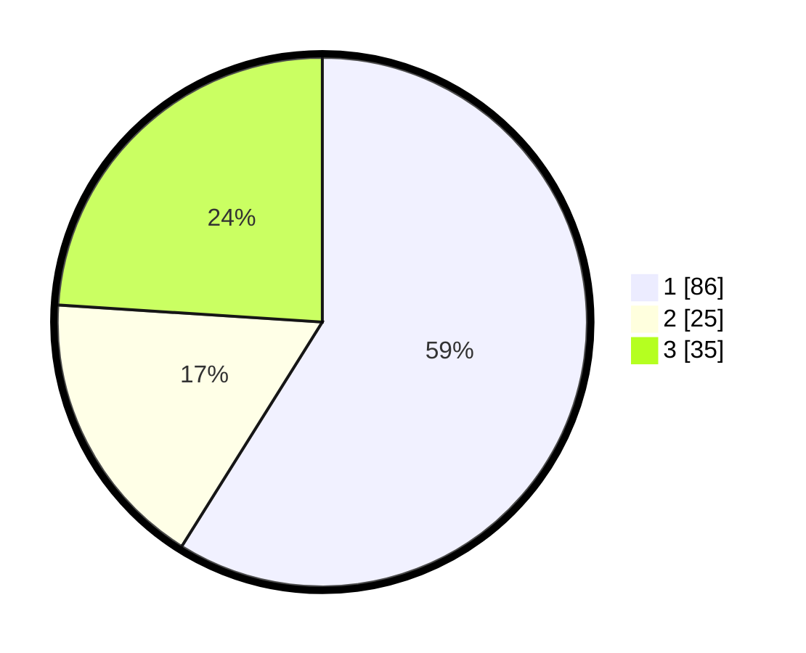

# Hasil

## Grafik

## Tabel

| No. | Nama Paslon    | Suara | Suara (raw) | Persentase |
|:--- |:-------------- | -----:| -----------:| ----------:|
| 1   | ANIES MUHAIMIN | 86    | [86][p-1]   | 58,90      |
| 2   | PRABOWO GIBRAN | 25    | [25][p-2]   | 17,12      |
| 3   | GANJAR MAHFUD  | 35    | [35][p-3]   | 23,97      |

[p-1]: https://github.com/gigit-pemilu/pemilu-2024/blob/main/pilpres/hitung-suara/sub/32-jawa-barat/sub/12-indramayu/sub/15-indramayu/sub/1006-lemahabang/sub/001-tps/sub/paslon-1.txt
[p-2]: https://github.com/gigit-pemilu/pemilu-2024/blob/main/pilpres/hitung-suara/sub/32-jawa-barat/sub/12-indramayu/sub/15-indramayu/sub/1006-lemahabang/sub/001-tps/sub/paslon-2.txt
[p-3]: https://github.com/gigit-pemilu/pemilu-2024/blob/main/pilpres/hitung-suara/sub/32-jawa-barat/sub/12-indramayu/sub/15-indramayu/sub/1006-lemahabang/sub/001-tps/sub/paslon-3.txt

## Foto C Plano

https://sirekap-obj-formc.kpu.go.id/5f1a/pemilu/ppwp/32/12/15/10/06/3212151006001-20240214-200258--38614d5f-e880-4153-b8a5-8588fdc0bde5.jpg

https://sirekap-obj-formc.kpu.go.id/5f1a/pemilu/ppwp/32/12/15/10/06/3212151006001-20240214-195754--0eb20a5b-e010-4bde-bf66-c60d3a0c7fff.jpg

https://sirekap-obj-formc.kpu.go.id/5f1a/pemilu/ppwp/32/12/15/10/06/3212151006001-20240214-195952--a52c923c-95e1-4943-88ea-3050997eca77.jpg

## Metadata

| Key        | Value               |
| ---------- | ------------------- |
| Time Stamp | 2024-02-14 21:46:01 |

