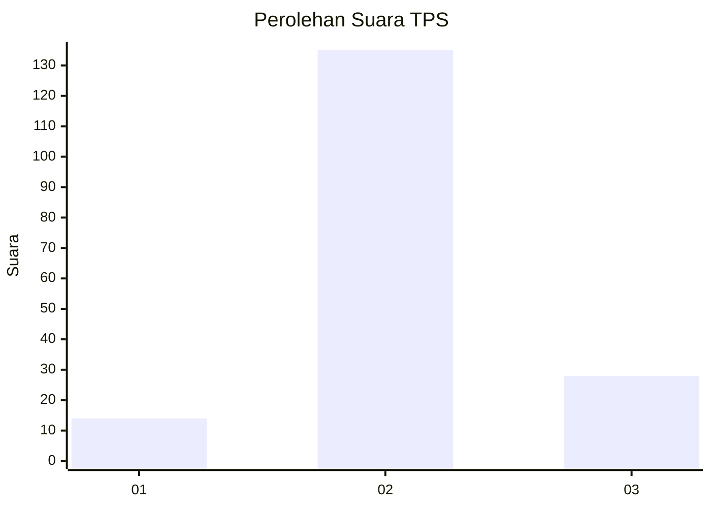
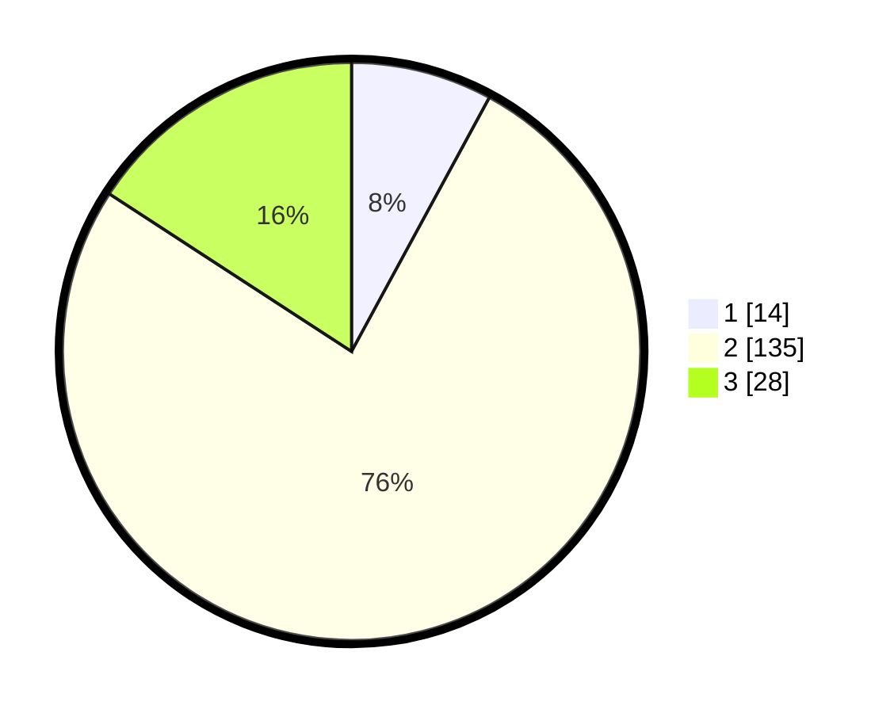

# Hasil

## Grafik

## Tabel

| No. | Nama Paslon    | Suara | Suara (raw) | Persentase |
|:--- |:-------------- | -----:| -----------:| ----------:|
| 1   | ANIES MUHAIMIN | 14    | [14][p-1]   | 7,91       |
| 2   | PRABOWO GIBRAN | 135   | [135][p-2]  | 76,27      |
| 3   | GANJAR MAHFUD  | 28    | [28][p-3]   | 15,82      |

[p-1]: https://github.com/gigit-pemilu/pemilu-2024-32-jawa-barat/blob/main/pilpres/hitung-suara/sub/32-jawa-barat/sub/12-indramayu/sub/16-sindang/sub/2001-panyindangan-kulon/sub/004-tps/sub/paslon-1.txt
[p-2]: https://github.com/gigit-pemilu/pemilu-2024-32-jawa-barat/blob/main/pilpres/hitung-suara/sub/32-jawa-barat/sub/12-indramayu/sub/16-sindang/sub/2001-panyindangan-kulon/sub/004-tps/sub/paslon-2.txt
[p-3]: https://github.com/gigit-pemilu/pemilu-2024-32-jawa-barat/blob/main/pilpres/hitung-suara/sub/32-jawa-barat/sub/12-indramayu/sub/16-sindang/sub/2001-panyindangan-kulon/sub/004-tps/sub/paslon-3.txt

## Foto C Plano

https://sirekap-obj-formc.kpu.go.id/bc1d/pemilu/ppwp/32/12/16/20/01/3212162001004-20240214-140927--daa7bc72-97a9-4bd4-ba07-3d684da4d878.jpg

https://sirekap-obj-formc.kpu.go.id/bc1d/pemilu/ppwp/32/12/16/20/01/3212162001004-20240214-141653--abfba925-875f-405e-9ac7-3548c5b649b4.jpg

https://sirekap-obj-formc.kpu.go.id/bc1d/pemilu/ppwp/32/12/16/20/01/3212162001004-20240214-141756--2f101884-05c2-43af-8f83-999ba166d817.jpg

## Metadata

| Key        | Value               |
| ---------- | ------------------- |
| Time Stamp | 2024-02-14 21:46:01 |

