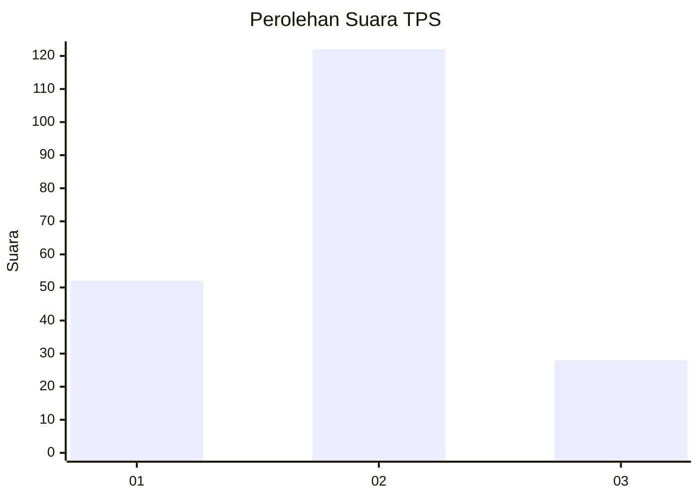
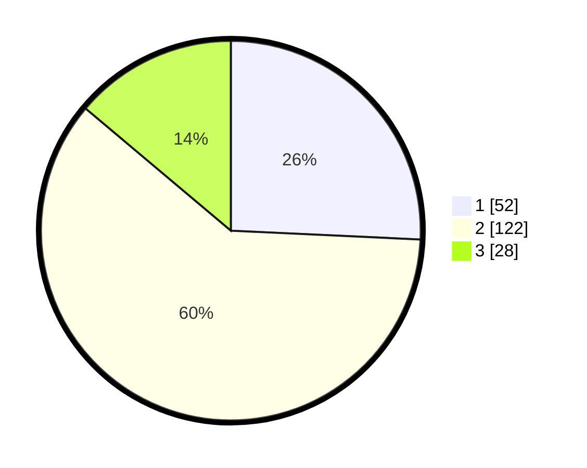

# Hasil

## Grafik

## Tabel

| No. | Nama Paslon    | Suara | Suara (raw) | Persentase |
|:--- |:-------------- | -----:| -----------:| ----------:|
| 1   | ANIES MUHAIMIN | 52    | [52][p-1]   | 25,74      |
| 2   | PRABOWO GIBRAN | 122   | [122][p-2]  | 60,40      |
| 3   | GANJAR MAHFUD  | 28    | [28][p-3]   | 13,86      |

[p-1]: https://github.com/gigit-pemilu/pemilu-2024/blob/main/pilpres/hitung-suara/sub/32-jawa-barat/sub/12-indramayu/sub/18-lohbener/sub/2010-pamayahan/sub/002-tps/sub/paslon-1.txt
[p-2]: https://github.com/gigit-pemilu/pemilu-2024/blob/main/pilpres/hitung-suara/sub/32-jawa-barat/sub/12-indramayu/sub/18-lohbener/sub/2010-pamayahan/sub/002-tps/sub/paslon-2.txt
[p-3]: https://github.com/gigit-pemilu/pemilu-2024/blob/main/pilpres/hitung-suara/sub/32-jawa-barat/sub/12-indramayu/sub/18-lohbener/sub/2010-pamayahan/sub/002-tps/sub/paslon-3.txt

## Foto C Plano

https://sirekap-obj-formc.kpu.go.id/9ab6/pemilu/ppwp/32/12/18/20/10/3212182010002-20240224-162551--e77594d1-4e08-4828-99c4-f77cd5e48d52.jpg

https://sirekap-obj-formc.kpu.go.id/9ab6/pemilu/ppwp/32/12/18/20/10/3212182010002-20240224-162612--8b17f738-4fc2-425c-b624-16f77ceb0df8.jpg

https://sirekap-obj-formc.kpu.go.id/9ab6/pemilu/ppwp/32/12/18/20/10/3212182010002-20240224-162646--98b24b08-6821-4d39-803e-276dbc6bac70.jpg

## Metadata

| Key        | Value               |
| ---------- | ------------------- |
| Time Stamp | 2024-02-24 22:31:28 |

## DATA PEMILIH TETAP

Jumlah pemilih dalam DPT: **71**.
 * L: **707**.
 * P: **500**.

## DATA PENGGUNA HAK PILIH

Jumlah pengguna hak pilih dalam DPT: **107**.
 * L: **57**.
 * P: **57**.

Jumlah pengguna hak pilih dalam DPTb: **532**.
 * L: **0**.
 * P: **77**.

Jumlah pengguna hak pilih dalam DPK: **727**.
 * L: **0**.
 * P: **2**.

Jumlah pengguna hak pilih: **727**.
 * L: **104**.
 * P: **113**.

## JUMLAH SUARA SAH DAN TIDAK SAH

JUMLAH SELURUH SUARA SAH: **213**.

JUMLAH SUARA TIDAK SAH: **700**.

JUMLAH SELURUH SUARA SAH DAN SUARA TIDAK SAH: **717**.

