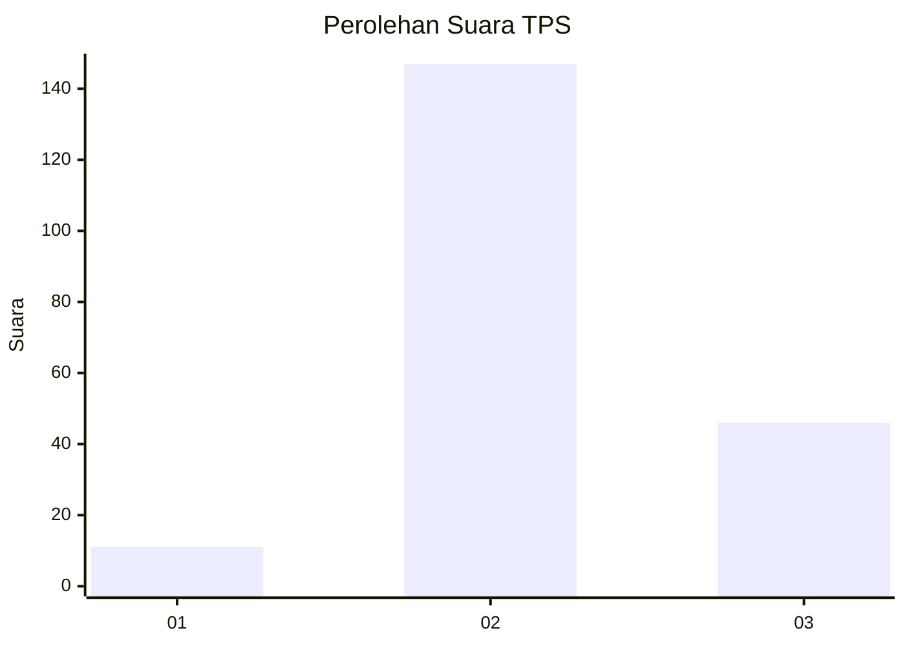
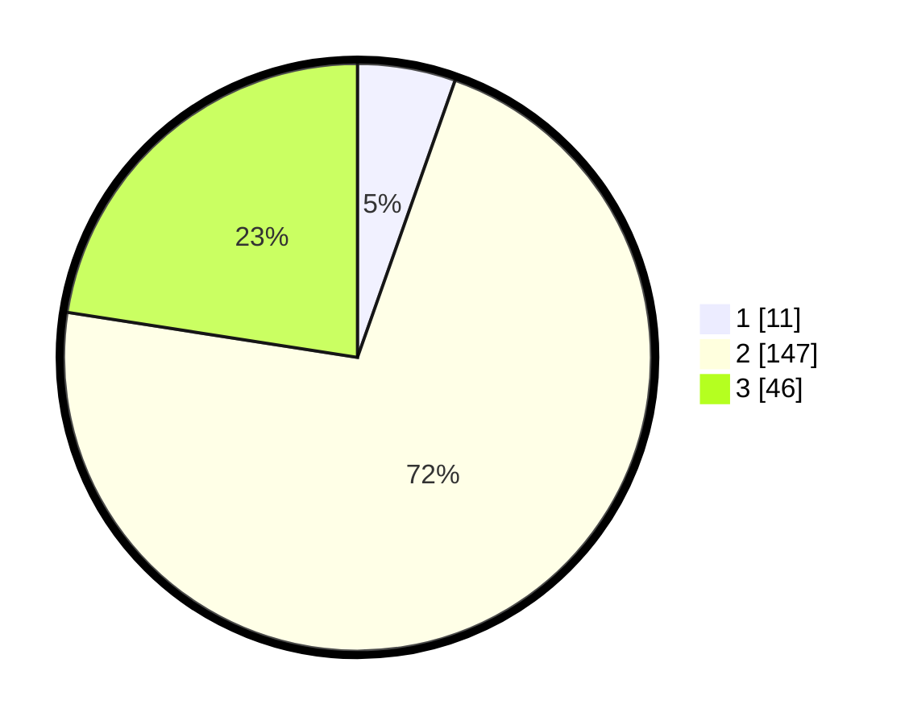

# Hasil

## Grafik

## Tabel

| No. | Nama Paslon    | Suara | Suara (raw) | Persentase |
|:--- |:-------------- | -----:| -----------:| ----------:|
| 1   | ANIES MUHAIMIN | 11    | [11][p-1]   | 5,39       |
| 2   | PRABOWO GIBRAN | 147   | [147][p-2]  | 72,06      |
| 3   | GANJAR MAHFUD  | 46    | [46][p-3]   | 22,55      |

[p-1]: https://github.com/gigit-pemilu/pemilu-2024-32-jawa-barat/blob/main/pilpres/hitung-suara/sub/32-jawa-barat/sub/12-indramayu/sub/20-losarang/sub/2001-ranjeng/sub/001-tps/sub/paslon-1.txt
[p-2]: https://github.com/gigit-pemilu/pemilu-2024-32-jawa-barat/blob/main/pilpres/hitung-suara/sub/32-jawa-barat/sub/12-indramayu/sub/20-losarang/sub/2001-ranjeng/sub/001-tps/sub/paslon-2.txt
[p-3]: https://github.com/gigit-pemilu/pemilu-2024-32-jawa-barat/blob/main/pilpres/hitung-suara/sub/32-jawa-barat/sub/12-indramayu/sub/20-losarang/sub/2001-ranjeng/sub/001-tps/sub/paslon-3.txt

## Foto C Plano

https://sirekap-obj-formc.kpu.go.id/8d49/pemilu/ppwp/32/12/20/20/01/3212202001001-20240215-080048--9df1fdf0-782a-43ac-981b-9a6ae6d1316a.jpg

https://sirekap-obj-formc.kpu.go.id/8d49/pemilu/ppwp/32/12/20/20/01/3212202001001-20240215-080703--ed35eda2-23e7-4c7c-87f5-bf10ea7ff989.jpg

https://sirekap-obj-formc.kpu.go.id/8d49/pemilu/ppwp/32/12/20/20/01/3212202001001-20240218-143438--6dbcb776-4fd8-43da-8ebc-ca927a9af109.jpg

## Metadata

| Key        | Value               |
| ---------- | ------------------- |
| Time Stamp | 2024-02-19 06:16:00 |

