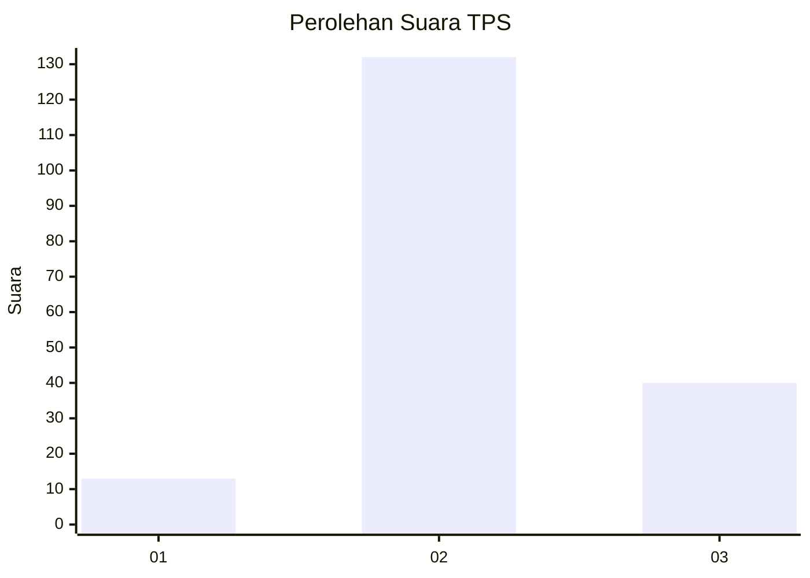

# Hasil

## Grafik

## Tabel

| No. | Nama Paslon    | Suara | Suara (raw) | Persentase |
|:--- |:-------------- | -----:| -----------:| ----------:|
| 1   | ANIES MUHAIMIN | 13    | [13][p-1]   | 7,03       |
| 2   | PRABOWO GIBRAN | 132   | [132][p-2]  | 71,35      |
| 3   | GANJAR MAHFUD  | 40    | [40][p-3]   | 21,62      |

[p-1]: https://github.com/gigit-pemilu/pemilu-2024/blob/main/pilpres/hitung-suara/sub/32-jawa-barat/sub/12-indramayu/sub/20-losarang/sub/2001-ranjeng/sub/003-tps/sub/paslon-1.txt
[p-2]: https://github.com/gigit-pemilu/pemilu-2024/blob/main/pilpres/hitung-suara/sub/32-jawa-barat/sub/12-indramayu/sub/20-losarang/sub/2001-ranjeng/sub/003-tps/sub/paslon-2.txt
[p-3]: https://github.com/gigit-pemilu/pemilu-2024/blob/main/pilpres/hitung-suara/sub/32-jawa-barat/sub/12-indramayu/sub/20-losarang/sub/2001-ranjeng/sub/003-tps/sub/paslon-3.txt

## Foto C Plano

https://sirekap-obj-formc.kpu.go.id/9ffa/pemilu/ppwp/32/12/20/20/01/3212202001003-20240214-221132--d5b420d3-ae32-4545-b6a7-12d2b9051a57.jpg

https://sirekap-obj-formc.kpu.go.id/9ffa/pemilu/ppwp/32/12/20/20/01/3212202001003-20240215-092350--1bc596db-4b17-421d-afb9-3a347b5002d0.jpg

https://sirekap-obj-formc.kpu.go.id/9ffa/pemilu/ppwp/32/12/20/20/01/3212202001003-20240215-092503--1d20c4c6-a9d2-495d-9887-1f72bb9bb942.jpg

## Metadata

| Key        | Value               |
| ---------- | ------------------- |
| Time Stamp | 2024-02-15 15:00:29 |

