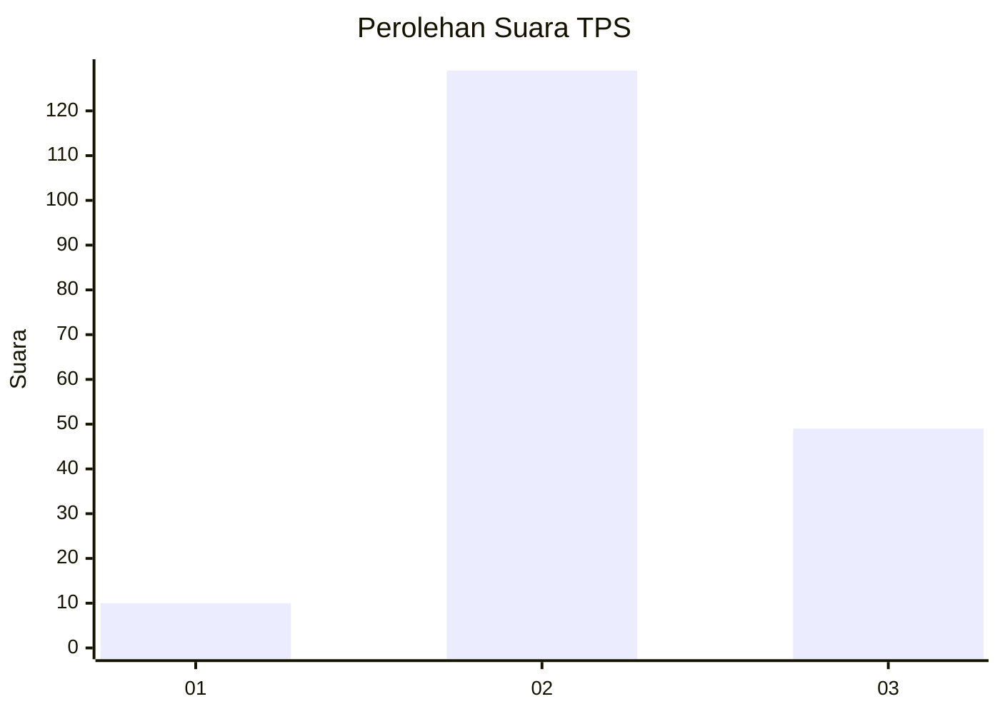
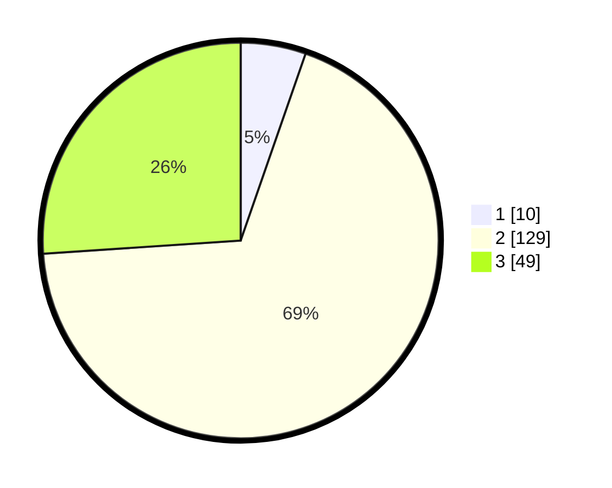

# Hasil

## Grafik

## Tabel

| No. | Nama Paslon    | Suara | Suara (raw) | Persentase |
|:--- |:-------------- | -----:| -----------:| ----------:|
| 1   | ANIES MUHAIMIN | 10    | [10][p-1]   | 5,32       |
| 2   | PRABOWO GIBRAN | 129   | [129][p-2]  | 68,62      |
| 3   | GANJAR MAHFUD  | 49    | [49][p-3]   | 26,06      |

[p-1]: https://github.com/gigit-pemilu/pemilu-2024/blob/main/pilpres/hitung-suara/sub/32-jawa-barat/sub/12-indramayu/sub/20-losarang/sub/2001-ranjeng/sub/005-tps/sub/paslon-1.txt
[p-2]: https://github.com/gigit-pemilu/pemilu-2024/blob/main/pilpres/hitung-suara/sub/32-jawa-barat/sub/12-indramayu/sub/20-losarang/sub/2001-ranjeng/sub/005-tps/sub/paslon-2.txt
[p-3]: https://github.com/gigit-pemilu/pemilu-2024/blob/main/pilpres/hitung-suara/sub/32-jawa-barat/sub/12-indramayu/sub/20-losarang/sub/2001-ranjeng/sub/005-tps/sub/paslon-3.txt

## Foto C Plano

https://sirekap-obj-formc.kpu.go.id/70ff/pemilu/ppwp/32/12/20/20/01/3212202001005-20240214-232241--a96e5a07-77b3-41d1-9b5f-56cb4b0b1304.jpg

https://sirekap-obj-formc.kpu.go.id/70ff/pemilu/ppwp/32/12/20/20/01/3212202001005-20240214-231936--ae3d3ba5-1ac3-4205-8dff-2b750c147b88.jpg

https://sirekap-obj-formc.kpu.go.id/70ff/pemilu/ppwp/32/12/20/20/01/3212202001005-20240214-232432--612f6837-015c-4b1f-907f-7db0db3251f3.jpg

## Metadata

| Key        | Value               |
| ---------- | ------------------- |
| Time Stamp | 2024-02-15 15:00:29 |

