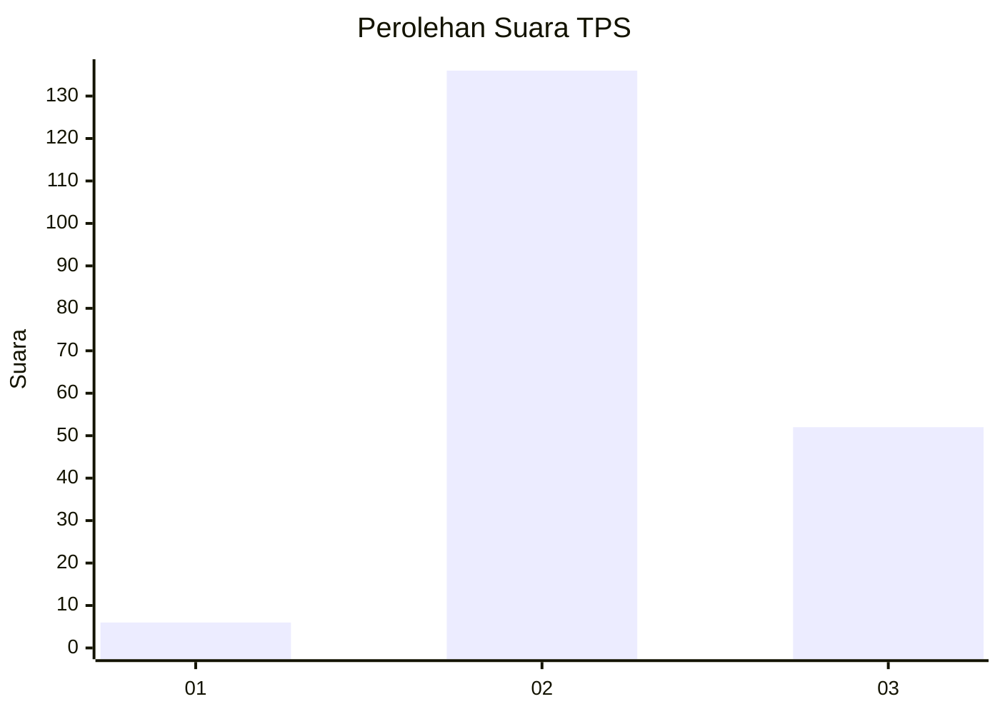
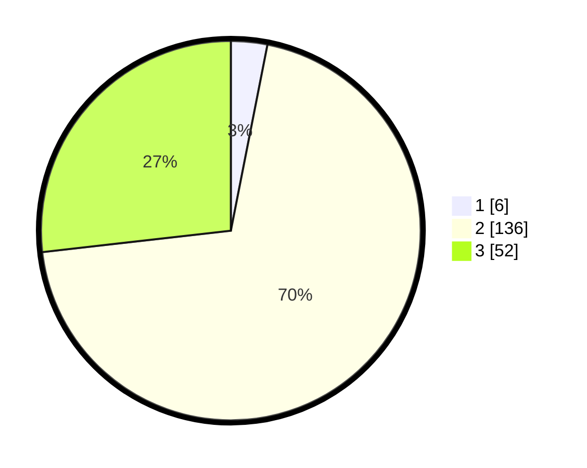

# Hasil

## Grafik

## Tabel

| No. | Nama Paslon    | Suara | Suara (raw) | Persentase |
|:--- |:-------------- | -----:| -----------:| ----------:|
| 1   | ANIES MUHAIMIN | 6     | [6][p-1]    | 3,09       |
| 2   | PRABOWO GIBRAN | 136   | [136][p-2]  | 70,10      |
| 3   | GANJAR MAHFUD  | 52    | [52][p-3]   | 26,80      |

[p-1]: https://github.com/gigit-pemilu/pemilu-2024-32-jawa-barat/blob/main/pilpres/hitung-suara/sub/32-jawa-barat/sub/12-indramayu/sub/20-losarang/sub/2001-ranjeng/sub/006-tps/sub/paslon-1.txt
[p-2]: https://github.com/gigit-pemilu/pemilu-2024-32-jawa-barat/blob/main/pilpres/hitung-suara/sub/32-jawa-barat/sub/12-indramayu/sub/20-losarang/sub/2001-ranjeng/sub/006-tps/sub/paslon-2.txt
[p-3]: https://github.com/gigit-pemilu/pemilu-2024-32-jawa-barat/blob/main/pilpres/hitung-suara/sub/32-jawa-barat/sub/12-indramayu/sub/20-losarang/sub/2001-ranjeng/sub/006-tps/sub/paslon-3.txt

## Foto C Plano

https://sirekap-obj-formc.kpu.go.id/8f31/pemilu/ppwp/32/12/20/20/01/3212202001006-20240215-094404--e5495c41-4db1-4d2d-8a9f-3b6d1c3bfedb.jpg

https://sirekap-obj-formc.kpu.go.id/8f31/pemilu/ppwp/32/12/20/20/01/3212202001006-20240215-094827--4b82426f-98cb-4384-822c-c50ef9f1eb76.jpg

https://sirekap-obj-formc.kpu.go.id/8f31/pemilu/ppwp/32/12/20/20/01/3212202001006-20240215-022417--31c07c31-984e-409d-9861-a2d22a4cb027.jpg

## Metadata

| Key        | Value               |
| ---------- | ------------------- |
| Time Stamp | 2024-02-15 17:00:25 |

