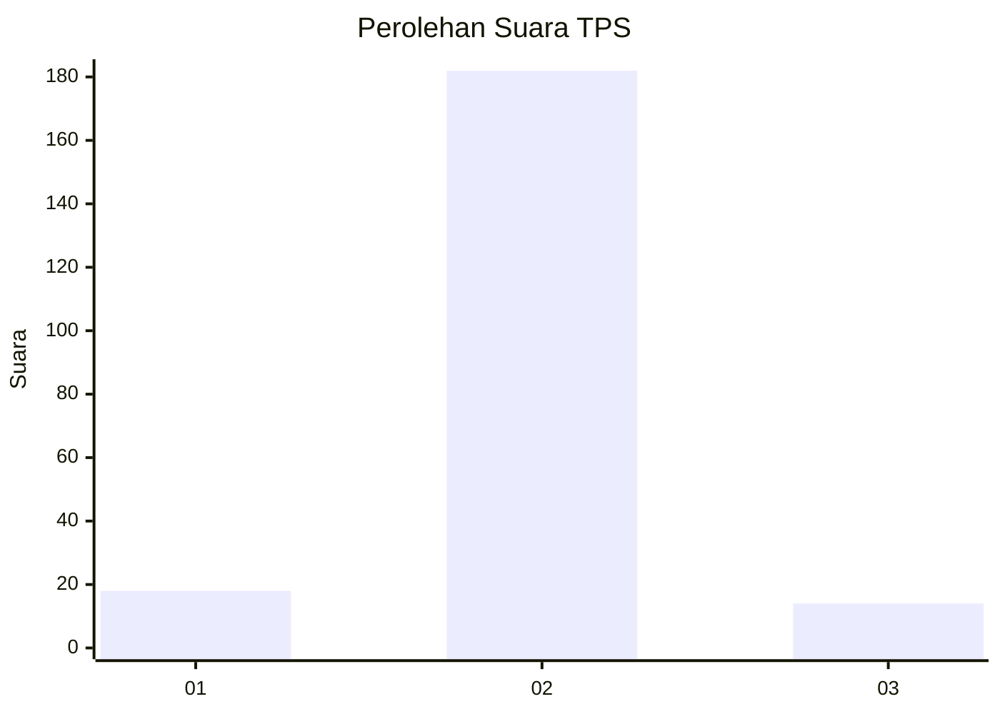
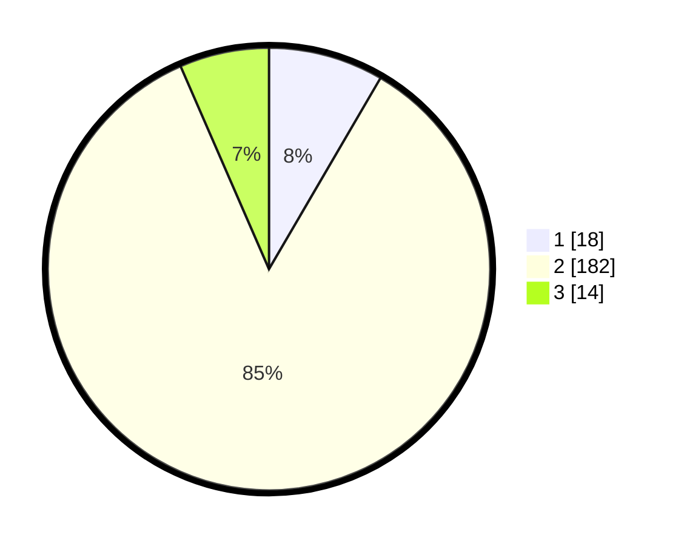

# Hasil

## Grafik

## Tabel

| No. | Nama Paslon    | Suara | Suara (raw) | Persentase |
|:--- |:-------------- | -----:| -----------:| ----------:|
| 1   | ANIES MUHAIMIN | 18    | [18][p-1]   | 8,41       |
| 2   | PRABOWO GIBRAN | 182   | [182][p-2]  | 85,05      |
| 3   | GANJAR MAHFUD  | 14    | [14][p-3]   | 6,54       |

[p-1]: https://github.com/gigit-pemilu/pemilu-2024-32-jawa-barat/blob/main/pilpres/hitung-suara/sub/32-jawa-barat/sub/12-indramayu/sub/21-kandanghaur/sub/2001-curug/sub/002-tps/sub/paslon-1.txt
[p-2]: https://github.com/gigit-pemilu/pemilu-2024-32-jawa-barat/blob/main/pilpres/hitung-suara/sub/32-jawa-barat/sub/12-indramayu/sub/21-kandanghaur/sub/2001-curug/sub/002-tps/sub/paslon-2.txt
[p-3]: https://github.com/gigit-pemilu/pemilu-2024-32-jawa-barat/blob/main/pilpres/hitung-suara/sub/32-jawa-barat/sub/12-indramayu/sub/21-kandanghaur/sub/2001-curug/sub/002-tps/sub/paslon-3.txt

## Foto C Plano

https://sirekap-obj-formc.kpu.go.id/a82a/pemilu/ppwp/32/12/21/20/01/3212212001002-20240214-225642--98295ab6-a19d-4de6-b60d-547e73239432.jpg

https://sirekap-obj-formc.kpu.go.id/a82a/pemilu/ppwp/32/12/21/20/01/3212212001002-20240214-225717--17f0858e-e9ca-463d-9c01-6766f0a9d18d.jpg

https://sirekap-obj-formc.kpu.go.id/a82a/pemilu/ppwp/32/12/21/20/01/3212212001002-20240214-225816--c071fdb0-67e7-4a9b-a7d8-e54652a8ea21.jpg

## Metadata

| Key        | Value               |
| ---------- | ------------------- |
| Time Stamp | 2024-02-15 15:00:29 |

