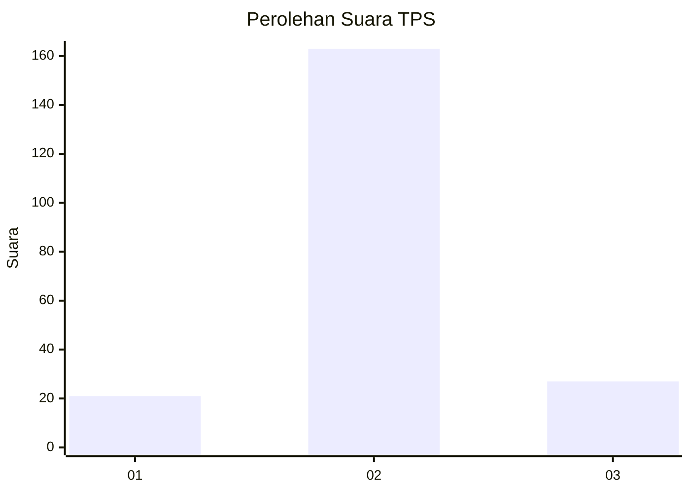
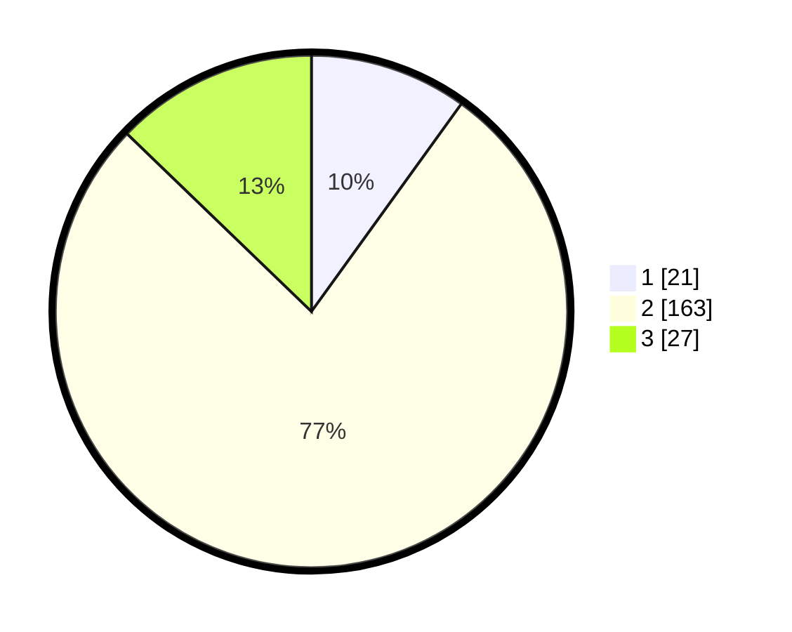

# Hasil

## Grafik

## Tabel

| No. | Nama Paslon    | Suara | Suara (raw) | Persentase |
|:--- |:-------------- | -----:| -----------:| ----------:|
| 1   | ANIES MUHAIMIN | 21    | [21][p-1]   | 9,95       |
| 2   | PRABOWO GIBRAN | 163   | [163][p-2]  | 77,25      |
| 3   | GANJAR MAHFUD  | 27    | [27][p-3]   | 12,80      |

[p-1]: https://github.com/gigit-pemilu/pemilu-2024/blob/main/pilpres/hitung-suara/sub/32-jawa-barat/sub/12-indramayu/sub/22-bongas/sub/2001-cipedang/sub/002-tps/sub/paslon-1.txt
[p-2]: https://github.com/gigit-pemilu/pemilu-2024/blob/main/pilpres/hitung-suara/sub/32-jawa-barat/sub/12-indramayu/sub/22-bongas/sub/2001-cipedang/sub/002-tps/sub/paslon-2.txt
[p-3]: https://github.com/gigit-pemilu/pemilu-2024/blob/main/pilpres/hitung-suara/sub/32-jawa-barat/sub/12-indramayu/sub/22-bongas/sub/2001-cipedang/sub/002-tps/sub/paslon-3.txt

## Foto C Plano

https://sirekap-obj-formc.kpu.go.id/ef0a/pemilu/ppwp/32/12/22/20/01/3212222001002-20240219-131732--97bdc966-efed-4d5c-a370-3d059c98e3e0.jpg

https://sirekap-obj-formc.kpu.go.id/ef0a/pemilu/ppwp/32/12/22/20/01/3212222001002-20240219-131842--16b41a04-d555-4d2f-a94f-05f5c5f1aef4.jpg

https://sirekap-obj-formc.kpu.go.id/ef0a/pemilu/ppwp/32/12/22/20/01/3212222001002-20240219-131953--c0525271-762c-46f5-b9dd-46948003d1cd.jpg

## Metadata

| Key        | Value               |
| ---------- | ------------------- |
| Time Stamp | 2024-02-20 18:00:00 |

