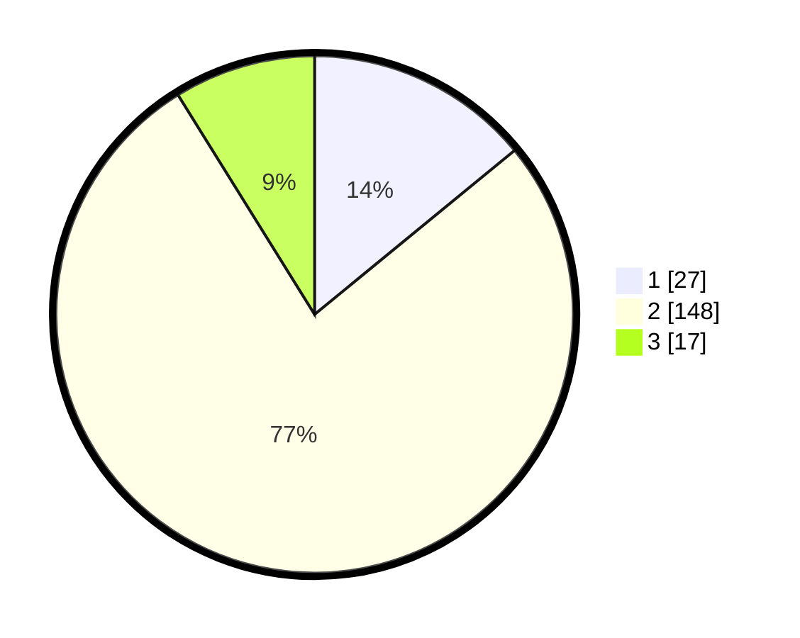

# Hasil

## Grafik

## Tabel

| No. | Nama Paslon    | Suara | Suara (raw) | Persentase |
|:--- |:-------------- | -----:| -----------:| ----------:|
| 1   | ANIES MUHAIMIN | 27    | [27][p-1]   | 14,06      |
| 2   | PRABOWO GIBRAN | 148   | [148][p-2]  | 77,08      |
| 3   | GANJAR MAHFUD  | 17    | [17][p-3]   | 8,85       |

[p-1]: https://github.com/gigit-pemilu/pemilu-2024-32-jawa-barat/blob/main/pilpres/hitung-suara/sub/32-jawa-barat/sub/12-indramayu/sub/22-bongas/sub/2001-cipedang/sub/006-tps/sub/paslon-1.txt
[p-2]: https://github.com/gigit-pemilu/pemilu-2024-32-jawa-barat/blob/main/pilpres/hitung-suara/sub/32-jawa-barat/sub/12-indramayu/sub/22-bongas/sub/2001-cipedang/sub/006-tps/sub/paslon-2.txt
[p-3]: https://github.com/gigit-pemilu/pemilu-2024-32-jawa-barat/blob/main/pilpres/hitung-suara/sub/32-jawa-barat/sub/12-indramayu/sub/22-bongas/sub/2001-cipedang/sub/006-tps/sub/paslon-3.txt

## Foto C Plano

https://sirekap-obj-formc.kpu.go.id/1447/pemilu/ppwp/32/12/22/20/01/3212222001006-20240220-084631--111fa043-37cd-43ea-8d53-d3c141ce19fa.jpg

https://sirekap-obj-formc.kpu.go.id/1447/pemilu/ppwp/32/12/22/20/01/3212222001006-20240214-230324--22991ae9-5571-477f-bda8-4477d7aa5f1c.jpg

https://sirekap-obj-formc.kpu.go.id/1447/pemilu/ppwp/32/12/22/20/01/3212222001006-20240214-230537--d98e7cd5-21d7-4b05-9eaa-c6765d616767.jpg

## Metadata

| Key        | Value               |
| ---------- | ------------------- |
| Time Stamp | 2024-02-20 09:00:00 |

