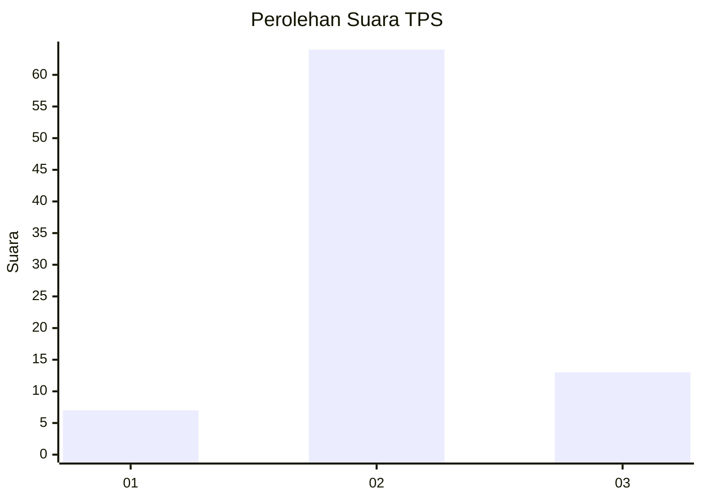

# Hasil

## Grafik

## Tabel

| No. | Nama Paslon    | Suara | Suara (raw) | Persentase |
|:--- |:-------------- | -----:| -----------:| ----------:|
| 1   | ANIES MUHAIMIN | 7     | [7][p-1]    | 8,33       |
| 2   | PRABOWO GIBRAN | 64    | [64][p-2]   | 76,19      |
| 3   | GANJAR MAHFUD  | 13    | [13][p-3]   | 15,48      |

[p-1]: https://github.com/gigit-pemilu/pemilu-2024-32-jawa-barat/blob/main/pilpres/hitung-suara/sub/32-jawa-barat/sub/12-indramayu/sub/22-bongas/sub/2007-kertamulya/sub/019-tps/sub/paslon-1.txt
[p-2]: https://github.com/gigit-pemilu/pemilu-2024-32-jawa-barat/blob/main/pilpres/hitung-suara/sub/32-jawa-barat/sub/12-indramayu/sub/22-bongas/sub/2007-kertamulya/sub/019-tps/sub/paslon-2.txt
[p-3]: https://github.com/gigit-pemilu/pemilu-2024-32-jawa-barat/blob/main/pilpres/hitung-suara/sub/32-jawa-barat/sub/12-indramayu/sub/22-bongas/sub/2007-kertamulya/sub/019-tps/sub/paslon-3.txt

## Foto C Plano

https://sirekap-obj-formc.kpu.go.id/003b/pemilu/ppwp/32/12/22/20/07/3212222007019-20240215-142543--ee6aeb78-eb92-40b2-9d4f-8a5f013012da.jpg

https://sirekap-obj-formc.kpu.go.id/003b/pemilu/ppwp/32/12/22/20/07/3212222007019-20240215-142937--ca227290-8551-454c-b357-c41094871796.jpg

https://sirekap-obj-formc.kpu.go.id/003b/pemilu/ppwp/32/12/22/20/07/3212222007019-20240215-143012--0f94e6d9-e859-4780-85f6-6d0442387348.jpg

## Metadata

| Key        | Value               |
| ---------- | ------------------- |
| Time Stamp | 2024-02-16 01:30:27 |

