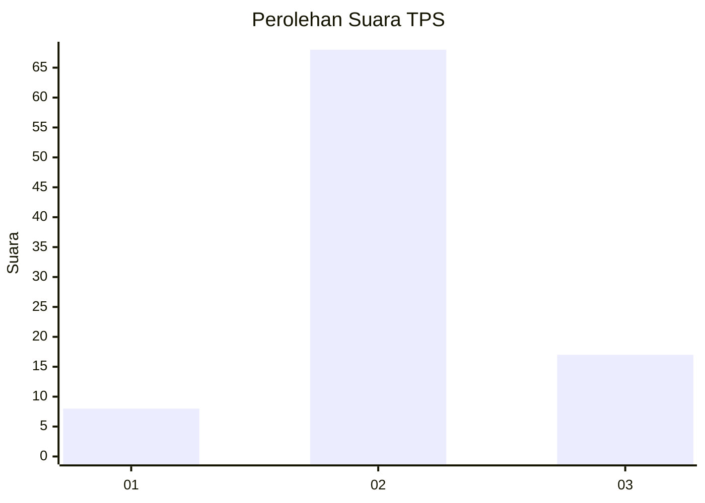
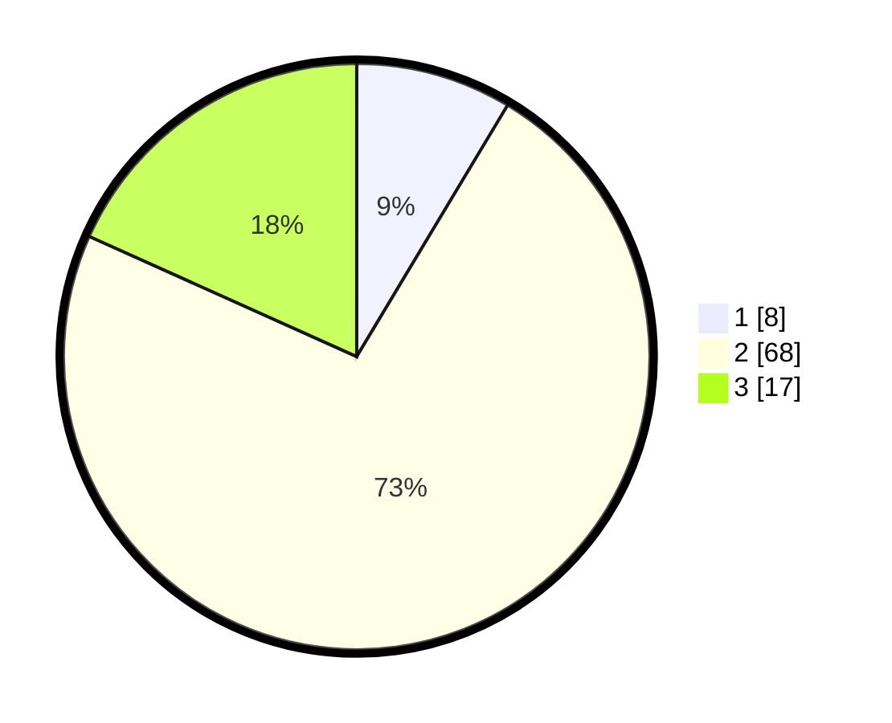

# Hasil

## Grafik

## Tabel

| No. | Nama Paslon    | Suara | Suara (raw) | Persentase |
|:--- |:-------------- | -----:| -----------:| ----------:|
| 1   | ANIES MUHAIMIN | 8     | [8][p-1]    | 8,60       |
| 2   | PRABOWO GIBRAN | 68    | [68][p-2]   | 73,12      |
| 3   | GANJAR MAHFUD  | 17    | [17][p-3]   | 18,28      |

[p-1]: https://github.com/gigit-pemilu/pemilu-2024/blob/main/pilpres/hitung-suara/sub/32-jawa-barat/sub/12-indramayu/sub/22-bongas/sub/2008-plawangan/sub/007-tps/sub/paslon-1.txt
[p-2]: https://github.com/gigit-pemilu/pemilu-2024/blob/main/pilpres/hitung-suara/sub/32-jawa-barat/sub/12-indramayu/sub/22-bongas/sub/2008-plawangan/sub/007-tps/sub/paslon-2.txt
[p-3]: https://github.com/gigit-pemilu/pemilu-2024/blob/main/pilpres/hitung-suara/sub/32-jawa-barat/sub/12-indramayu/sub/22-bongas/sub/2008-plawangan/sub/007-tps/sub/paslon-3.txt

## Foto C Plano

https://sirekap-obj-formc.kpu.go.id/7257/pemilu/ppwp/32/12/22/20/08/3212222008007-20240214-231055--8ef871dd-e4d6-486a-990a-c4c5ebec16e9.jpg

https://sirekap-obj-formc.kpu.go.id/7257/pemilu/ppwp/32/12/22/20/08/3212222008007-20240214-141630--6a0c5581-433d-40ca-b499-6b717fd34fe5.jpg

https://sirekap-obj-formc.kpu.go.id/7257/pemilu/ppwp/32/12/22/20/08/3212222008007-20240214-203414--36df41e4-f40a-40aa-9901-a5df927e9429.jpg

## Metadata

| Key        | Value               |
| ---------- | ------------------- |
| Time Stamp | 2024-02-15 03:06:03 |

