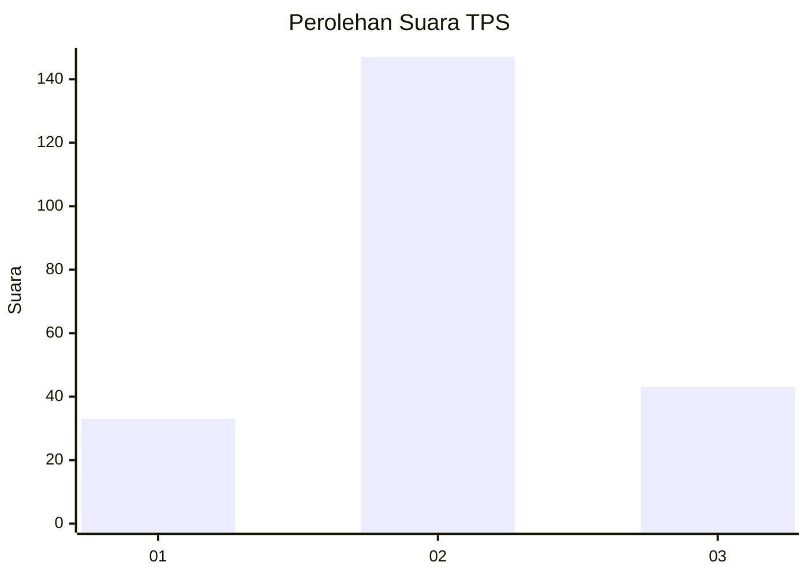
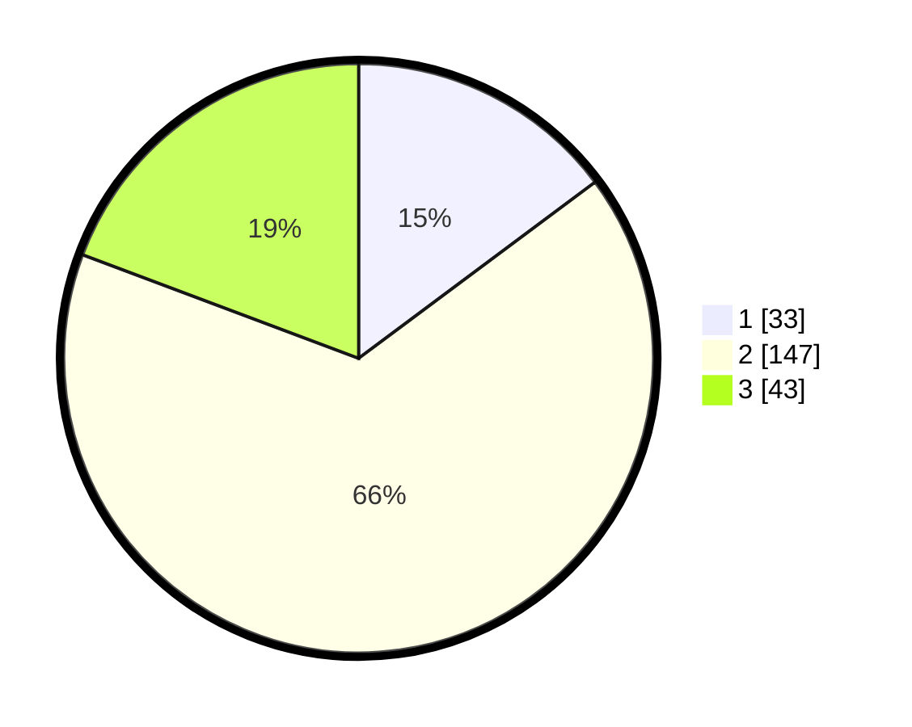

# Hasil

## Grafik

## Tabel

| No. | Nama Paslon    | Suara | Suara (raw) | Persentase |
|:--- |:-------------- | -----:| -----------:| ----------:|
| 1   | ANIES MUHAIMIN | 33    | [33][p-1]   | 14,80      |
| 2   | PRABOWO GIBRAN | 147   | [147][p-2]  | 65,92      |
| 3   | GANJAR MAHFUD  | 43    | [43][p-3]   | 19,28      |

[p-1]: https://github.com/gigit-pemilu/pemilu-2024-32-jawa-barat/blob/main/pilpres/hitung-suara/sub/32-jawa-barat/sub/12-indramayu/sub/23-anjatan/sub/2001-anjatan/sub/001-tps/sub/paslon-1.txt
[p-2]: https://github.com/gigit-pemilu/pemilu-2024-32-jawa-barat/blob/main/pilpres/hitung-suara/sub/32-jawa-barat/sub/12-indramayu/sub/23-anjatan/sub/2001-anjatan/sub/001-tps/sub/paslon-2.txt
[p-3]: https://github.com/gigit-pemilu/pemilu-2024-32-jawa-barat/blob/main/pilpres/hitung-suara/sub/32-jawa-barat/sub/12-indramayu/sub/23-anjatan/sub/2001-anjatan/sub/001-tps/sub/paslon-3.txt

## Foto C Plano

https://sirekap-obj-formc.kpu.go.id/9e5c/pemilu/ppwp/32/12/23/20/01/3212232001001-20240221-143512--80543af7-d6e9-4d69-9356-418927c21f0f.jpg

https://sirekap-obj-formc.kpu.go.id/9e5c/pemilu/ppwp/32/12/23/20/01/3212232001001-20240221-143710--ac1ef0d4-f4cb-4237-a9f3-7b61fc1e8d64.jpg

https://sirekap-obj-formc.kpu.go.id/9e5c/pemilu/ppwp/32/12/23/20/01/3212232001001-20240221-142004--9597ee79-ea7f-43a0-b491-ef3136fd6b20.jpg

## Metadata

| Key        | Value               |
| ---------- | ------------------- |
| Time Stamp | 2024-02-24 22:31:28 |

